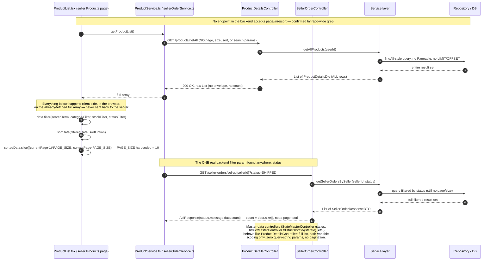

# High-Level Design (HLD) — Pharma Aggregator Marketplace

## 1. Document Control

| Field | Value |
|---|---|
| Document title | High-Level Design — Pharma Aggregator Marketplace |
| Document code | 04-HLD |
| System | pharma-aggregator-client (Next.js 16 frontend) + pharma-aggregator-server (Spring Boot backend) |
| Repositories | `Frontend/pharma-aggregator-client`, `Backend/pharma-aggregator-server` |
| Prepared from | Direct source-code inspection (controllers, services, entities, config, CI/CD, Dockerfiles) — no design intent, ticket, or third-party documentation was used as a source |
| Status | Draft — reverse-engineered from the existing codebase as of the date below |
| Related documents | `docs/08-SECURITY-AND-DEPLOYMENT.md` (full security detail; referenced, not duplicated, in Section 10) |

### Revision History

| Version | Date | Author | Summary of changes |
|---|---|---|---|
| 0.1 | 2026-08-31 | Reverse-engineering pass (Claude Code) | Initial draft, generated entirely from source-code discovery across both repositories |

---

## 2. Introduction & Purpose

### 2.1 Purpose

This document describes the High-Level Design of the Pharma Aggregator Marketplace as it **actually exists in code today** — not as originally specified, not as documented in stale markdown files, and not as aspirationally intended by inline comments that don't match the live code path. Every claim in this document is traceable to a specific file opened during discovery; where something could not be confirmed, this document says so explicitly rather than inferring it.

### 2.2 System Summary

The Pharma Aggregator Marketplace is a two-sided B2B marketplace connecting pharmaceutical/medical-product **sellers** (manufacturers, distributors, PCD companies, white-labelers) with **buyers** (hospitals, clinics, pharmacies, diagnostic centres, laboratories). The system is built as:

- **Frontend**: a single Next.js 16 (App Router) application (`pharma-aggregator-client`) serving three audiences — sellers, buyers, and anonymous/guest visitors browsing products — from one codebase, with **no separate admin UI**.
- **Backend**: a single Spring Boot monolith (`pharma-aggregator-server`) exposing all functionality under one context path (`/api/v1`), backed by one PostgreSQL database.

There is **no admin frontend** anywhere in this codebase (confirmed: `src/services/admin/TestService.ts` and `src/services/buyer/TestService.ts` are both literal one-line placeholders, and admin-only backend endpoints such as `POST /admin/sellers/review`, `POST /admin/buyers/review`, and `POST /admin/orders/{orderId}/override` have no corresponding UI anywhere in `src/app/**`). Admin actions are performed by whatever external tool or manual API call reaches these backend-only endpoints — its existence is inferred only from a `app.admin-frontend-url` property referenced in email-link construction, and was not located in either repository.

### 2.3 In Scope / Out of Scope

**In scope for this document**: seller and buyer registration/onboarding, authentication, product catalog management (6 product categories), stock/batch/pricing management, order placement and fulfillment, quote requests (RFQ), master/reference data, and the deployment/CI-CD pipeline as evidenced in the backend repository.

**Out of scope / not built**: any admin UI, any payment gateway integration (the system is COD-only — see Section 9), any real-time notification channel beyond email/SMS, and any horizontal-scaling or multi-tenant infrastructure (none evidenced).

### 2.4 Audience

Engineering team members onboarding onto this codebase, technical reviewers assessing production-readiness, and anyone auditing the gap between intended design and shipped implementation.

---

## 3. System Overview / Architecture Diagram

The system is a classic three-tier arrangement — browser client, backend monolith, relational database — with two external SaaS integrations (AWS S3 for file storage, Twilio Verify for SMS OTP) and one for email (SMTP via Spring `JavaMailSender`, **not** AWS SES). There is no API gateway, message queue, cache layer, or CDN anywhere in the code inspected.

A structural quirk with real engineering consequences: the frontend uses **three independent Axios HTTP clients** rather than one shared client, each with different failure-handling behavior (see Section 4 and Section 9):

- `src/lib/api.ts` — used by seller auth/profile/master-data services; has full 401-triggered refresh-token rotation with a request queue.
- `src/lib/buyerApi.ts` — a structurally near-identical but entirely separate client for the buyer domain, with its own token keys and its own refresh logic.
- `src/utils/api.ts` — used by every product-category service (Drug, Consumable, Non-Consumable, Supplement, Cosmetic, Food & Infant) and shared product lookups; attaches a Bearer token but has **no** response interceptor, so a 401 here never triggers a silent refresh.

Two further call sites bypass all three clients entirely: `IFSCService.ts` (raw `fetch()` to Razorpay's public IFSC API, a `bankify.in` fallback, and — with a URL-construction bug — this app's own backend) and the bulk Excel/CSV product-import feature in `DashboardFilters.tsx` (raw `fetch()` to a **hardcoded external staging host**, `https://api-test-aggreator.tiameds.ai/api/v1/products/import`, never built from `NEXT_PUBLIC_API_URL`).

```mermaid
flowchart TB
    subgraph Client["Client Layer"]
        SellerBrowser["Seller Browser"]
        BuyerBrowser["Buyer / Guest Browser"]
    end

    subgraph Frontend["Frontend — Next.js 16 App Router (pharma-aggregator-client)<br/>Client-rendered SPA-style app; no server-side data-fetching layer found"]
        SellerUI["Seller UI<br/>seller_7a3b9f2c/** + LoginModals.tsx"]
        BuyerUI["Buyer UI<br/>buyer_e8d45a1b/** + global login/signup modals"]
        PublicUI["Public product / checkout / orders pages"]

        LibApi["src/lib/api.ts<br/>Seller Axios client<br/>Bearer attach + 401 refresh queue"]
        BuyerApiClient["src/lib/buyerApi.ts<br/>Buyer Axios client<br/>Bearer attach + 401 refresh queue (isolated token set)"]
        UtilsApi["src/utils/api.ts<br/>Product/master Axios client<br/>Bearer attach only — NO refresh handling"]
        IFSCDirect["IFSCService.ts<br/>raw fetch() — bypasses all 3 clients"]
        ExcelDirect["Bulk Excel/CSV import (DashboardFilters.tsx)<br/>raw fetch() to a HARDCODED external host —<br/>bypasses all 3 clients, ignores NEXT_PUBLIC_API_URL"]

        SellerUI --> LibApi
        SellerUI --> UtilsApi
        SellerUI --> IFSCDirect
        SellerUI --> ExcelDirect
        BuyerUI --> BuyerApiClient
        PublicUI --> UtilsApi
        PublicUI --> BuyerApiClient
    end

    SellerBrowser --> SellerUI
    BuyerBrowser --> BuyerUI
    SellerBrowser --> PublicUI
    BuyerBrowser --> PublicUI

    subgraph Backend["Backend — pharma-aggregator-server (Spring Boot monolith)<br/>context-path /api/v1 · default port 8080 (no server.port configured in any profile)"]
        AuthFilter["AuthTokenFilter<br/>validates Bearer JWT, resolves seller-vs-buyer table via a<br/>preferBuyer flag (SecurityConfig: anyRequest().permitAll() —<br/>Spring Security enforces nothing at the URL level)"]
        ControllerLayer["Controllers<br/>Auth (Seller/Buyer) · Master Data · Product Catalog ·<br/>Stock/Pricing · Order/Payment/Invoice/Return · Quote ·<br/>Temp Seller/Buyer · Admin · Content/Misc"]
        ServiceLayer["Services<br/>business rules, ID generation (Postgres advisory locks),<br/>state machines, S3/Twilio/SMTP orchestration"]
        RepoLayer["Spring Data JPA repositories"]

        AuthFilter --> ControllerLayer --> ServiceLayer --> RepoLayer
    end

    LibApi -->|"HTTPS + Bearer JWT"| AuthFilter
    BuyerApiClient -->|"HTTPS + Bearer JWT"| AuthFilter
    UtilsApi -->|"HTTPS + Bearer JWT"| AuthFilter
    IFSCDirect -.->|"GET {API_URL}ifsc/{code}<br/>missing '/' separator — 404s in practice"| AuthFilter

    subgraph Data["Data & Storage"]
        Postgres[("PostgreSQL<br/>dev: hardcoded AWS RDS endpoint<br/>test: env-var driven (Secrets Manager)<br/>prod: local docker-compose container")]
        S3[("AWS S3 (SDK v2)<br/>product images/docs, seller & buyer<br/>onboarding documents, GST tax invoices")]
    end

    RepoLayer --> Postgres
    ServiceLayer -->|"S3Service"| S3

    subgraph External["External Third-Party Services"]
        Twilio["Twilio Verify<br/>SMS OTP send/verify — code never stored server-side"]
        SMTP["SMTP mail server<br/>Spring JavaMailSender — NOT AWS SES"]
        Razorpay["Razorpay public IFSC API<br/>(external, no backend involvement)"]
        Bankify["bankify.in IFSC API<br/>(external fallback, no backend involvement)"]
        ExtStaging["api-test-aggreator.tiameds.ai<br/>hardcoded external staging backend —<br/>used only by the bulk Excel/CSV import feature"]
    end

    ServiceLayer --> Twilio
    ServiceLayer --> SMTP
    IFSCDirect --> Razorpay
    IFSCDirect --> Bankify
    ExcelDirect --> ExtStaging

    Note["NOTE: no API gateway, message queue, cache layer, CDN,<br/>or additional AWS service (SES/SNS/Lambda/DynamoDB) was found<br/>anywhere in the code inspected — none are shown because none are evidenced."]
```



---

## 4. Component Breakdown

### 4.1 Frontend Components

| Name | Purpose | Responsibilities | Inputs | Outputs | Dependencies | Data owned | APIs exposed |
|---|---|---|---|---|---|---|---|
| Seller App (`seller_7a3b9f2c/**`) | Full seller workflow: registration, dashboard, product CRUD, orders, quotes | Client-side auth guard (`layout.tsx`), 30-min inactivity logout, back-button interception, onboarding gate | User input, JWT in `localStorage` | HTTP calls via `lib/api.ts` / `utils/api.ts` | `sellerAuthService`, product services, `StockService`, `sellerOrderService` | None (stateless UI; tokens in `localStorage`) | None — consumes backend APIs only |
| Buyer App (`buyer_e8d45a1b/**`) | Buyer signup/login, dashboard, RFQ management, order history | Client-side auth guard (`dashboard/layout.tsx`, modal-based rather than redirect-based), onboarding gate | User input, JWT in `localStorage` | HTTP calls via `lib/buyerApi.ts` / `utils/api.ts` | `buyerAuthService`, `buyerRegistrationService`, `quoteRequestService`, `orderService` | None | None |
| Public/Guest pages (`product/[id]/**`, `checkout/`, `about/`, `contact/`) | Product browsing, price-request/RFQ submission, checkout, static marketing content | Renders product data; allows anonymous quote-request submission | Product IDs, form input | HTTP calls | `quoteRequestService`, product lookup services | None | None |
| `src/lib/api.ts` | Seller-domain Axios client | Attach Bearer token; on 401, queue concurrent requests and rotate refresh token; hard-redirect on failure | Outgoing requests, `localStorage` tokens | HTTP requests/responses | None | `accessToken`/`refreshToken`/`user` in `localStorage`, `token` cookie | N/A (HTTP client) |
| `src/lib/buyerApi.ts` | Buyer-domain Axios client (independent of the seller client) | Same refresh-rotation pattern as `lib/api.ts`, fully isolated | Outgoing requests, `localStorage` tokens | HTTP requests/responses | None | `buyerAccessToken`/`buyerRefreshToken`/`buyerUser` in `localStorage`, `buyerToken` cookie | N/A |
| `src/utils/api.ts` | Product/master-data Axios client | Attach Bearer token only; **no** 401/refresh handling | Outgoing requests | HTTP requests/responses | None | None | N/A |
| Product Category Services (`src/services/product/*`) | One service per product category (Drug, Consumable, Non-Consumable, Supplement, Cosmetic, Food & Infant) plus shared lookups | Build category-specific create/update payloads, master-data lookups, document/image upload orchestration | Form data from category forms | Product/attribute DTOs | `utils/api.ts` | None | N/A |
| `SellerRegMasterService`, `IFSCService` | Registration-time master-data lookups; bank IFSC resolution | Fetch states/districts/talukas/company-types/etc.; 3-source IFSC lookup with a fallback chain | IFSC code, master-data IDs | Master lists, bank details | `lib/api.ts` (master data); raw `fetch()` (IFSC, 3 external hosts) | None | N/A |
| Zod Schemas (`src/schema/**`) | Client-side validation | Field/cross-field validation rules per domain | Form state | Validation result | `zod` | None | N/A |

### 4.2 Backend Components

| Name | Purpose | Responsibilities | Inputs | Outputs | Dependencies | Data owned | APIs exposed |
|---|---|---|---|---|---|---|---|
| Auth (Seller) — `SignupController`, `AuthenticationController`, `AuthController` | Email/password signup, 2-step OTP login, password reset | BCrypt password check, OTP generation/verification (5-min expiry, lockout after 5/3 attempts), JWT + refresh-token issuance | Credentials, OTP codes | JWT access token, opaque refresh token | `AuthService`, `JwtUtils`, `EmailService` | `tbl_user`, `tbl_login_otp`, `tbl_refresh_tokens` | `POST /auth/signup`, `/auth/signup/verify-otp`, `/authentication/login`, `/verify-otp`, `/refresh`, `/logout`, `/auth/reset-password`, `/auth/forgot-password` |
| Auth (Buyer) — `BuyerSignupController`, `BuyerAuthenticationController`, `BuyerProfileController` | Independent buyer signup/login stack, structurally mirroring seller auth but isolated tables/services | Manual `PasswordEncoder.matches()` (bypasses `AuthenticationManager`), same OTP + JWT/refresh pattern | Credentials, OTP codes | JWT, refresh token | `BuyerAuthService`, `JwtUtils` (shared), `EmailService` | `tbl_buyer_user`, `tbl_buyer_login_otp`, `tbl_buyer_refresh_tokens` | `POST /buyer/auth/signup`, `/buyer/authentication/login`, `/verify-otp`, `/refresh`, `/reset-password`, `GET /buyer/authentication/me` |
| Seller Onboarding — `TempSellerController` + OTP controllers | Draft/submit/resubmit seller registration; email + SMS(Twilio) OTP verification | Draft save (no validation), full submit (validated), document upload to S3, admin-review resubmission loop | Registration form data, documents | `TempSeller` record, S3 URLs | `TempSellerServiceImpl`, `SellerTypeFieldValidator`, `S3Service`, `TwilioOTPService` | `tbl_temp_seller` + address/coordinator/bank/document child tables | `POST /temp-sellers`, `/draft`, `/draft/{id}/finalize`, `PUT /temp-sellers/{id}`, document upload/delete endpoints |
| Buyer Onboarding — `TempBuyerController` | Draft/submit buyer organization registration (GST/PAN/address/contact/docs) | Same draft/finalize pattern as seller; GST-or-PAN-required validation | Registration form data, documents | `TempBuyer` record, S3 URLs | `TempBuyerServiceImpl`, `S3Service` | `tbl_temp_buyer` + child tables | `POST /temp-buyers`, `/draft`, `/draft/{id}/finalize`, `PUT /temp-buyers/{id}` |
| Admin Approval — `AdminSellerController`, `AdminBuyerController`, `AdminSellerApprovalController`, `AdminOrderController` | ACCEPT/REJECT/CORRECTION review of pending registrations; profile-update approval; order status override | Seller/Buyer ID generation (Postgres advisory locks), two-phase S3 migration, non-atomic approve-then-migrate pattern | Review decision + comments | Approved `Seller`/`Buyer` records | `SellerApprovalServiceImpl`, `BuyerApprovalServiceImpl`, `SellerProfileService`, `OrderQueryServiceImpl` | `tbl_seller`, `tbl_buyer` + child tables, `tbl_pending_seller` | `POST /admin/sellers/review`, `/admin/buyers/review`, `/admin/seller-requests/{id}/approve|reject`, `/admin/orders/{id}/override` |
| Master/Reference Data — 8 `controller/master/*` + `controller/product/*` lookups | Geographic hierarchy, seller/buyer/company/product/document type lookups, dosage forms, pack types, therapeutic categories, GST%, etc. | Read-only GETs; cascading dropdown support via path variables | None (or a parent ID) | Lookup lists | JPA repositories only | `tbl_state_master`, `tbl_district_master`, `tbl_taluka_master`, `tbl_seller_type_master`, etc. | ~40 `GET` endpoints, all unauthenticated |
| Product Catalog — `ProductDetailsController`, `ProductImportController`, `ProductImageController`, `ProductDocumentController` | CRUD for 6 product categories; Strategy-pattern Excel/CSV bulk import; image/certificate/brochure upload | Per-category attribute validation, product ID generation, merge-vs-create logic on import | Product form data, spreadsheet files, image/document files | Product records, S3 file URLs | `ProductDetailsServiceImpl`, `UniversalExcelImportService`, `ProductImportStrategyFactory`, `S3Service` | `tm_product_details` + 6 category attribute tables | `POST /products/create`, `/products/import`, `GET /products/getAll`, `/getById/{id}`, `PUT /update/{id}`, image/document upload endpoints |
| Stock & Pricing — `StockController`, `PricingDetailsController` | Batch/lot-level stock ledger with FIFO consumption | Restock-or-create batch logic, FIFO debit with pessimistic locking, append-only stock ledger, soft-delete | Batch/lot data, quantities | Updated batch state, ledger rows | `StockServiceImpl`, `PricingDetailsServiceImpl` | `tm_pricing_details`, `tbl_stock_ledger` | `POST /stock/add`, `/add-batches`, `/debit`, `GET /stock/{productId}/**`, `DELETE .../batches/{pricingId}` |
| Orders — `OrderController`, `SellerOrderController`, `InvoiceController`, `PaymentController`, `ReturnController` | Order placement (COD only), per-seller fulfillment state machine, invoice generation, return/refund | Cart-to-order fan-out per seller, OTP-gated delivery confirmation, 7-day return window, GST invoice PDF generation | Cart/quote data, fulfillment actions | `Order`/`SellerOrder`/`Invoice`/`Refund` records | `OrderPlacementServiceImpl`, `SellerOrderFulfillmentServiceImpl`, `OrderCancellationServiceImpl`, `ReturnRefundServiceImpl`, `InvoiceServiceImpl`, `StockService` | `tbl_order`, `tbl_seller_order`, `tbl_order_item`, `tbl_payment`, `tbl_invoice`, `tbl_refund`, `tbl_return_request` | `POST /orders`, `/orders/{id}/cancel`, `PATCH /seller-orders/{id}/{confirm,pack,ship,out-for-delivery,deliver,cancel}`, `/returns/**`, `/invoices/**` |
| Quote Requests — `BuyerQuoteRequestController`, `SellerQuoteRequestController` | Single-shot Price-Request/RFQ negotiation | Guest-buyer auto-provisioning, one-shot seller quote, buyer accept/reject, hand-off to order placement | Quote request/response data | `QuoteRequest` records | `QuoteRequestService`, `EmailService` | `tbl_quote_request` | `POST /buyer/quote-requests`, `PATCH /accept`, `/reject`, `GET /seller/quote-requests`, `PATCH /respond` |
| Content/Misc — `LegalContentController`, `IFSCOverrideController`, `HomeController` | Legal terms content, IFSC override cache, health checks | Simple GET lookups | Content key, IFSC code | Content/IFSC data, health status | JPA repositories | `tbl_legal_content`, `tbl_ifsc_overrides` | `GET /content/{key}`, `/ifsc/{code}`, `/health`, `/public/health-check` |
| Security Infrastructure — `SecurityConfig`, `AuthTokenFilter`, `JwtUtils` | JWT issuance/validation, request-level identity resolution | HS256 signing, buyer-vs-seller table disambiguation via URL-prefix heuristic | Bearer token | `SecurityContext` population | None (foundational) | None | N/A |

### 4.3 Implementation Traceability

| Design Element | Source File | Implementation |
|---|---|---|
| Seller Axios client with refresh-token rotation | `src/lib/api.ts` | IMPLEMENTED |
| Buyer Axios client with refresh-token rotation | `src/lib/buyerApi.ts` | IMPLEMENTED |
| Product/master Axios client (no refresh) | `src/utils/api.ts` | IMPLEMENTED (deliberately without 401 handling) |
| Client-side seller route guard | `src/app/seller_7a3b9f2c/layout.tsx` | IMPLEMENTED (post-mount, not edge middleware) |
| Client-side buyer dashboard route guard | `src/app/buyer_e8d45a1b/dashboard/layout.tsx` | IMPLEMENTED (modal-based, not redirect-based) |
| Edge-level route protection | `src/proxy.ts` | NOT IMPLEMENTED — file exists with the right shape but is never wired up (wrong filename/export for Next.js middleware auto-wiring); no `middleware.ts` exists anywhere in the repo |
| JWT issuance (HS256, subject-only claims) | `security/JwtUtils.java` | IMPLEMENTED |
| Opaque, hashed, rotating refresh tokens | `security/JwtUtils.java`, `AuthService.java`, `BuyerAuthService.java` | IMPLEMENTED |
| Framework-level endpoint authorization | `config/SecurityConfig.java` | NOT IMPLEMENTED — `anyRequest().permitAll()` is live; the role-scoped alternative is commented out |
| Seller onboarding state machine (DRAFT→OPEN→CORRECTION_REQUIRED→RESUBMITTED→APPROVED/REJECTED) | `entity/temp/seller/TempSellerStatus.java`, `service/serviceImpl/temp/seller/TempSellerServiceImpl.java` | IMPLEMENTED |
| Buyer onboarding state machine | `entity/temp/buyer/TempBuyerStatus.java`, `service/serviceImpl/temp/buyer/TempBuyerServiceImpl.java` | IMPLEMENTED |
| Seller/Buyer ID generation via Postgres advisory locks | `repository/seller/SellerRepository.java` (lock 12345), `repository/buyer/BuyerRepository.java` (lock 54321) | IMPLEMENTED |
| Two-phase (commit-then-migrate) S3 file migration on approval | `service/serviceImpl/admin/SellerApprovalServiceImpl.java`, `BuyerApprovalServiceImpl.java` | IMPLEMENTED (non-atomic by explicit design; migration failures are logged, never rolled back) |
| Strategy-pattern product import (6 categories) | `service/product/util/ProductImportStrategy.java` + 6 `*ImportStrategy.java` implementations, `ProductImportStrategyFactory.java` | IMPLEMENTED |
| Bulk import routed through the app's own configured backend | `src/app/seller_7a3b9f2c/dashboard/components/DashboardFilters.tsx` | NOT IMPLEMENTED — hits a hardcoded external staging host instead of `NEXT_PUBLIC_API_URL` |
| Batch/lot stock ledger with FIFO consumption | `entity/product/PricingDetails.java`, `entity/product/StockLedger.java`, `service/product/productImpl/StockServiceImpl.java` | IMPLEMENTED |
| Pricing recalculation on stock restock | `service/product/productImpl/PricingDetailsServiceImpl.java` | NOT IMPLEMENTED — restock only increments `stockQuantity`; MRP/selling price/discount/GST are untouched |
| Order placement with per-seller fan-out and FIFO stock debit | `service/order/orderImpl/OrderPlacementServiceImpl.java` | IMPLEMENTED |
| Payment gateway / webhook integration | `service/order/orderImpl/PaymentServiceImpl.java` | NOT IMPLEMENTED — COD-only; the entity's own javadoc references a `handleWebhook` method that does not exist anywhere in the class |
| Seller order fulfillment state machine with OTP-gated delivery | `service/order/orderImpl/SellerOrderFulfillmentServiceImpl.java` | IMPLEMENTED |
| GST invoice PDF generation, sequential per-seller-per-FY numbering | `service/order/orderImpl/InvoiceServiceImpl.java` | IMPLEMENTED (numbering race is a known, accepted gap — see Section 9) |
| Return/refund workflow | `service/order/orderImpl/ReturnRefundServiceImpl.java` | PARTIALLY IMPLEMENTED — request/approve/process-refund exists; `Payment.status` is never updated to REFUNDED, and `ReturnStatus.PICKED_UP`/`CLOSED` are declared but never reachable |
| Quote Request (RFQ/Price Request) negotiation | `service/quote/QuoteRequestService.java` | IMPLEMENTED (strictly single-shot — no counter-offer/re-quote path exists) |
| Admin approval UI | — | NOT IMPLEMENTED — no admin frontend exists anywhere in `pharma-aggregator-client`; backend admin endpoints have no corresponding UI |
| List-endpoint pagination | (searched all controllers) | NOT IDENTIFIED — no `Pageable`/page/size/sort parameter found on any endpoint in either repository |
| Automated test suite | (searched both repositories) | NOT IDENTIFIED — no test framework installed in the frontend; backend CI explicitly skips test execution |

---

## 5. Technology Stack

Only technologies with direct evidence in source/config files are listed.

### Frontend
- **Framework**: Next.js 16.1.1 (App Router), React 19.2.3 / React DOM 19.2.3
- **Language**: TypeScript 5
- **Styling**: Tailwind CSS v4 (`@tailwindcss/postcss`), MUI (`@mui/material` 7.3.8, `@mui/x-date-pickers` 8.27.2), Bootstrap 5.3.8 + `bootstrap-icons` — three systems coexisting
- **Forms/Validation**: `react-hook-form` 7.71.2, `@hookform/resolvers` 5.2.2, `zod` 4.3.6
- **HTTP**: `axios` 1.13.2
- **Notifications (UI)**: `react-toastify` 11.1.0 and `react-hot-toast` 2.6.0 — both installed and both actually invoked
- **Build output**: `output: 'standalone'` (`next.config.ts`)
- **Linting**: ESLint 9, `eslint-config-next` 16.1.1

### Backend
- **Framework**: Spring Boot (parent 4.0.1), Java 17 (compiler target 21 in `pom.xml` despite `java.version=17` property)
- **Security**: Spring Security (JWT via `io.jsonwebtoken`/jjwt 0.11.5, HS256), `BCryptPasswordEncoder`
- **Persistence**: Spring Data JPA / Hibernate, Flyway (`flyway-core`, no explicit `flyway-database-postgresql` artifact)
- **Documents**: iText 7.2.5 (GST invoice PDF generation)
- **API docs**: springdoc-openapi-starter-webmvc-ui 2.3.0 (Swagger UI at `/api/v1/swagger-ui`, disabled in prod)

### Database
- **PostgreSQL** in all three profiles (`org.postgresql.Driver`, `PostgreSQLDialect`)
- Schema managed by a **mix** of Flyway migrations (`src/main/resources/db/migration/V1–V3`) and manually-run ad hoc SQL scripts under `docs/` (not Flyway-tracked, must be applied by hand — the docs themselves say so)
- `ddl-auto`: `update` in dev/test, `validate` in prod

### Cloud / Infrastructure (evidenced)
- **AWS S3** (SDK v2, `StaticCredentialsProvider`) — file storage for product images/documents, seller/buyer onboarding documents, GST invoices
- **AWS ECR** — container registry (test environment only)
- **AWS ECS (Fargate)** — container orchestration, one task definition found (`tiamed-aggregator-task-defination`, test environment only)
- **AWS Secrets Manager** — injects all non-trivial backend environment variables in the ECS task definition
- **AWS CloudWatch Logs** — `awslogs` driver, log group `/ecs/tiameds-tiamed-aggregator-task-defination`
- **AWS RDS (PostgreSQL)** — hardcoded endpoint in the dev profile only
- **NOT identified**: no API Gateway, Load Balancer, CloudFront, SES, SNS, Lambda, DynamoDB, ElastiCache, or Cognito anywhere in either repository

### Storage (non-AWS)
- Browser `localStorage` / `document.cookie` for session tokens (both frontend clients)

### CI/CD
- **Backend only**: two GitHub Actions workflows — `qodana_code_quality.yml` (static analysis, no build/deploy) and `tests.yml` (the actual build+deploy pipeline, despite its name; tests are explicitly skipped via `-DskipTests`)
- **Frontend**: **NOT IDENTIFIED** — no `.github/` directory, no CI config of any kind found in `pharma-aggregator-client`

### Monitoring
- **NOT IDENTIFIED** — no APM, error-tracking (Sentry/Rollbar/etc.), or metrics-collection library found in either repository. CloudWatch Logs (log aggregation only) is the only observability tooling evidenced.

### Testing
- **NOT IDENTIFIED** — no test framework installed in either repository (no Jest/Vitest/Playwright/Cypress/RTL on the frontend; no JUnit test execution wired into CI on the backend — `mvn -DskipTests` explicitly skips whatever tests may exist in source).

### Third-Party SaaS
- **Twilio Verify** (SDK 9.15.0) — SMS OTP send/verify; the backend never stores the OTP code itself for this channel
- **SMTP** via Spring `JavaMailSender` — all email (OTP, confirmations, approvals) goes through SMTP, not a cloud email API
- **Razorpay public IFSC API** and **bankify.in** — called directly from the frontend for bank-branch lookup, entirely outside backend involvement

---

## 6. Data Flow Diagrams

Each diagram below is a mermaid sequence diagram traced directly from source code (both frontend and backend), reused verbatim from the discovery pass. Every step and finding was verified against the cited files during tracing; see the accompanying `keyFindings`/`gaps` notes embedded as diagram comments where relevant.

### 6.1 Authentication / Login (Seller & Buyer)

Both seller and buyer login are structurally identical two-step (password → email OTP) flows ending in a JWT access token plus an opaque, hashed, rotating refresh token — but fully isolated from each other (separate tables, separate controllers, separate frontend Axios clients).

```mermaid
sequenceDiagram
    autonumber

    participant Browser as Browser (localStorage + document.cookie)
    participant SUI as Seller UI (LoginModals.tsx)
    participant SAuth as sellerAuthService.ts
    participant SApi as lib/api.ts (axios, seller)
    participant SCtrl as AuthenticationController (/authentication)
    participant SSvc as AuthService (seller, backend)
    participant Jwt as JwtUtils (shared, HS256)
    participant Mail as EmailService (SMTP, shared)
    participant SDB as tbl_user / tbl_login_otp / tbl_refresh_tokens
    participant AF as AuthTokenFilter (shared, on every request)

    participant BUI as Buyer UI (LoginForm / LoginOtpStep)
    participant BAuth as buyerAuthService.ts
    participant BApi as lib/buyerApi.ts (axios, buyer)
    participant BCtrl as BuyerAuthenticationController (/buyer/authentication)
    participant BSvc as BuyerAuthService (buyer, backend)
    participant BDB as tbl_buyer_user / tbl_buyer_login_otp / tbl_buyer_refresh_tokens

    Note over SUI,SDB: SELLER LOGIN — src/app/modals/LoginModals/LoginModals.tsx is the REAL, wired-up seller login UI.<br/>src/app/(auth)/login_fhy26sb/** is a separate, orphaned scaffold (fetch('/api/seller/...') routes that don't exist) — not part of this flow.

    rect rgb(235,245,255)
    Note over Browser,SDB: STEP 1 — password login, sends OTP
    Browser->>SUI: submit username + password
    SUI->>SAuth: sellerAuthService.login(credentials)
    SAuth->>SApi: POST /authentication/login {username,password}
    SApi->>SCtrl: forwarded (Bearer attach interceptor: no token yet, so no header)
    SCtrl->>SSvc: validateCredentialsAndSendOtp(loginRequest)
    SSvc->>SDB: findByUsername(username)
    SDB-->>SSvc: User row
    alt account locked or inactive
        SSvc-->>SCtrl: AccountLockedException / AccountInactiveException
        SCtrl-->>SApi: 403 {status,error,message}
    else credentials checked
        SSvc->>SSvc: AuthenticationManager.authenticate() — BCrypt check via Spring Security
        alt bad password
            SSvc->>SDB: increment failedLoginAttempts (lock account at 5 — MAX_LOGIN_FAILED_ATTEMPTS)
            SSvc-->>SCtrl: InvalidCredentialsException
            SCtrl-->>SApi: 401 {status,error,message}
        else password OK
            SSvc->>SDB: resetFailedLoginAttempts; invalidateAllOtpsForUser(user)
            SSvc->>SDB: save new LoginOtp (6-digit, isUsed=false, expiresAt=+5min, OTP_EXPIRY_MINUTES)
            SSvc->>Mail: sendCoordinatorOtp(user.username, otpCode)
            SSvc-->>SCtrl: OtpSentResponse{message, username}
            SCtrl-->>SApi: 200 {status:"SUCCESS", data:{message,username}}
            SApi-->>SAuth: response (checked for a nested 200-wrapped 401 failure shape)
            SAuth->>Browser: localStorage.setItem("otpUsername", username)
            SAuth-->>SUI: OtpSentResponse — show OTP entry screen
        end
    end
    end

    rect rgb(235,255,240)
    Note over Browser,SDB: STEP 2 — OTP verification, JWT + refresh-token issuance
    Browser->>SUI: submit 6-digit OTP
    SUI->>SAuth: sellerAuthService.verifyOtp({username, otp})
    SAuth->>SApi: POST /authentication/verify-otp {username, otp}
    SApi->>SCtrl: forwarded
    SCtrl->>SSvc: verifyOtpAndIssueToken(request)
    SSvc->>SDB: findActiveOtpByUser(user) — unused AND unexpired AND unlocked
    alt no active OTP found
        SSvc-->>SCtrl: OtpExpiredException
        SCtrl-->>SApi: 410 Gone
    else OTP row found
        alt otp.otpCode != request.otp
            SSvc->>SDB: incrementFailedAttempts; lock OTP row at 3 (MAX_OTP_FAILED_ATTEMPTS)
            SSvc-->>SCtrl: OtpInvalidException (401) or OtpLockedException (429, must login again)
            SCtrl-->>SApi: 401 / 429 {status,error,message}
        else OTP matches
            SSvc->>SDB: markOtpAsUsed(otpId); updateLastLogin(userId, now)
            SSvc->>Jwt: generateJwtToken(authentication)
            Note right of Jwt: HS256, key = HMAC(app.jwt.secret).<br/>Claims: sub=username, iat, exp only — NO roles/userId embedded.<br/>app.jwt.expiration in application-dev.yml = 86400000ms (24h, commented as a "temporary" override of an intended 30 min)
            Jwt-->>SSvc: accessToken (signed JWT)
            SSvc->>Jwt: generateRefreshToken()
            Note right of Jwt: 64 random bytes (SecureRandom), base64url-encoded — an OPAQUE token, not a JWT
            Jwt-->>SSvc: rawRefreshToken
            SSvc->>Jwt: hashToken(rawRefreshToken) — SHA-256
            SSvc->>SDB: save RefreshToken{tokenHash (raw never stored), expiresAt=now+app.jwt.refresh-expiration (7 days)}
            SSvc-->>SCtrl: LoginResponse{accessToken, refreshToken(raw), userId, username, roles, passwordTemporary, message}
            SCtrl-->>SApi: 200 {status:"SUCCESS", data:LoginResponse}
            SApi-->>SAuth: response
            alt loginData.passwordTemporary === true
                SAuth->>Browser: do NOT store accessToken/refreshToken; clear any stale ones; deleteCookie("token")
                SAuth-->>SUI: caller routes to first-time password-reset step (POST /auth/reset-password)
            else normal login
                SAuth->>Browser: localStorage.setItem(accessToken, refreshToken, user, lastLogin)
                SAuth->>Browser: decode JWT payload via atob() to read exp → localStorage.setItem("tokenExpiresAt", exp*1000)
                SAuth->>Browser: setCookie("token", accessToken, 1 day) — plain document.cookie, NOT httpOnly, SameSite=Lax
                SAuth-->>SUI: LoginResponse — redirect into /seller_7a3b9f2c/dashboard
            end
        end
    end
    end

    Note over BUI,BDB: BUYER LOGIN — src/app/buyer_e8d45a1b/login/page.tsx renders null; a global BuyerLoginModalProvider (mounted in root layout.tsx) opens the actual modal built from these same LoginForm/LoginOtpStep components. Structurally mirrors seller login but is fully isolated (own tables, own controller, own axios client, own localStorage key prefix "buyer*").

    rect rgb(255,245,235)
    Note over Browser,BDB: STEP 1 — password login, sends OTP (buyer)
    Browser->>BUI: submit email + password
    BUI->>BAuth: buyerAuthService.login(credentials)
    BAuth->>BApi: POST /buyer/authentication/login
    BApi->>BCtrl: forwarded
    BCtrl->>BSvc: validateCredentialsAndSendOtp(loginRequest)
    BSvc->>BDB: findByEmail(username)
    BDB-->>BSvc: BuyerUser row
    alt locked / inactive
        BSvc-->>BCtrl: AccountLockedException / AccountInactiveException (403)
    else
        BSvc->>BSvc: passwordEncoder.matches(password, buyerUser.passwordHash) — manual BCrypt check, NOT Spring Security's AuthenticationManager
        alt bad password
            BSvc->>BDB: increment failedLoginAttempts (lock at 5)
            BSvc-->>BCtrl: InvalidCredentialsException (401)
        else password OK
            BSvc->>BDB: resetFailedLoginAttempts; invalidateAllOtpsForBuyerUser(buyerUser)
            BSvc->>BDB: save new BuyerLoginOtp (6-digit, +5min expiry)
            BSvc->>Mail: sendBuyerOtp(email, otpCode)
            BSvc-->>BCtrl: BuyerOtpSentResponse{message, username}
            BCtrl-->>BApi: 200 {status:"SUCCESS", data:{...}}
            BApi-->>BAuth: response
            BAuth->>Browser: localStorage.setItem("buyerOtpUsername", username)
            BAuth-->>BUI: show OTP entry screen
        end
    end
    end

    rect rgb(250,240,255)
    Note over Browser,BDB: STEP 2 — OTP verification, JWT + refresh-token issuance (buyer)
    Browser->>BUI: submit 6-digit OTP
    BUI->>BAuth: buyerAuthService.verifyOtp({username, otp})
    BAuth->>BApi: POST /buyer/authentication/verify-otp
    BApi->>BCtrl: forwarded
    BCtrl->>BSvc: verifyOtpAndIssueToken(request)
    BSvc->>BDB: findActiveOtpByBuyerUser(buyerUser)
    alt no active OTP
        BSvc-->>BCtrl: OtpExpiredException (410)
    else
        alt otp mismatch
            BSvc->>BDB: incrementFailedAttempts; lock at 3 attempts
            BSvc-->>BCtrl: OtpInvalidException (401) / OtpLockedException (429)
        else OTP matches
            BSvc->>BDB: markOtpAsUsed; updateLastLogin
            BSvc->>BSvc: manually build UserDetailsImpl{id=buyerUserId, authorities=[ROLE_BUYER]} — no AuthenticationManager/UserDetailsServiceImpl involved
            BSvc->>Jwt: generateJwtToken(authentication) — same shared JwtUtils/HS256 key as seller
            Jwt-->>BSvc: accessToken
            BSvc->>Jwt: generateRefreshToken() + hashToken()
            Jwt-->>BSvc: rawRefreshToken
            BSvc->>BDB: save BuyerRefreshToken{tokenHash, expiresAt=+7 days}
            BSvc-->>BCtrl: BuyerLoginResponse{accessToken, refreshToken(raw), buyerUserId, username, phone, roles, passwordTemporary}
            BCtrl-->>BApi: 200 {status:"SUCCESS", data:...}
            BApi-->>BAuth: response
            alt passwordTemporary === true
                BAuth-->>BUI: no tokens stored — route to reset-password (temp password from e.g. a guest quote-request account)
            else
                BAuth->>Browser: localStorage.setItem(buyerUser, buyerLastLogin, buyerAccessToken, buyerRefreshToken, buyerTokenExpiresAt)
                BAuth->>Browser: setCookie("buyerToken", accessToken, 1 day) — separate cookie name from seller's "token"
                BAuth-->>BUI: redirect — /buyer_e8d45a1b/dashboard (client-side guard in dashboard/layout.tsx checks buyerAccessToken+buyerRefreshToken)
            end
        end
    end
    end

    Note over Browser,AF: SUBSEQUENT AUTHENTICATED REQUESTS — Authorization header attach (both roles)
    rect rgb(245,245,245)
    Browser->>SApi: any seller-domain call (request interceptor)
    SApi->>SApi: reads localStorage("accessToken") → sets header Authorization: Bearer <token>
    SApi->>AF: request with Bearer token
    Note right of AF: AuthTokenFilter parses the Bearer header, jwtUtils.validateJwtToken(), then<br/>userDetailsService.loadUserByUsername(username, preferBuyer) — preferBuyer=true only if the<br/>request URI contains "/buyer/", so an email registered as both buyer and seller resolves correctly.<br/>NOTE: SecurityConfig.filterChain() sets anyRequest().permitAll() — Spring Security enforces<br/>NOTHING at the HTTP layer; this filter only populates SecurityContext for app-code checks to read.
    AF-->>SApi: 200 (protected data) — normal case
    Browser->>BApi: any buyer-domain call (request interceptor)
    BApi->>BApi: reads localStorage("buyerAccessToken") → sets Authorization: Bearer <token>
    BApi->>AF: request with Bearer token (same shared filter/JwtUtils, different token/table)
    end

    Note over Browser,SDB: 401 / REFRESH HANDLING — src/lib/api.ts response interceptor (seller)
    rect rgb(255,235,235)
    AF-->>SApi: 401 Unauthorized (expired/invalid access token)
    alt request URL contains "/refresh", or is /authentication/login, /authentication/verify-otp, or /auth/signup
        SApi-->>Browser: reject as-is (treated as a normal auth failure, NOT session expiry — no refresh attempted)
    else any other protected call, and not already retried
        alt a refresh is already in flight (isRefreshing)
            SApi->>SApi: push {resolve,reject} onto failedQueue and wait
        else first 401 to arrive
            SApi->>SApi: set _retry=true, isRefreshing=true
            alt no refreshToken in localStorage
                SApi->>Browser: clear all seller auth localStorage keys + cookie "token"; redirect "/?showLogin=true&session=expired"
            else refreshToken present
                SApi->>SCtrl: raw axios.post(/authentication/refresh, {refreshToken}) — bypasses the `api` instance itself to avoid interceptor recursion
                SCtrl->>SSvc: refreshAccessToken(rawRefreshToken)
                SSvc->>Jwt: hashToken(rawRefreshToken)
                SSvc->>SDB: findByTokenHash(hash)
                alt not found, or !isValid() (revoked or past expiresAt)
                    SSvc-->>SCtrl: RefreshTokenException
                    SCtrl-->>SApi: 401 {message}
                    SApi->>Browser: clear auth keys + cookie + sessionStorage.clear(); redirect "/?showLogin=true&session=expired"
                else valid
                    SSvc->>SDB: stored.setRevokedAt(now) — ROTATE: old refresh token is now dead
                    SSvc->>Jwt: generateJwtToken(new auth) + generateRefreshToken() (new raw)
                    SSvc->>SDB: save new RefreshToken{tokenHash of new raw, +7 days}
                    SSvc-->>SCtrl: LoginResponse{new accessToken, new refreshToken}
                    SCtrl-->>SApi: 200 {accessToken, refreshToken}
                    SApi->>Browser: localStorage.setItem(accessToken, refreshToken); cookie "token" updated
                    SApi->>SApi: processQueue() — replays every request that had queued during the refresh
                    SApi->>AF: retry the original failed request with new Bearer token
                    AF-->>SApi: 200 (success)
                end
            end
        end
    end
    end

    Note over Browser,BDB: 401 / REFRESH HANDLING — src/lib/buyerApi.ts response interceptor (buyer, structurally identical, separate token set)
    rect rgb(255,240,245)
    AF-->>BApi: 401 Unauthorized
    alt url is /refresh, /buyer/authentication/login, /buyer/authentication/verify-otp, or /buyer/auth/signup
        BApi-->>Browser: reject as-is
    else
        BApi->>BApi: queue concurrent 401s the same way (isRefreshing/failedQueue)
        alt no buyerRefreshToken
            BApi->>Browser: clear buyerAccessToken/buyerRefreshToken/buyerTokenExpiresAt/buyerUser + cookie "buyerToken"; redirect "/buyer_e8d45a1b/login?session=expired"
        else
            BApi->>BCtrl: raw axios.post(/buyer/authentication/refresh, {refreshToken})
            BCtrl->>BSvc: refreshAccessToken(rawRefreshToken)
            BSvc->>BDB: findByTokenHash(hash); check isValid()
            alt invalid/expired/revoked
                BSvc-->>BCtrl: RefreshTokenException (401)
                BApi->>Browser: clear buyer auth keys + cookie; redirect to buyer login
            else valid
                BSvc->>BDB: revoke old row (setRevokedAt)
                BSvc->>BSvc: issueTokensForUser(buyerUser) — new access+refresh pair, new BuyerRefreshToken row persisted
                BCtrl-->>BApi: 200 {accessToken, refreshToken}
                BApi->>Browser: localStorage updated; cookie "buyerToken" updated
                BApi->>AF: retry original request with new Bearer token
            end
        end
    end
    end

    Note over SApi,BApi: NOT part of this flow but adjacent: src/utils/api.ts is a THIRD axios client (used by every product/* service, not by login) that attaches the Bearer token but has NO response interceptor at all — a 401 hit through it does not auto-refresh or redirect.
```

### 6.2 Seller Onboarding (Registration → OTP → Admin Approval → Dashboard Access)

```mermaid
sequenceDiagram
    autonumber
    actor Seller
    participant SignupUI as SignupForm.tsx<br/>(seller_7a3b9f2c/components)
    participant RegisterUI as SellerRegister.tsx<br/>(seller_7a3b9f2c/components)
    participant CoordUI as CoordinatorForm.tsx
    participant AuthSvc as sellerAuthService<br/>(src/services/seller/authService.ts, uses lib/api.ts)
    participant RegSvc as sellerRegService<br/>(sellerRegistrationService.ts)
    participant SignupCtrl as SignupController<br/>(/auth/signup)
    participant AuthCtrl as AuthenticationController<br/>(/authentication)
    participant EmailOtpCtrl as TempSellerEmailOtpController<br/>(/temp-seller/email-otp)
    participant SmsOtpCtrl as SMSOTPController<br/>(/otp) + Twilio Verify
    participant TempCtrl as TempSellerController<br/>(/temp-sellers)
    participant TempSvc as TempSellerServiceImpl
    participant DB as tbl_temp_seller (+ address/<br/>coordinator/bankDetails/documents)
    participant S3 as AWS S3<br/>(tempsellers/{REQ_ID}/...)
    actor Admin
    participant AdminCtrl as AdminSellerController<br/>(/admin/sellers/review)
    participant ApprovalSvc as SellerApprovalServiceImpl
    participant SellerDB as tbl_seller (+ child tables)

    rect rgb(235,245,255)
    note over Seller,SignupCtrl: Phase 1 — Signup-first identity (must precede any TempSeller)
    Seller->>SignupUI: Enter fullName/email/password
    SignupUI->>AuthSvc: sendSignupOtp()
    AuthSvc->>SignupCtrl: POST /auth/signup
    SignupCtrl-->>AuthSvc: OTP emailed
    Seller->>SignupUI: Enter signup OTP
    SignupUI->>AuthSvc: verifySignupOtp()
    AuthSvc->>SignupCtrl: POST /auth/signup/verify-otp
    SignupCtrl-->>AuthSvc: User created in tbl_user (no tokens issued)
    note over Seller,AuthCtrl: Seller must now log in separately (2-step OTP login)
    Seller->>AuthSvc: login(username,password)
    AuthSvc->>AuthCtrl: POST /authentication/login
    AuthCtrl-->>AuthSvc: password OK, login OTP emailed (tbl_login_otp)
    Seller->>AuthSvc: verifyOtp(code)
    AuthSvc->>AuthCtrl: POST /authentication/verify-otp
    AuthCtrl-->>AuthSvc: accessToken + refreshToken (JWT, subject-only claims)
    AuthSvc-->>AuthSvc: store accessToken/refreshToken/user in localStorage<br/>+ mirror "token" into document.cookie
    end

    rect rgb(255,248,235)
    note over Seller,DB: Phase 2 — TempSeller registration wizard (SellerRegister.tsx, 5 steps)
    Seller->>RegisterUI: Open wizard (embedded in OnboardingGate or standalone)
    RegisterUI->>RegSvc: getTempSellerByUserId(userId)
    RegSvc->>TempCtrl: GET /temp-sellers/user/{userId}
    alt no prior draft (404)
        TempCtrl-->>RegSvc: 404 Not Found (swallowed as "nothing to resume")
    else DRAFT row exists
        TempCtrl-->>RegSvc: TempSeller row (status=DRAFT)
        RegSvc-->>RegisterUI: resume formData + tempSellerId
    end

    Seller->>CoordUI: Enter coordinator email/mobile
    CoordUI->>RegSvc: sendEmailOtp({email})
    RegSvc->>EmailOtpCtrl: POST /temp-seller/email-otp/send
    EmailOtpCtrl-->>RegSvc: 6-digit code emailed (tbl_temp_seller_email_otp, 5 min expiry)
    Seller->>CoordUI: Enter emailed OTP
    CoordUI->>RegSvc: verify email OTP
    RegSvc->>EmailOtpCtrl: POST /temp-seller/email-otp/verify
    EmailOtpCtrl-->>CoordUI: verified=true (self-hosted check, no attempt-lock)

    CoordUI->>RegSvc: sendSMSOtp({phone})
    RegSvc->>SmsOtpCtrl: POST /otp/send
    SmsOtpCtrl->>SmsOtpCtrl: Twilio Verify sends SMS (PhoneOTP audit row, 5 min)
    Seller->>CoordUI: Enter SMS OTP
    CoordUI->>RegSvc: verify SMS OTP
    RegSvc->>SmsOtpCtrl: POST /otp/verify
    SmsOtpCtrl->>SmsOtpCtrl: Twilio VerificationCheck.setCode() (server stores no code)
    SmsOtpCtrl-->>CoordUI: verified=true

    opt Seller clicks "Save Draft" at any step
        RegisterUI->>RegSvc: createDraftTempSeller() / updateDraftTempSeller()
        RegSvc->>TempCtrl: POST /temp-sellers/draft  or  PUT /temp-sellers/draft/{id}
        TempCtrl->>TempSvc: saveDraft(tempSellerId, dto)  [no @Valid, no SellerTypeFieldValidator]
        TempSvc->>DB: INSERT/UPDATE status=DRAFT (bad master-data ids logged & skipped, not thrown)
        DB-->>TempSvc: tempSellerId
        TempSvc-->>RegisterUI: TempSellerResponseDTO
    end

    Seller->>RegisterUI: Complete all 5 steps, click Submit
    RegisterUI->>RegSvc: createTempSeller(request)  OR  finalizeDraftTempSeller(tempSellerId, request)
    alt no existing draft
        RegSvc->>TempCtrl: POST /temp-sellers  (@Valid full TempSellerRequestDTO)
        TempCtrl->>TempSvc: createTempSeller(dto)
        TempSvc->>TempSvc: resolveAuthenticatedUser() — reads SecurityContext<br/>(AuthTokenFilter-populated); throws 401 if no valid Bearer JWT
        TempSvc->>TempSvc: sellerTypeFieldValidator.validate() (hard-throws on bad master refs)
    else existing DRAFT row
        RegSvc->>TempCtrl: POST /temp-sellers/draft/{tempSellerId}/finalize (@Valid)
        TempCtrl->>TempSvc: finalizeDraft(tempSellerId, dto)
        TempSvc->>TempSvc: guard: current status must be DRAFT, else throw
        TempSvc->>TempSvc: sellerTypeFieldValidator.validate() (same full validation as create)
    end
    TempSvc->>DB: persist TempSeller + address + coordinator + bankDetails<br/>+ documents (status = OPEN)
    TempSvc-->>TempSvc: sendConfirmationEmail() via IndependentEmailService (SMTP)
    TempSvc-->>RegisterUI: TempSellerResponseDTO {tempSellerId, sellerRequestId, status:"OPEN"}

    RegisterUI->>RegSvc: getTempSellerById(tempSellerId)
    RegSvc->>TempCtrl: GET /temp-sellers/{id}
    TempCtrl-->>RegisterUI: full row incl. per-document ids (for file-upload targeting)

    RegisterUI->>RegSvc: uploadDocuments(tempSellerId, multipart)
    RegSvc->>TempCtrl: POST /temp-sellers/{tempSellerId}/documents/upload<br/>(sellerImage, gstFile, bankFile, companyRegistrationCertificate,<br/>authorizationLetter, licenseFiles[]+licenseNames[]+documentIds[])
    TempCtrl->>S3: store each file under tempsellers/{REQ_ID}/{gst|bankdocument|<br/>companyregistrationcertificate|authorizationletter|licenses|sellerimage}/...
    S3-->>TempCtrl: S3 URLs
    TempCtrl-->>DB: replace "PENDING" placeholder URLs with real S3 URLs
    TempCtrl-->>RegisterUI: upload success
    RegisterUI-->>Seller: Success modal — "Application submitted" (status still OPEN)
    note over RegisterUI,TempCtrl: If document upload fails, RegisterUI calls<br/>DELETE /temp-sellers/{id} to roll back the just-created row
    end

    rect rgb(255,238,238)
    note over Admin,SellerDB: Phase 3 — Admin review (AdminSellerController / SellerApprovalServiceImpl)
    Admin->>AdminCtrl: POST /admin/sellers/review<br/>{id, status: ACCEPT | REJECT | CORRECTION, comments}
    AdminCtrl->>ApprovalSvc: processReview(request)
    alt status = CORRECTION
        ApprovalSvc->>DB: tempSeller.status = CORRECTION_REQUIRED
        ApprovalSvc->>ApprovalSvc: saveReviewHistory(CORRECTION_REQUIRED) [tbl_temp_seller_review_history]
        ApprovalSvc-->>Seller: HTML email with correction link (ADMIN_FRONTEND_URL/SellerCorrection/...)
        note over Seller,TempCtrl: Seller edits via PUT /temp-sellers/{id} (updateTempSeller)<br/>— only allowed from CORRECTION_REQUIRED (throws for APPROVED/<br/>REJECTED/RESUBMITTED/OPEN) — sets status = RESUBMITTED,<br/>looping back to Admin review
    else status = REJECT
        ApprovalSvc->>DB: tempSeller.status = REJECTED
        ApprovalSvc->>ApprovalSvc: saveReviewHistory(REJECTED)
        ApprovalSvc-->>Seller: HTML rejection email with reasons
    else status = ACCEPT
        ApprovalSvc->>ApprovalSvc: handleApproval(tempSeller, comments)
        ApprovalSvc->>ApprovalSvc: signupUser = tempSeller.getUser();<br/>throw ApplicationException if null (no orphaned-row auto-fix)
        ApprovalSvc->>ApprovalSvc: generateSellerId(): [2 chars sellerName][3 chars<br/>sellerTypeAbbreviation][4-digit global seq]<br/>via pg_advisory_xact_lock(12345) + MAX(sequence)+1
        ApprovalSvc->>SellerDB: PHASE 1 — INSERT Seller + SellerAddress + SellerCoordinator<br/>+ SellerBankDetails + SellerGST + SellerDocument rows,<br/>still pointing at OLD tempsellers/{REQ_ID}/... S3 URLs;<br/>seller.status="APPROVED", approvedAt=now, user=signupUser
        ApprovalSvc->>DB: tempSeller.status = APPROVED (flipped immediately after<br/>Phase 1, BEFORE any email/PDF I/O — non-atomic by design)
        ApprovalSvc->>ApprovalSvc: saveReviewHistory(APPROVED)
        ApprovalSvc->>S3: PHASE 2 — copy each file tempsellers/{REQ_ID}/... →<br/>sellers/{SELLER_ID}/{sellerimage|gst|bankdocument|<br/>licenses|companyregistrationcertificate}/..., then delete old object<br/>(best-effort: failures logged, never roll back the approval)
        S3-->>SellerDB: update SellerDocument/SellerGST/SellerBankDetails<br/>URLs to new sellers/{SELLER_ID}/... paths
        ApprovalSvc->>ApprovalSvc: sendApprovalAgreementEmail() — fetch SellerTerms PDF,<br/>email seller ID + login link (try/catch: failure never<br/>undoes the already-committed approval)
        ApprovalSvc-->>Seller: Approval email with Seller ID + PDF agreement attached<br/>("log in using the email/password you created during signup" —<br/>no new credentials are issued at approval time)
    end
    ApprovalSvc-->>AdminCtrl: SellerApprovalResultDTO {tempSellerId, userId, sellerId, status}
    end

    rect rgb(235,255,238)
    note over Seller,SellerDB: Phase 4 — First dashboard access post-approval
    Seller->>AuthSvc: login(username,password) [/authentication/login]
    AuthSvc->>AuthSvc: verifyOtp(code) [/authentication/verify-otp] → accessToken/refreshToken stored
    Seller->>RegisterUI: Navigate to /seller_7a3b9f2c/dashboard
    note over RegisterUI: seller_7a3b9f2c/layout.tsx guard: checks localStorage<br/>accessToken + refreshToken + sellerAuthService.isAuthenticated();<br/>redirects to /?showLogin=true if any are missing
    RegisterUI->>RegSvc: useSellerOnboardingStatus() → sellerProfileService.getCurrentSellerProfile()
    RegSvc->>SellerDB: GET /sellers/user/{userId}
    alt Seller row exists (approved)
        SellerDB-->>RegSvc: 200 SellerProfile
        RegSvc-->>RegisterUI: status = "approved"
        RegisterUI-->>Seller: OnboardingGate shows one-time "Registration Complete" screen<br/>(dismiss sets localStorage sellerRegistrationCompleteSeen_{userId})<br/>then renders the real dashboard Overview
    else no Seller row yet
        SellerDB-->>RegSvc: 404 (falls back to GET /temp-sellers/user/{userId})
        RegSvc-->>RegisterUI: status = "pending" (or "draft" if TempSeller.status=DRAFT)
        RegisterUI-->>Seller: OnboardingGate shows "Application Under Review" (blocks dashboard)
    end
    end
```

### 6.3 Buyer Onboarding (Signup → OTP → Profile)

Buyer onboarding is two independently-gated layers: account signup (email+phone+password → email OTP → an immediately-loginable `BuyerUser`, no admin gate) and organization registration (`TempBuyer` draft → submit → admin ACCEPT/REJECT/CORRECTION → `Buyer`). The admin-approval layer is a full parallel pipeline to the seller flow — not a simplified stub — using the same ACCEPT/REJECT/CORRECTION state machine and the same two-phase commit-then-S3-migration pattern, just at roughly 40–60% the code volume (measured by line count) of its seller equivalent, and with a genuinely simpler, read-only buyer profile page (no edit flow, unlike the seller's).

```mermaid
sequenceDiagram
    autonumber
    actor Buyer
    participant SignupUI as buyer_e8d45a1b/signup<br/>(SignupForm, SignupOtpStep)
    participant BuyerApi as src/lib/buyerApi.ts
    participant SignupCtl as BuyerSignupController<br/>/buyer/auth/signup
    participant SignupSvc as BuyerSignupService
    participant LoginUI as Login modal<br/>(buyer_e8d45a1b/login)
    participant AuthCtl as BuyerAuthenticationController<br/>/buyer/authentication
    participant AuthSvc as BuyerAuthService
    participant Gate as BuyerOnboardingGate.tsx
    participant Wizard as BuyerRegister.tsx<br/>(Org -> Contact -> Compliance -> Review)
    participant TempCtl as TempBuyerController<br/>/temp-buyers
    participant TempSvc as TempBuyerServiceImpl
    participant AdminCtl as AdminBuyerController<br/>/admin/buyers/review
    participant ApprovalSvc as BuyerApprovalServiceImpl
    participant DB as tbl_buyer_user / tbl_temp_buyer / tbl_buyer

    Note over Buyer,SignupSvc: Layer 1 — Account signup (identical shape to seller's SignupController)
    Buyer->>SignupUI: fill fullName/email/phone/password
    SignupUI->>BuyerApi: POST /buyer/auth/signup
    BuyerApi->>SignupCtl: forward request
    SignupCtl->>SignupSvc: sendSignupOtp()
    SignupSvc->>DB: existsByEmail? (409 if taken)
    SignupSvc->>DB: save BuyerSignupOtp (otp, 5min expiry, bcrypt pwd hash)
    SignupSvc-->>Buyer: email OTP sent
    Buyer->>SignupUI: enter 6-digit OTP
    SignupUI->>BuyerApi: POST /buyer/auth/signup/verify-otp
    BuyerApi->>SignupCtl: forward request
    SignupCtl->>SignupSvc: verifyAndCreateBuyer()
    SignupSvc->>DB: validate OTP (unused, unexpired, matches)
    SignupSvc->>DB: re-check existsByEmail (race guard)
    SignupSvc->>DB: INSERT BuyerUser (emailVerified=true, phoneVerified=false)
    SignupSvc-->>SignupUI: "Account created. Please log in." (no tokens)
    SignupUI-->>Buyer: toast + open login modal

    Note over Buyer,AuthSvc: Login — password then email OTP then JWT (fully isolated from seller/tbl_user)
    Buyer->>LoginUI: email + password
    LoginUI->>BuyerApi: POST /buyer/authentication/login
    BuyerApi->>AuthCtl: forward
    AuthCtl->>AuthSvc: validateCredentialsAndSendOtp()
    AuthSvc->>DB: PasswordEncoder.matches() (manual, not AuthenticationManager)
    AuthSvc->>DB: invalidate prior OTPs, save new BuyerLoginOtp, email it
    Buyer->>LoginUI: enter login OTP
    LoginUI->>BuyerApi: POST /buyer/authentication/verify-otp
    BuyerApi->>AuthCtl: forward
    AuthCtl->>AuthSvc: verifyOtpAndIssueToken() (max 3 attempts, else OTP locked)
    AuthSvc->>DB: issue JWT accessToken + rotated SHA-256-hashed refreshToken
    AuthSvc-->>LoginUI: BuyerLoginResponse {accessToken, refreshToken, buyerUserId}
    LoginUI-->>Buyer: store buyerAccessToken/buyerRefreshToken + buyerToken cookie

    Note over Buyer,ApprovalSvc: Layer 2 — Organization registration (parallel state machine to seller's, NOT a stub)
    Buyer->>Gate: visit /buyer_e8d45a1b/dashboard
    Gate->>BuyerApi: GET /temp-buyers/user/{buyerUserId}
    BuyerApi->>TempCtl: forward (via useBuyerOnboardingStatus)
    TempCtl->>TempSvc: findByUserId()
    alt no TempBuyer yet
        TempSvc-->>Gate: 404 -> status "draft", tempBuyer=null
        Gate-->>Buyer: BuyerWelcomeOverview ("Register Your Business")
        Buyer->>Wizard: start 3-step wizard + Review
        loop each step
            Wizard->>BuyerApi: POST/PUT /temp-buyers/draft(/{id})
            BuyerApi->>TempCtl: forward (no bean validation, status=DRAFT)
        end
        Wizard->>BuyerApi: POST /temp-buyers/draft/{id}/finalize
        BuyerApi->>TempCtl: forward
        TempCtl->>TempSvc: finalizeDraft() (validate buyerType, GST-or-PAN)
        TempSvc->>DB: status DRAFT -> SUBMITTED
    else TempBuyer exists
        TempSvc-->>Gate: status (submitted/under_review/correction_required/rejected/approved)
        Gate-->>Buyer: BuyerStatusBanner / hub / checklist per status
    end

    Note over AdminCtl,DB: Admin review (outside buyer's own UI)
    AdminCtl->>ApprovalSvc: processReview(ACCEPT|REJECT|CORRECTION)
    alt ACCEPT
        ApprovalSvc->>DB: generate Buyer ID (advisory lock 54321)
        ApprovalSvc->>DB: INSERT Buyer+BuyerAddress+BuyerContact+BuyerDocument; TempBuyer -> APPROVED (Phase 1, committed)
        ApprovalSvc-->>DB: best-effort: migrate S3 files tempbuyers/{REQ_ID}/... -> buyers/{BUYER_ID}/..., email welcome (Phase 2, failures only logged)
    else REJECT / CORRECTION
        ApprovalSvc->>DB: TempBuyer -> REJECTED / CORRECTION_REQUIRED
        ApprovalSvc-->>DB: best-effort email notice
    end
    ApprovalSvc->>DB: INSERT TempBuyerReviewHistory (reviewedBy="ADMIN")

    Gate->>Buyer: status=approved -> one-time "Congratulations" screen -> real dashboard
    Buyer->>BuyerApi: GET /temp-buyers/user/{buyerUserId} (profile page, read-only, no edit flow)
```

### 6.4 Product Creation, Category-Specific Attributes & Import

```mermaid
sequenceDiagram
    autonumber
    actor Seller
    participant AddProduct as AddProduct.tsx<br/>(products/add/page.tsx)
    participant MedForm as MedicalDevicesForm.tsx<br/>(consumable/non-consumable radio)
    participant CatForm as Category Form<br/>(DrugForm / ConsumableForm / NonConsumableForm /<br/>SupplementForm / CosmeticForm / FoodInfantForm)
    participant Svc as utils/api.ts client<br/>(ProductService.ts / ConsumbaleService.ts / etc.)
    participant PDC as ProductDetailsController<br/>(/products/create)
    participant PDS as ProductDetailsServiceImpl
    participant DB as tm_product_details +<br/>per-category attribute tables
    participant PIC as ProductImageController<br/>(/product-images/{productId})
    participant PImgSvc as ProductImageService (+S3Service)
    participant DocCtl as ProductUserManualController /<br/>ProductDocumentController /<br/>NutritionalInformationImageController
    participant DocSvc as ProductUserManualServiceImpl /<br/>ProductDocumentService (+S3Service)

    rect rgb(235,245,255)
    Note over Seller,CatForm: Manual entry path
    Seller->>AddProduct: Click "Add Product" -> pick category
    AddProduct->>CatForm: render (Drugs/Supplements/FoodInfant/Cosmetic directly;<br/>Medical Devices via MedForm radio -> Consumable/NonConsumable)
    Seller->>CatForm: Fill product/category-attribute/packaging fields,<br/>select images, certificate files, brochure/user-manual
    CatForm->>CatForm: Client-side validate (zod schema for Drug/Supplement;<br/>hand-rolled validate() for Consumable/NonConsumable/Cosmetic)
    end

    CatForm->>Svc: createDrugProduct / createConsumableProduct / ... (payload)
    Note right of CatForm: payload omits packaging/pricing at create time —<br/>attached later from the product view page.<br/>Certificate entries sent as {certificationId, certificateUrl:"PENDING"}
    Svc->>PDC: POST /products/create (Bearer token, JSON)
    PDC->>PDS: createProduct(dto, userId, allowMergeIntoExisting=false)
    PDS->>PDS: look up Seller by userId, Category by categoryId
    PDS->>PDS: generateProductId() = 2-letter seller prefix +<br/>3-letter product-name fragment + 5-digit global sequence
    PDS->>PDS: setChildRelationships(): per-category attribute checks<br/>(NonConsumable/Supplement/FoodInfant require certifications<br/>non-empty + category FK non-null; Consumable/Cosmetic check<br/>certifications != null only — empty list passes, dead check)
    PDS->>DB: save ProductDetails (status defaults PUBLISHED)<br/>+ cascaded attribute + placeholder ProductCertificateDocument rows
    DB-->>PDS: saved entity (productId, productAttributeId per category)
    PDS-->>PDC: ProductDetailsDto
    PDC-->>Svc: 200 OK { productId, productAttribute*[0].productAttributeId,<br/>certificateDocuments[] }
    Svc-->>CatForm: response.data

    CatForm->>CatForm: extract productId + productAttributeId from response

    opt images selected
        CatForm->>Svc: uploadProductImages(productId, files) /<br/>uploadSupplementProductImages(...)
        Svc->>PIC: POST /product-images/{productId} (multipart "images")
        PIC->>PImgSvc: uploadImages(productId, files)
        PImgSvc->>PImgSvc: validate each file non-empty + contentType startsWith "image/"
        PImgSvc->>DB: S3Service.uploadFile() per file, then save ProductImage rows
        PImgSvc-->>PIC: list of image URLs
        PIC-->>Svc: 200 OK
    end

    alt Drug category
        opt user manual file selected
            CatForm->>Svc: uploadProductUserManual(productAttributeId, file)
            Svc->>DocCtl: POST /userManual/{productAttributeId} (multipart "file")
            DocCtl->>DocSvc: uploadManual() — upsert 1:1 ProductUserManual
            DocSvc->>DB: S3 upload + save ProductUserManual row
        end
    else Food & Infant category
        opt user manual file selected
            CatForm->>Svc: uploadFoodInfantUserManual(productAttributeId, file)
            Svc->>DocCtl: POST /userManual/new/{productAttributeId}
            DocCtl->>DocSvc: uploadUserManual() — sets product_user_manual<br/>column directly on ProductAttributeFoodInfant
        end
        CatForm->>Svc: uploadNutritionalInformationImage(attributeId, categoryId, image)
        Svc->>DocCtl: POST /nutritionalInformationImage/{productAttributeId}
    else Supplement category
        opt nutritional image / brochure selected
            CatForm->>Svc: uploadNutritionalInformationImage(...) /<br/>uploadSupplementBrochure(attributeId, file)
            Svc->>DocCtl: POST /nutritionalInformationImage/{id} /<br/>POST /product-documents/supplements/{id}/brochure
        end
    else Consumable / Non-Consumable / Cosmetic category
        opt brochure file selected
            CatForm->>Svc: uploadConsumableBrochure / uploadNonConsumableBrochure /<br/>uploadCosmeticBrochure(attributeId, file)
            Svc->>DocCtl: POST /product-documents/{category}/{attributeId}/brochure
            DocCtl->>DocSvc: uploadXxxBrochure() — deleteIfRealUrl(existing),<br/>S3 upload, overwrite brochurePath column in place
        end
    end

    opt certificate files selected (Consumable/NonConsumable/Supplements/Cosmetic/Food)
        loop for each certificate with a new file
            CatForm->>Svc: uploadConsumableCertificate(attributeId, productCertificateDocumentId, file)<br/>(analogous uploadXxxCertificate/uploadFoodInfantCertificates for other categories)
            Svc->>DocCtl: POST /product-documents/{category}/{attributeId}/certificates<br/>(multipart: documentIds[] + certificateFiles[], same order)
            DocCtl->>DocSvc: uploadXxxCertificates()
            DocSvc->>DB: look up existing ProductCertificateDocument by documentId,<br/>verify it belongs to this productAttributeId (else 400),<br/>deleteIfRealUrl(old S3 object), S3 upload,<br/>overwrite certificateUrl in place (no new row)
        end
    end

    CatForm-->>Seller: show success modal / navigate to product view

    rect rgb(255,245,230)
    Note over Seller,DB: Bulk Excel/CSV import path (separate entry point)
    participant DF as DashboardFilters.tsx<br/>("Add Product" dropdown -> Excel/CSV)
    participant Ext as fetch() direct call<br/>(bypasses lib/api.ts AND utils/api.ts)
    participant PIC2 as ProductImportController<br/>(/products/import)
    participant UES as UniversalExcelImportService
    participant Fac as ProductImportStrategyFactory
    participant Strat as *ImportStrategy<br/>(Drug/Consumable/NonConsumable/<br/>Cosmetics/FoodInfant/Supplements)

    Seller->>DF: pick category + choose "Excel/CSV" method,<br/>upload .xlsx/.xls/.csv file
    DF->>Ext: POST hardcoded https://api-test-aggreator.tiameds.ai/api/v1/products/import<br/>(FormData: file, categoryId; Authorization: Bearer accessToken from localStorage)
    Note right of DF: BUG: IMPORT_API_URL is a hardcoded external<br/>staging host, NOT built from NEXT_PUBLIC_API_URL —<br/>unlike every other product service in this app
    Ext->>PIC2: POST /products/import (multipart file + categoryId)
    PIC2->>UES: importFile(file, userId, categoryId)
    UES->>UES: resolveStrategyKey(categoryId) via Category.categoryName<br/>(e.g. "CONSUMABLE MEDICAL DEVICES & EQUIPMENT" -> "CONSUMABLE")
    UES->>Fac: getStrategy(strategyKey)
    Fac-->>UES: matching @Component bean (case-insensitive key match)
    UES->>UES: open workbook/CSV; skip sheets named "Master"/"Masters";<br/>data rows start at index 2 (rows 0/1 are headers)
    loop for each data row with a non-blank Product Name
        UES->>Strat: mapRow(row, categoryId, userId) / mapCsv(record, categoryId, userId)
        Strat->>Strat: validateMandatoryExcel/Csv() — collects ALL violations,<br/>then throws ValidationException (not fail-fast). Placeholder<br/>ProductCertificateDocument rows built with<br/>certificateUrl="NOT_UPLOADED" / brochurePath="NOT_UPLOADED"
        Strat-->>UES: ProductDetailsDto (or ValidationException caught per-row)
        UES->>PDS: createProduct(dto, userId, allowMergeIntoExisting=true)
        Note right of PDS: true: same seller+productName+manufacturerName+categoryId<br/>merges as a new packaging/pricing variant via<br/>addVariantToExistingProduct() instead of a new row
        PDS->>DB: save (new product OR merged packaging/pricing variant)
        UES->>UES: record success, or capture row error (rowNumber, productName, message)
    end
    UES-->>PIC2: ExcelImportResultDto (totalRows, successCount, failureCount, errors[])
    PIC2-->>Ext: 200 OK
    Ext-->>DF: parse response, show per-row validation errors if any
    Note over Seller: Certificate/brochure/user-manual/image files still need<br/>the same per-category upload endpoints above —<br/>the Excel path does not upload any binary files itself
    end
```

### 6.5 Stock / Batch Management

```mermaid
sequenceDiagram
    autonumber
    actor Seller
    participant PV as ProductView1.tsx<br/>(Stock Management section)
    participant SUM as StockUpdateModal.tsx<br/>(wizard: restock existing / create new batch)
    participant BSUM as BatchStockUpdateModal.tsx<br/>(quick per-batch +/- update)
    participant Svc as StockService.ts<br/>(addStock / getAvailableBatches / deleteBatch)
    participant Api as utils/api.ts<br/>(axios, Bearer token, NO 401 refresh)
    participant SC as StockController<br/>(/stock/**)
    participant SS as StockServiceImpl
    participant PDS as PricingDetailsServiceImpl<br/>(resolveOrCreateBatch)
    participant PD as PricingDetails<br/>(tm_pricing_details = the batch/lot)
    participant SL as StockLedger<br/>(tbl_stock_ledger, append-only)

    Note over PV: AddBatchModal.tsx is dead code on this branch —<br/>its main modal component was removed (commit "remove AddBatchModal<br/>integration"); only orphaned unused helper JSX remains, imported nowhere.

    Seller->>PV: Open product, view "Stock Management" batch list
    PV->>Svc: getAvailableBatches(productId)
    Svc->>Api: GET /stock/{productId}/batches
    Api->>SC: GET /stock/{productId}/batches
    SC->>SS: getAvailableBatchesFifo(productId, packagingId?)
    SS->>PD: findBy...StockQuantityGreaterThanOrderByManufacturingDateAsc
    PD-->>SS: batches (FIFO by manufacturingDate, deleted_at IS NULL)
    SS-->>SC: List<BatchAvailabilityDto>
    SC-->>PV: 200 batches

    alt Row-level "Update Stock" (quick +/- on one known batch)
        Seller->>PV: Click "Update Stock" on a batch row
        PV->>BSUM: open with batch (pricingId already known client-side)
        Seller->>BSUM: Enter +/- quantity, confirm
        BSUM->>Svc: addStock({productId, packagingId, batchLotNumber,<br/>manufacturingDate, expiryDate, quantity,<br/>referenceType:"MANUAL_STOCK_UPDATE"})
    else Wizard "Update Stock" — restock an existing batch
        Seller->>PV: Click top-level "Update Stock"
        PV->>SUM: open (step 1: choose update type)
        Seller->>SUM: Pick "Existing batch", select from list, enter quantity
        SUM->>Svc: addStock({productId, packagingId, batchLotNumber,<br/>manufacturingDate, expiryDate, quantity,<br/>referenceType:"MANUAL_STOCK_UPDATE"})
    else Wizard "Update Stock" — create a brand-new batch
        Seller->>PV: Click top-level "Update Stock"
        PV->>SUM: open (step 1: choose update type)
        Seller->>SUM: Pick "New batch": lot number, mfg/expiry dates, qty,<br/>MRP, selling price, discount%, special discounts,<br/>shelf life, new packagingDetails
        SUM->>Svc: validateBatchNumber (GET /pricing/validateBatchNumber) [pre-check]
        SUM->>Svc: addStock({productId, packagingDetails{...},<br/>batchLotNumber, manufacturingDate, expiryDate, quantity,<br/>mrp, sellingPrice, discountPercentage, specialDiscounts[],<br/>shelfLifeMonths/Days, dateOfStockEntry,<br/>referenceType:"MANUAL_STOCK_UPDATE"})
    end

    Svc->>Api: POST /stock/add  (Bearer token attached; no refresh-on-401)
    Api->>SC: POST /stock/add
    SC->>SS: addStock(StockInRequestDto, userId)
    SS->>SS: load Seller by userId, load ProductDetails by productId
    SS->>SS: verify product.seller == calling seller (else 401 Unauthorized)

    alt packagingId given
        SS->>SS: resolvePackaging() — must belong to this product
    else packagingDetails given (new-batch flow)
        SS->>PD: PackagingDetailsService.resolveOrCreatePackaging(...)
    end

    SS->>PDS: resolveOrCreateBatch(product, packaging, candidatePricingDetails,<br/>sellerName, sellerId)
    PDS->>PD: lookup by (productId[, packagingId], batchLotNumber)

    alt Batch lot number already exists in scope
        alt existing.expiryDate != candidate.expiryDate
            PDS-->>SS: throw BadRequestException("...different expiry date")
            SS-->>SC: 400 error
            SC-->>Api: 400
            Api-->>Svc: reject
            Svc-->>SUM: extractErrorMessage(err) shown inline
        else expiry matches — RESTOCK
            PDS->>PD: existing.stockQuantity += candidate.stockQuantity
            Note over PDS,PD: mrp/sellingPrice/discountPercentage/gstPercentage/finalPrice<br/>are NOT touched on restock — no pricing recalculation happens here.
            PDS-->>SS: existing PricingDetails (updated qty)
        end
    else No such batch yet — CREATE
        PDS->>PD: generatePricingId() = <2-letter seller prefix>BTCH<5-digit seq><br/>(synchronized, mirrors ProductDetails' own generator)
        PDS->>PD: set productDetails, packagingDetails, dateOfStockEntry (default=today),<br/>createdBy, createdDate; mrp/sellingPrice/discountPercentage/gstPercentage<br/>are taken as-is from the request — still no computed/derived pricing
        PDS-->>SS: new PricingDetails (unsaved)
    end

    SS->>PD: pricingDetailsRepository.save(batch)
    SS->>SL: buildLedgerRow(batch, product, seller, userId,<br/>STOCK_IN, quantity, batch.stockQuantity, referenceId, referenceType)
    SS->>SL: stockLedgerRepository.save(ledger)  — append-only audit row
    SS-->>SC: StockLedgerResponseDto{ledgerId, pricingId, batchLotNumber,<br/>transactionType=STOCK_IN, quantity, balanceAfter, ...}
    SC-->>Api: 200 OK
    Api-->>Svc: response.data
    Svc-->>SUM: StockLedgerResponse
    Svc-->>BSUM: StockLedgerResponse

    SUM->>SUM: setResult({batchNumber, previousStock = balanceAfter-quantity,<br/>addedStock = quantity, updatedStock = balanceAfter}) → SuccessView
    BSUM->>BSUM: same derived-preview success view
    SUM->>PV: onSuccess() -> refetchProduct()
    BSUM->>PV: onSuccess() -> refetchProduct()
    PV->>Svc: getDrugProductById(productId) — re-render Stock Management table

    Note over SC,SL: No pricing recalculation is triggered anywhere in this flow.<br/>PricingDetails.finalPrice is never computed/set by any live code path<br/>(only commented-out Excel-import setters exist). GST/discount math for a<br/>batch's sellingPrice/discountPercentage/gstPercentage only happens later,<br/>at order time, in OrderPlacementServiceImpl — not on stock add/restock.

    opt Delete a batch (soft delete)
        Seller->>PV: Click "Delete" on a batch row
        PV->>Svc: deleteBatch(productId, pricingId)
        Svc->>Api: DELETE /stock/{productId}/batches/{pricingId}
        Api->>SC: DELETE /stock/{productId}/batches/{pricingId}
        SC->>SS: deleteBatch(productId, pricingId, userId)
        SS->>SS: verify ownership; load batch; verify batch belongs to product
        alt batch.stockQuantity > 0
            SS->>SL: write STOCK_OUT ledger row (quantity=previousQty,<br/>balanceAfter=0, referenceType="BATCH_DELETED")
        end
        SS->>PD: set deletedBy, deletedAt (stockQuantity left untouched —<br/>@SQLRestriction("deleted_at IS NULL") excludes it from all totals/availability)
        SS-->>SC: BatchDeleteResponseDto
        SC-->>PV: 200 OK
        PV->>Svc: refetchProduct()
    end
```

### 6.6 Order Placement, Fulfillment, Invoice, Cancellation & Return

```mermaid
sequenceDiagram
    autonumber

    actor Buyer
    participant BuyerUI as Buyer UI<br/>(checkout/page.tsx,<br/>orders/page.tsx,<br/>OrderDetailContent.tsx)
    participant OrderCtrl as OrderController<br/>(/orders)
    participant PlaceSvc as OrderPlacementServiceImpl
    participant StockSvc as StockService<br/>(FIFO debit/restock)
    participant OrderDB as Order / SellerOrder /<br/>OrderItem / Payment (DB)

    actor Seller
    participant SellerUI as Seller UI<br/>(seller_7a3b9f2c/orders/page.tsx)
    participant SOCtrl as SellerOrderController<br/>(/seller-orders)
    participant FulfillSvc as SellerOrderFulfillmentServiceImpl
    participant Twilio as TwilioOTPService

    participant InvCtrl as InvoiceController<br/>(/invoices)
    participant InvSvc as InvoiceServiceImpl
    participant S3 as S3Service

    participant PayCtrl as PaymentController<br/>(/payments)

    participant APIClient as No frontend caller found<br/>(returns/refunds/invoices/payments<br/>are backend-only today)
    participant RetCtrl as ReturnController<br/>(/returns)
    participant RetSvc as ReturnRefundServiceImpl
    participant CancelSvc as OrderCancellationServiceImpl

    Note over OrderCtrl,RetCtrl: SecurityConfig.filterChain = anyRequest().permitAll()<br/>(no @PreAuthorize anywhere in this flow) — only<br/>SellerOrderController resolves the actor from the JWT;<br/>everywhere else actorId/buyerId/sellerId is trusted from the request body.

    rect rgb(235,245,255)
    Note over Buyer,OrderDB: 1. ORDER PLACEMENT — POST /orders (real UI: checkout/page.tsx -> orderService.placeOrder)
    Buyer->>BuyerUI: Checkout cart (or "Place Order" from an ACCEPTED QuoteRequest)
    BuyerUI->>OrderCtrl: POST /orders {buyerId, lines[] or quoteRequestId, idempotencyKey}
    OrderCtrl->>PlaceSvc: placeOrder(request)
    alt idempotencyKey already used
        PlaceSvc-->>OrderCtrl: return the ORIGINAL Order unchanged (no duplicate)
    else new order
        PlaceSvc->>PlaceSvc: resolve product/seller/packaging server-side per line<br/>(sellerId never trusted from client)
        PlaceSvc->>StockSvc: hasSufficientStock() then debitStock() (FIFO, per line)
        StockSvc-->>PlaceSvc: debited batches (1 line may span multiple batches)
        Note right of PlaceSvc: A line that can't be fulfilled is dropped into<br/>rejectedLines instead of failing the whole order<br/>(BadRequestException only if EVERY line fails)
        PlaceSvc->>PlaceSvc: group resulting OrderItems by sellerId<br/>(LinkedHashMap) -> build one SellerOrder per seller<br/>id = SORD-{orderId-suffix}-{seq}, status=PLACED
        PlaceSvc->>OrderDB: save Order (status=OrderStatus.PLACED,<br/>id=ORD-yyyyMMdd-##### via pg advisory lock 98765)
        PlaceSvc->>OrderDB: save Payment (provider=COD,<br/>status=PaymentStatus.SUCCESS, paidAt=now,<br/>id=PAY-yyyyMMdd-##### via advisory lock 98766)
        Note right of OrderDB: COD-only build, no gateway/webhook —<br/>every order is settled SUCCESS immediately.<br/>Invoice is NOT generated here (only on delivery).
        PlaceSvc-->>OrderCtrl: OrderResponseDTO (+ rejectedLines[])
    end
    OrderCtrl-->>BuyerUI: 201 Created
    BuyerUI-->>Buyer: order confirmation
    end

    rect rgb(235,255,240)
    Note over Seller,Twilio: 2. SELLER-ORDER FULFILLMENT — real UI: seller_7a3b9f2c/orders/page.tsx -> sellerOrderService.ts
    Seller->>SellerUI: Confirm order
    SellerUI->>SOCtrl: PATCH /seller-orders/{id}/confirm (JWT -> sellerId, ownership checked)
    SOCtrl->>FulfillSvc: confirm(sellerOrderId, sellerId)
    FulfillSvc->>FulfillSvc: require PLACED -> set CONFIRMED,<br/>write OrderStatusHistory, recompute Order rollup
    FulfillSvc-->>SellerUI: SellerOrder(CONFIRMED)

    SellerUI->>SOCtrl: PATCH /seller-orders/{id}/pack
    SOCtrl->>FulfillSvc: pack(): require CONFIRMED -> PACKED

    SellerUI->>SOCtrl: PATCH /seller-orders/{id}/ship {courierName, trackingNumber, trackingUrl}
    SOCtrl->>FulfillSvc: ship(): require PACKED -> SHIPPED (records courier info)

    SellerUI->>SOCtrl: PATCH /seller-orders/{id}/out-for-delivery
    SOCtrl->>FulfillSvc: markOutForDelivery(): require SHIPPED -> OUT_FOR_DELIVERY
    FulfillSvc->>Twilio: sendOTP(buyer delivery phone) [best-effort, failure only logged]

    Seller->>SellerUI: Buyer reads OTP aloud at doorstep
    opt buyer says OTP never arrived
        SellerUI->>SOCtrl: PATCH /seller-orders/{id}/resend-delivery-otp
        SOCtrl->>FulfillSvc: resendDeliveryOtp() (only while OUT_FOR_DELIVERY, not a status transition)
        FulfillSvc->>Twilio: sendOTP() again (failure IS surfaced this time)
    end

    SellerUI->>SOCtrl: PATCH /seller-orders/{id}/deliver {otp}
    SOCtrl->>FulfillSvc: markDelivered(sellerOrderId, sellerId, otp)
    FulfillSvc->>Twilio: verifyOTP(phone, otp)
    Twilio-->>FulfillSvc: valid (else BadRequestException BEFORE any state mutation)
    FulfillSvc->>InvSvc: generateInvoiceWithPdfBytes(sellerOrderId) [best-effort,<br/>try/catch — a PDF/S3 failure never blocks DELIVERED]
    InvSvc->>S3: uploadFileFromResource(invoice PDF)
    InvSvc->>OrderDB: save Invoice (INV-{sellerId}-{FYstartYY}{FYendYY}-#####,<br/>one per SellerOrder, sequential per seller per FY)
    FulfillSvc->>OrderDB: SellerOrder OUT_FOR_DELIVERY -> DELIVERED,<br/>deliveredAt=now, recompute Order rollup
    FulfillSvc-->>SellerUI: SellerOrder(DELIVERED)
    end

    rect rgb(255,250,230)
    Note over APIClient,S3: 3. INVOICE — no frontend UI calls this;<br/>only reachable via a direct API client
    APIClient->>InvCtrl: POST /invoices/generate/{sellerOrderId}
    InvCtrl->>InvSvc: generateInvoice()
    alt Invoice already exists for this SellerOrder
        InvSvc->>S3: GET existing PDF bytes (plain java.net.http.HttpClient)
        InvSvc-->>InvCtrl: same Invoice (idempotent — no duplicate numbering)
    else no invoice yet
        InvSvc->>OrderDB: create Invoice as in step 2
    end
    APIClient->>InvCtrl: GET /invoices/{invoiceId}
    InvCtrl-->>APIClient: invoiceNumber, invoiceFileUrl, generatedAt

    APIClient->>PayCtrl: GET /payments/{paymentId}
    PayCtrl-->>APIClient: Payment row (read-only; class javadoc says<br/>no gateway/webhook is integrated — COD-only)
    end

    rect rgb(255,235,235)
    Note over Buyer,OrderDB: 4. CANCELLATION — real UI: OrderDetailContent.tsx / seller orders page<br/>only legal while SellerOrder is PLACED, CONFIRMED or PACKED
    alt buyer cancels whole Order
        BuyerUI->>OrderCtrl: POST /orders/{orderId}/cancel {actorRole:BUYER, actorId, reason}
        OrderCtrl->>CancelSvc: cancelOrder() — SELLER role is REJECTED on this endpoint,<br/>ADMIN unrestricted
    else buyer or seller cancels one SellerOrder
        BuyerUI->>SOCtrl: (buyer, via buyerApi) PATCH /seller-orders/{id}/cancel
        SellerUI->>SOCtrl: (seller) PATCH /seller-orders/{id}/cancel
        SOCtrl->>CancelSvc: cancelSellerOrder()
    end
    CancelSvc->>StockSvc: restockExactBatch() per OrderItem (by pricingId)
    CancelSvc->>OrderDB: OrderItem.itemStatus=CANCELLED,<br/>SellerOrder.status=CANCELLED
    opt Payment.status == SUCCESS
        CancelSvc->>OrderDB: create Refund(status=REQUESTED,<br/>orderItem=null i.e. whole-seller-order scope,<br/>amount=sellerOrder.grandTotal)
    end
    CancelSvc->>OrderDB: recompute Order rollup (OrderStatusRollup.compute)
    end

    rect rgb(245,235,255)
    Note over APIClient,RetSvc: 5. RETURN / REFUND — no frontend UI calls /returns anywhere in this repo
    APIClient->>RetCtrl: POST /returns {orderItemId, buyerId, reason}
    RetCtrl->>RetSvc: requestReturn()
    RetSvc->>RetSvc: require SellerOrder.status==DELIVERED AND<br/>now <= deliveredAt + 7 days (RETURN_WINDOW_DAYS, hardcoded placeholder)
    RetSvc->>OrderDB: create ReturnRequest(status=REQUESTED),<br/>SellerOrder DELIVERED -> RETURN_REQUESTED

    APIClient->>RetCtrl: PATCH /returns/{id}/decision {sellerId, approve, comment}
    RetCtrl->>RetSvc: decideReturn() — only legal while ReturnRequest==REQUESTED
    alt approve = true
        RetSvc->>OrderDB: ReturnRequest -> APPROVED,<br/>SellerOrder -> RETURN_APPROVED
        RetSvc->>OrderDB: create Refund(status=REQUESTED, orderItem=that item,<br/>amount=item.lineTotal), linked to the ReturnRequest
    else approve = false
        RetSvc->>OrderDB: ReturnRequest -> REJECTED,<br/>SellerOrder -> RETURN_REJECTED (terminal — no Refund)
    end

    APIClient->>RetCtrl: POST /returns/refunds/{refundId}/process
    RetCtrl->>RetSvc: processRefund() — idempotent no-op if already COMPLETED
    RetSvc->>OrderDB: Refund.status=COMPLETED, processedAt=now
    RetSvc->>StockSvc: restockExactBatch() (unconditional — no "resellable" flag exists)
    RetSvc->>OrderDB: SellerOrder -> RETURNED (actorRole=SYSTEM, terminal state)
    Note right of OrderDB: Payment.status is NEVER updated to REFUNDED here —<br/>PaymentStatus.REFUNDED/PARTIALLY_REFUNDED and<br/>SellerOrderStatus.REFUNDED are declared but dead code.<br/>ReturnStatus.PICKED_UP/CLOSED are also declared but never set —<br/>an approved ReturnRequest stays APPROVED forever.
    end
```

### 6.7 Buyer/Seller Quote Request Workflow (RFQ / Price Request)

A buyer (logged in, or an anonymous guest) submits a Price Request or RFQ against one specific product; the seller is auto-resolved from that product. The workflow is strictly linear/single-shot — no counter-offer, no re-quote, no edit/cancel endpoint exists anywhere in the code.

```mermaid
sequenceDiagram
    autonumber
    actor Buyer as Buyer / Guest
    participant FE_B as Frontend: Product Page<br/>(RequestPriceForm / GetQuoteForm)
    participant BQC as BuyerQuoteRequestController
    participant QRS as QuoteRequestService
    participant DB as tbl_quote_request
    actor Seller as Seller
    participant FE_S as Frontend: Conversions Page
    participant SQC as SellerQuoteRequestController
    participant FE_B2 as Frontend: Buyer RFQ Page
    participant FE_CO as Frontend: Checkout Page
    participant OPS as OrderPlacementServiceImpl

    Note over Buyer,DB: 1. Submission (PRICE_REQUEST or RFQ)
    Buyer->>FE_B: Fill form (product, qty, contact info,<br/>+ type-specific fields)
    FE_B->>BQC: POST /buyer/quote-requests (guest allowed)
    BQC->>BQC: resolveOptionalBuyerUserId()<br/>(JWT if ROLE_BUYER, else null)
    BQC->>QRS: create(buyerUserId?, dto)
    alt buyerUserId == null (guest)
        QRS->>QRS: resolveOrCreateGuestBuyer()<br/>(match by email, or auto-provision<br/>BuyerUser + temp password, email it)
    end
    QRS->>QRS: seller = product.getSeller()<br/>(buyer never chooses seller)
    QRS->>DB: save QuoteRequest(status=PENDING)
    QRS-->>Buyer: best-effort confirmation email
    QRS-->>Seller: best-effort new-request email
    QRS-->>FE_B: QuoteRequestResponseDTO

    Note over Seller,DB: 2. Seller responds (one-shot, PENDING only)
    Seller->>FE_S: Open Conversions / Quote Requests
    FE_S->>SQC: GET /seller/quote-requests
    SQC->>QRS: listForSeller(sellerId from JWT)
    QRS->>DB: findBySeller_SellerId...
    DB-->>FE_S: list (incl. this PENDING request)
    Seller->>FE_S: Enter quotedPrice, validUntil, notes
    FE_S->>SQC: PATCH /seller/quote-requests/{id}/respond
    SQC->>QRS: respond(id, sellerId, dto)
    alt status != PENDING
        QRS-->>SQC: 400 "already responded to"
    else status == PENDING
        QRS->>DB: set quotedPrice/quoteValidUntil/sellerNotes,<br/>status=QUOTED
        QRS-->>Buyer: best-effort "you've received a quote" email
        QRS-->>FE_S: updated DTO
    end

    Note over Buyer,DB: 3. Buyer accepts or rejects (QUOTED only)
    Buyer->>FE_B2: Open RFQ dashboard
    FE_B2->>BQC: GET /buyer/quote-requests
    BQC->>QRS: listForBuyer(buyerUserId from JWT)
    QRS->>DB: findByBuyerUser_BuyerUserId...
    DB-->>FE_B2: list (incl. this QUOTED request)
    alt Buyer accepts
        Buyer->>FE_B2: Click Accept
        FE_B2->>BQC: PATCH /buyer/quote-requests/{id}/accept
        BQC->>QRS: accept(id, buyerUserId)
        alt status != QUOTED
            QRS-->>BQC: 400 "Only a quoted request can be accepted"
        else status == QUOTED
            QRS->>DB: status=ACCEPTED
        end
    else Buyer rejects
        Buyer->>FE_B2: Click Reject
        FE_B2->>BQC: PATCH /buyer/quote-requests/{id}/reject
        BQC->>QRS: reject(id, buyerUserId)
        alt status != QUOTED
            QRS-->>BQC: 400 "Only a quoted request can be rejected"
        else status == QUOTED
            QRS->>DB: status=REJECTED
        end
    end

    Note over Buyer,OPS: 4. Accepted quote → Order (separate downstream flow)
    Buyer->>FE_B2: Click "Place Order" (only if org approved)
    FE_B2->>FE_CO: navigate /checkout?quoteRequestId={id}
    FE_CO->>OPS: place order referencing quoteRequestId
    alt status == ORDER_PLACED already
        OPS-->>FE_CO: error "already placed as order <orderId>"
    else status != ACCEPTED
        OPS-->>FE_CO: error (not accepted)
    else status == ACCEPTED
        OPS->>OPS: build order line item from<br/>product/quantity/quotedPrice
        OPS->>DB: status=ORDER_PLACED, orderId=&lt;new order id&gt;
        OPS-->>FE_CO: Order created
    end
```

### 6.8 Master Data Retrieval — No Pagination/Sort/Search Convention

There is **no** pagination, sorting, or search-query convention anywhere in this codebase. Every list endpoint returns the entire result set in one response; the seller Products page's search/sort/filter/paging is implemented **entirely client-side**, on the already-fully-fetched array, and none of that state is ever sent back to the server.



### 6.9 System Architecture (reference)

See Section 3 for the full system-architecture diagram (`docs/diagrams/system-architecture.mmd`).

### 6.10 Deployment Architecture (reference)

See Section 8 for the full deployment-architecture diagram (`docs/diagrams/deployment-architecture.mmd`).

### 6.11 Component Diagram (reference)

```mermaid
flowchart TB
    subgraph FE["FRONTEND — pharma-aggregator-client (Next.js 16 App Router)"]
        direction TB

        subgraph FE_Routes["Routing (src/app/**)"]
            R_Public["Public: page.tsx, about/, contact/,<br/>product/[id]/{request-price,get-quote}"]
            R_Seller["seller_7a3b9f2c/**<br/>dashboard, products (add/edit/view), profile,<br/>orders, conversions, settings*, shipment*<br/>(* = UnderDevelopment stub)"]
            R_Buyer["buyer_e8d45a1b/**<br/>login, signup, dashboard (orders, rfq, profile,<br/>catalog*, suppliers*, support*)"]
            R_Checkout["checkout/, orders/[orderId]<br/>reset-password/, reset-password/[token]"]
            R_Dead["(auth)/login_fhy26sb/**<br/>ORPHANED — calls non-existent /api/seller/* routes,<br/>linked from nowhere in the app"]
        end

        subgraph FE_Modals["Global auth surfaces"]
            M_Seller["LoginModals.tsx<br/>(real seller login/OTP/reset UI)"]
            M_Buyer["BuyerLoginModal / BuyerSignupModal<br/>(mounted in root layout.tsx)"]
        end

        subgraph FE_Services["Services layer (src/services/**)"]
            S_Seller["seller/*<br/>authService, updateProfileService,<br/>SellerRegMasterService, IFSCService,<br/>sellerRegistrationService"]
            S_Buyer["buyer/*<br/>buyerAuthService, buyerProfileService,<br/>buyerRegistrationService, quoteRequestService,<br/>orderService"]
            S_Product["product/*<br/>ProductService (Drug), ConsumbaleService,<br/>NonConsumbaleService, SupplementService,<br/>CosmeticService, FoodInfantService,<br/>+ shared lookups (PackType, Molecule,<br/>TherapeuticCategory, StorageCondition, Pricing)"]
            S_Other["StockService.ts, sellerOrderService.ts,<br/>quoteRequestService.ts (seller side)"]
            S_Stub["admin/TestService.ts, buyer/TestService.ts<br/>one-line placeholders — no admin UI in this app"]
        end

        subgraph FE_Api["API clients"]
            A_Lib["lib/api.ts (seller, refresh-aware)"]
            A_Buyer["lib/buyerApi.ts (buyer, refresh-aware)"]
            A_Utils["utils/api.ts (product/master, no refresh)"]
        end

        subgraph FE_Support["Cross-cutting"]
            Sch["src/schema/** — Zod validation<br/>(mostly manual .parse()/.safeParse(),<br/>react-hook-form used in only 7 files)"]
            State["localStorage tokens, CartContext,<br/>useSessionManager (30-min seller inactivity logout),<br/>react-toastify + react-hot-toast (both live)"]
            ProxyDead["src/proxy.ts — DEAD CODE<br/>wrong filename/export, never wired as middleware"]
        end

        R_Seller --> M_Seller
        R_Seller --> S_Seller
        R_Seller --> S_Product
        R_Seller --> S_Other
        R_Buyer --> M_Buyer
        R_Buyer --> S_Buyer
        R_Checkout --> S_Buyer
        R_Checkout --> S_Other
        S_Seller --> A_Lib
        S_Buyer --> A_Buyer
        S_Product --> A_Utils
        S_Other --> A_Utils
        FE_Routes --> Sch
        FE_Routes --> State
    end

    subgraph BE["BACKEND — pharma-aggregator-server (Spring Boot monolith, /api/v1)"]
        direction TB

        subgraph BE_Security["Security"]
            Sec_Config["SecurityConfig<br/>anyRequest().permitAll() is LIVE —<br/>role-scoped rules exist only commented out"]
            Sec_Filter["AuthTokenFilter + JwtUtils<br/>HS256 JWT (subject-only claims),<br/>opaque SHA-256-hashed rotating refresh tokens"]
        end

        subgraph BE_Auth["Auth & Onboarding controllers/services"]
            C_SellerAuth["SignupController, AuthenticationController,<br/>AuthController (seller)"]
            C_BuyerAuth["BuyerSignupController,<br/>BuyerAuthenticationController,<br/>BuyerProfileController"]
            C_TempSeller["TempSellerController + OTP controllers<br/>(TempSellerEmailOtpController, SMSOTPController)<br/>-> TempSellerServiceImpl"]
            C_TempBuyer["TempBuyerController<br/>-> TempBuyerServiceImpl"]
            C_Admin["AdminSellerController, AdminBuyerController,<br/>AdminOrderController, AdminSellerApprovalController<br/>-> SellerApprovalServiceImpl / BuyerApprovalServiceImpl<br/>/ SellerProfileService / OrderQueryServiceImpl"]
        end

        subgraph BE_Master["Master / Reference Data"]
            C_Master["8 controller/master/* (State/District/Taluka,<br/>SellerType, BuyerType, CompanyType,<br/>ProductType, DocumentType) — GET-only"]
            C_ProdLookup["controller/product/* lookups<br/>(MastersController god-service, DosageForm,<br/>PackType, Therapeutic, Category, GST%, etc.)"]
        end

        subgraph BE_Product["Product Catalog"]
            C_ProductCrud["ProductDetailsController<br/>-> ProductDetailsServiceImpl<br/>(create/update/delete, per-category attribute rules)"]
            C_Import["ProductImportController<br/>-> UniversalExcelImportService<br/>-> ProductImportStrategyFactory<br/>-> 6x *ImportStrategy (Strategy pattern)"]
            C_Docs["ProductImageController, ProductDocumentController,<br/>ProductUserManualController,<br/>NutritionalInformationImageController<br/>-> S3Service"]
        end

        subgraph BE_StockOrder["Stock, Pricing & Orders"]
            C_Stock["StockController, PricingDetailsController<br/>-> StockServiceImpl, PricingDetailsServiceImpl<br/>(batch/lot ledger, FIFO debit, advisory-lock IDs)"]
            C_Order["OrderController, SellerOrderController,<br/>InvoiceController, PaymentController, ReturnController<br/>-> OrderPlacementServiceImpl,<br/>SellerOrderFulfillmentServiceImpl,<br/>OrderCancellationServiceImpl,<br/>ReturnRefundServiceImpl, InvoiceServiceImpl"]
        end

        subgraph BE_Quote["Quote Requests"]
            C_Quote["BuyerQuoteRequestController,<br/>SellerQuoteRequestController<br/>-> QuoteRequestService"]
        end

        subgraph BE_Misc["Content / Misc"]
            C_Content["LegalContentController, IFSCOverrideController,<br/>HomeController (health checks)"]
        end

        subgraph BE_Repo["Persistence"]
            Repo["Spring Data JPA repositories<br/>(one package per domain, mirrors controller layout)"]
        end

        Sec_Filter --> BE_Auth
        Sec_Filter --> BE_Master
        Sec_Filter --> BE_Product
        Sec_Filter --> BE_StockOrder
        Sec_Filter --> BE_Quote
        Sec_Filter --> BE_Misc
        Sec_Config -.->|"configures"| Sec_Filter

        C_SellerAuth --> Repo
        C_BuyerAuth --> Repo
        C_TempSeller --> Repo
        C_TempBuyer --> Repo
        C_Admin --> Repo
        C_Master --> Repo
        C_ProdLookup --> Repo
        C_ProductCrud --> Repo
        C_Import --> C_ProductCrud
        C_Docs --> Repo
        C_Stock --> Repo
        C_Order --> C_Stock
        C_Quote --> C_Order
        C_Content --> Repo
    end

    A_Lib -->|"HTTP/JSON, Bearer JWT"| Sec_Filter
    A_Buyer -->|"HTTP/JSON, Bearer JWT"| Sec_Filter
    A_Utils -->|"HTTP/JSON, Bearer JWT"| Sec_Filter

    Repo --> DB[("PostgreSQL")]
    C_Docs --> S3ext[("AWS S3")]
    C_TempSeller --> S3ext
    C_TempBuyer --> S3ext
    C_Order --> S3ext
    C_TempSeller --> TwilioExt["Twilio Verify"]
    C_TempBuyer --> TwilioExt
    C_Order --> TwilioExt
    C_SellerAuth --> SmtpExt["SMTP (JavaMailSender)"]
    C_BuyerAuth --> SmtpExt
    C_Admin --> SmtpExt
```



---

## 7. Integration Points

| Integration | Direction | Protocol | Purpose | Auth Mechanism | Evidence |
|---|---|---|---|---|---|
| Frontend ↔ Backend (seller domain) | Bidirectional | HTTPS/JSON via Axios | All seller-facing API calls | Bearer JWT + refresh-token rotation | `src/lib/api.ts` |
| Frontend ↔ Backend (buyer domain) | Bidirectional | HTTPS/JSON via Axios | All buyer-facing API calls | Bearer JWT + refresh-token rotation (isolated from seller) | `src/lib/buyerApi.ts` |
| Frontend ↔ Backend (product/master domain) | Bidirectional | HTTPS/JSON via Axios | Product CRUD, master-data lookups | Bearer JWT, **no refresh handling** | `src/utils/api.ts` |
| Frontend → AWS S3 | Outbound (indirect, via backend) | HTTPS multipart upload → backend → S3 SDK v2 | Product images/docs, onboarding documents, invoices | AWS static credentials (backend-held) | `S3Config.java`, `S3Service.java` |
| Backend → Twilio Verify | Outbound | HTTPS (Twilio SDK) | SMS OTP send/verify for phone verification | Twilio Account SID/Auth Token/Verify Service SID | `TwilioConfig.java`, `TwilioOTPService.java` |
| Backend → SMTP server | Outbound | SMTP | All transactional email (OTP, confirmations, approval/rejection notices) | SMTP credentials via `SPRING_MAIL_*` | `EmailService.java`, `application-dev.yml` |
| Frontend → Razorpay public IFSC API | Outbound (direct from browser) | HTTPS | Bank IFSC code → branch details lookup | None (public API) | `IFSCService.ts` |
| Frontend → bankify.in | Outbound (direct from browser) | HTTPS | IFSC lookup fallback | None (public API) | `IFSCService.ts` |
| Frontend → backend `/ifsc/{code}` | Outbound (direct from browser) | HTTPS | IFSC lookup for KSCB-prefixed codes / last-resort fallback | None | `IFSCService.ts`, `IFSCOverrideController.java` — **note**: URL is malformed (missing `/` separator), so this call 404s in practice |
| Frontend bulk-import → hardcoded external host | Outbound (direct from browser) | HTTPS multipart | Excel/CSV bulk product import | Bearer token manually attached | `DashboardFilters.tsx` — hits `https://api-test-aggreator.tiameds.ai/api/v1/products/import`, a different deployment than `NEXT_PUBLIC_API_URL` |
| CI/CD → Amazon ECR / ECS | Outbound (pipeline) | AWS API | Container image push + deployment | AWS credentials (GitHub Actions secrets) | `.github/workflows/tests.yml` |
| Backend → PostgreSQL | Outbound | JDBC | All persistent state | DB credentials per profile | `application-{dev,test,prod}.yml` |

---

## 8. Deployment Architecture

The **backend** has an evidenced, real CI/CD pipeline and AWS deployment target for its **test environment only**. The **frontend** has containerization assets (`Dockerfile`, `docker-compose.yml`) but **no evidenced CI/CD pipeline or cloud deployment target** — no `.github/` directory or other CI config exists in `pharma-aggregator-client`.

```mermaid
flowchart TB
    subgraph Dev["Local development"]
        DevWs["Developer workstation"]
        FEDockerCompose["Frontend docker-compose.yml<br/>single 'app' service, port 3000:3000, env_file .env"]
        BEDockerCompose["Backend docker-compose.yml<br/>app-dev/postgres-dev (8080/5432)<br/>app-test/postgres-test (8081/5433)<br/>app-prod/postgres-prod (8082/5434)<br/>each postgres:16-alpine, own named volume"]
        DevWs --> FEDockerCompose
        DevWs --> BEDockerCompose
    end

    subgraph FEImage["Frontend Docker image (Dockerfile, 3-stage)"]
        FEBuilder["Stage: builder — node:20-alpine<br/>npm run build<br/>(next.config.ts: output: 'standalone')"]
        FERunner["Stage: runner — node:20-alpine<br/>runs as non-root user 'nextjs' (uid/gid 1001)<br/>copies .next/standalone + .next/static + public<br/>CMD node server.js · EXPOSE 3000"]
        FEBuilder --> FERunner
    end

    subgraph BEImage["Backend Docker image (Dockerfile, multi-stage)"]
        BEBuilder["Stage: build — maven:3.9.9-eclipse-temurin-17-alpine<br/>mvn -q -DskipTests package"]
        BERunner["Stage: runtime — eclipse-temurin:17-jre-alpine<br/>curl installed (used by ECS health check)<br/>ENV SPRING_PROFILES_ACTIVE=dev (overridable)<br/>ENTRYPOINT java -jar app.jar · EXPOSE 8080"]
        BEBuilder --> BERunner
    end

    FEDockerCompose --> FEImage
    BEDockerCompose --> BEImage

    subgraph CI["GitHub Actions — backend repo only<br/>(no .github/, no CI config of any kind found in the frontend repo)"]
        Qodana["qodana_code_quality.yml<br/>JetBrains Qodana static/security scan<br/>on push to dev/main/test + all pull requests<br/>NO build step, NO test execution, NO deploy"]
        TestsYml["tests.yml — filename says 'tests', content is the real CI/CD pipeline<br/>trigger: push/PR to the 'test' branch, or manual dispatch<br/>1. mvn -DskipTests clean install (tests explicitly skipped)<br/>2. docker build, tag = commit SHA<br/>3. push image to Amazon ECR<br/>4. render deploy/tiamed-aggregator-task-defination.json with the new image<br/>5. amazon-ecs-deploy-task-definition, wait-for-service-stability<br/>(a post-deploy health-check step exists in the file but is fully commented out)"]
    end

    BERunner -.->|"image built from this Dockerfile"| TestsYml

    subgraph AWSTest["AWS — 'test' environment (the only environment with an evidenced ECS deployment)<br/>region ap-south-1 · account 977098986605"]
        ECR[("Amazon ECR<br/>repo referenced by GitHub secret ECR_REPOSITORY<br/>image tag = git commit SHA")]
        SecretsMgr[("AWS Secrets Manager<br/>secret name: pharma_aggregator_test<br/>DB_URL / DB_PORT / DB_NAME / DB_USERNAME / DB_PASSWORD<br/>AWS_ACCESS_KEY / AWS_SECRET_KEY / AWS_REGION / AWS_BUCKET_NAME<br/>ACCOUNT_SID / AUTH_TOKEN / SERVICE_SID<br/>SPRING_MAIL_HOST / PORT / USERNAME / PASSWORD<br/>(injected as `secrets`, never as plaintext `environment`)")]
        ECSTask["ECS Fargate task definition<br/>family: tiamed-aggregator-task-defination<br/>1 vCPU / 3 GB memory · linux/x86_64<br/>container 'pharma-aggregator-test', port 8080 -> 8080 (awsvpc)<br/>plaintext env var: SPRING_PROFILES_ACTIVE=test"]
        ECSService["ECS Service / Cluster<br/>name supplied at deploy time via GitHub secrets<br/>ECS_SERVICE / ECS_CLUSTER (not literal values in the repo)"]
        CWLogs[("Amazon CloudWatch Logs<br/>log group: /ecs/tiameds-tiamed-aggregator-task-defination<br/>driver: awslogs, stream prefix 'ecs'")]
        RDS[("Amazon RDS — PostgreSQL<br/>dev profile hardcodes the endpoint<br/>pharma-aggregator-test.*.rds.amazonaws.com directly in source;<br/>test profile's DB_URL/DB_PORT/DB_NAME are injected via Secrets Manager<br/>(same naming pattern — not confirmed to be the identical instance)")]
        S3Bucket[("Amazon S3 bucket<br/>name from AWS_BUCKET_NAME secret<br/>accessed via AWS SDK v2, StaticCredentialsProvider")]
        IAMRole["IAM role: ecsTaskExecutionRole<br/>used as BOTH taskRoleArn and executionRoleArn"]

        TestsYml -->|"docker push"| ECR
        TestsYml -->|"register + deploy"| ECSTask
        ECR -->|"pulled at task launch"| ECSTask
        ECSTask --> ECSService
        ECSTask -.->|"secretsmanager ARN references"| SecretsMgr
        ECSService --> CWLogs
        ECSService -->|"JDBC"| RDS
        ECSService -->|"S3 SDK calls"| S3Bucket
        ECSTask --> IAMRole
    end

    subgraph HealthCheck["Container health check (evidenced directly in the task definition JSON)"]
        HC["curl -f http://localhost:8080/api/v1/public/health-check<br/>interval 30s / timeout 5s / retries 3 / startPeriod 60s<br/>backed by HomeController's GET /public/health-check"]
    end
    ECSTask --> HC

    subgraph NotEvidenced["Explicitly NOT evidenced in discovery — omitted rather than invented"]
        NE1["No Application Load Balancer, API Gateway, or reverse proxy<br/>appears in the ECS task definition or any config file read"]
        NE2["No CloudFront / CDN configuration found"]
        NE3["No CI/CD pipeline or cloud deployment target found for the FRONTEND<br/>(only a Dockerfile + docker-compose.yml, run locally)"]
        NE4["No production ECS task definition found — only the 'test'-tagged<br/>family exists; application-prod.yml instead points at a local<br/>docker-compose 'postgres-prod' host, suggesting prod may run via<br/>docker-compose rather than ECS, but this is not confirmed"]
        NE5["No blue/green or canary deployment strategy evidenced —<br/>amazon-ecs-deploy-task-definition performs a standard rolling update"]
    end
```



Environment summary (as evidenced in `application-{dev,test,prod}.yml`):

| Profile | `ddl-auto` | Datasource | Swagger UI | Flyway |
|---|---|---|---|---|
| `dev` | `update` | Hardcoded AWS RDS endpoint | Enabled, try-it-out on | Enabled (`baseline-on-migrate: true`) |
| `test` | `update` | Env-var driven (`DB_URL`/`DB_PORT`/`DB_NAME`) | Enabled, try-it-out on | Enabled (same block as dev) |
| `prod` | `validate` | Local docker-compose `postgres-prod` host | **Disabled** (`springdoc.swagger-ui.enabled: false`) | No `spring.flyway` block — falls back to library defaults |

---

## 9. Scalability & Performance

| Item | Status | Detail |
|---|---|---|
| Stateless JWT authentication | **IMPLEMENTED** | `SessionCreationPolicy.STATELESS`, CSRF disabled — standard for horizontal scale-out (`SecurityConfig.java`) |
| Refresh-token rotation with concurrent-request queueing | **IMPLEMENTED** | Both `src/lib/api.ts` and `src/lib/buyerApi.ts` coalesce concurrent 401s behind one in-flight refresh call | 
| FIFO batch consumption with pessimistic row locking | **IMPLEMENTED** | `StockServiceImpl.debitStock` uses `PESSIMISTIC_WRITE`-locked queries inside a single `@Transactional` method to prevent overselling under concurrent debits (`PricingDetailsRepository.lockAvailableBatchesForDebit`) |
| Sequential ID generation via Postgres advisory locks | **IMPLEMENTED** | Seller IDs (lock key `12345`), Buyer IDs (`54321`), Order IDs (`98765`), Payment IDs (`98766`) — serializes ID generation under concurrent approvals/placements without a global table lock |
| Idempotent order placement | **IMPLEMENTED** | `PlaceOrderRequestDTO.idempotencyKey` — a repeat call with the same key returns the original `Order` unchanged |
| Idempotent invoice generation | **IMPLEMENTED** | Re-calling `POST /invoices/generate/{sellerOrderId}` for an existing invoice re-fetches the stored PDF rather than regenerating/renumbering it |
| Pagination on list endpoints | **NOT IDENTIFIED** | Searched: every controller for `Pageable`/`PageRequest`/`Sort.by`/`page`/`size`/`limit`/`offset` query params across the entire backend — found none in live code (one dead, commented-out `Sort.by` line). All list endpoints (`GET /products/getAll`, `GET /sellers`, `GET /temp-sellers`, `GET /buyer/quote-requests`, etc.) return the entire unpaginated result set |
| Server-side filtering/search/sort | **NOT IDENTIFIED** | The only real backend query-param filter found anywhere is an optional `status` string on two order-list endpoints. All product-list search/sort/filter/pagination in the seller UI (`ProductList.tsx`) runs client-side, in the browser, on the full fetched array |
| Connection pooling tuning | **NOT IDENTIFIED** | No HikariCP settings found anywhere in `src/main/resources` — Spring Boot/HikariCP defaults apply in every profile |
| Caching layer (Redis/Memcached/CDN) | **NOT IDENTIFIED** | No cache dependency, no CDN configuration, in either repository |
| Horizontal scaling / auto-scaling configuration | **NOT IDENTIFIED** | The ECS task definition specifies a fixed task (no `desiredCount`/auto-scaling policy evidenced); no load balancer target group was found |
| Invoice numbering race-condition guard | **PARTIALLY IMPLEMENTED** | `InvoiceRepository.countByInvoiceNumberPrefix` is a plain `COUNT(*)` query with **no** advisory lock (unlike Seller/Buyer/Order/Payment ID generation) — the repository's own doc comment accepts this as a theoretical race under concurrent generation for the same seller+financial-year |
| GST/pricing recalculation on stock restock | **NOT IMPLEMENTED (by design of current code)** | Confirmed by direct read of `PricingDetailsServiceImpl`: restocking a batch never recalculates `finalPrice`, `gstPercentage`, `discountPercentage`, or `sellingPrice` — those are computed only once, at order time, in `OrderPlacementServiceImpl` |
| — | RECOMMENDATION — NOT CURRENTLY IMPLEMENTED | Add `Pageable`-based pagination to all list endpoints, especially `GET /products/getAll`, `GET /sellers`, `GET /temp-sellers`, and `GET /admin/orders`, before catalog/order volume grows |
| — | RECOMMENDATION — NOT CURRENTLY IMPLEMENTED | Introduce a read-side cache (e.g. Redis) for master/reference-data lookups (states/districts/talukas, product-category masters) — these are unauthenticated, read-only, and rarely change, making them ideal cache candidates |
| — | RECOMMENDATION — NOT CURRENTLY IMPLEMENTED | Apply a Postgres advisory lock (or a `SELECT ... FOR UPDATE` sequence table) to invoice-number generation to close the documented race condition |
| — | RECOMMENDATION — NOT CURRENTLY IMPLEMENTED | Define an ECS auto-scaling policy and an Application Load Balancer in front of the ECS service, currently absent from the task definition |
| — | RECOMMENDATION — NOT CURRENTLY IMPLEMENTED | Unify the three frontend Axios clients (or at minimum add 401/refresh handling to `utils/api.ts`) so a token expiry during product management does not silently fail requests |

---

## 10. Security Considerations (Summary)

Full detail — JWT/refresh-token mechanics, CORS configuration, password hashing, exception-handling architecture, and the complete authorization gap analysis — lives in **[`08-SECURITY-AND-DEPLOYMENT.md`](./08-SECURITY-AND-DEPLOYMENT.md)**. This section is a summary only.

The single most consequential security fact in this codebase, cited throughout Sections 3–8 because it affects nearly every flow: **`SecurityConfig.java`'s live filter-chain rule is `auth.anyRequest().permitAll()`** — every HTTP endpoint in the backend is reachable without a valid JWT at the Spring Security layer. A stricter, role-scoped rule set exists in the same file but is entirely commented out. `AuthTokenFilter` still runs and populates `SecurityContext` on every request, so any "requires authentication" behavior described elsewhere in this document (e.g. `resolveAuthenticatedUser()` in `TempSellerServiceImpl`, JWT-derived seller/buyer identity in `SellerOrderController`) is enforced **only by application code reading that context**, not by the framework.

Other summary points (see the linked document for full detail and file citations):

- Passwords: `BCryptPasswordEncoder` (backend), correctly never sent/stored client-side beyond the login form.
- Tokens: HS256 JWT with subject-only claims (no roles embedded), paired with an opaque, SHA-256-hashed, single-use-rotation refresh token — a sound pattern, but access-token expiry in `application-dev.yml`/`application-test.yml` is set to 24 hours with an inline comment admitting this is a "temporary" override of an intended 30 minutes.
- Session storage: tokens are kept in `localStorage` and mirrored into a plain, **non-httpOnly** `document.cookie` (`token` for sellers, `buyerToken` for buyers) — vulnerable to XSS token theft by design of this pattern.
- Many admin-only endpoints (`POST /admin/buyers/review`, `POST /admin/orders/{orderId}/override`) have **no application-level authorization check at all** in the controller itself, relying entirely on the (currently disabled) framework-level rule.
- CORS is configured with an explicit origin whitelist in `CrossConfig.java`, but several individual controllers additionally carry `@CrossOrigin(origins = "*")`, which conflicts with the whitelist+credentials configuration — Spring's precedence between the two was not resolved during discovery.
- No admin UI exists in this frontend for any of the admin-only backend actions described above (see Section 2.2).

---

## 11. Assumptions & Constraints

### 11.1 Verified (directly confirmed by opening source files)

- Single Spring Boot monolith at context path `/api/v1`, default port 8080.
- PostgreSQL is the only database engine used, in all three profiles.
- Three independent frontend Axios clients exist with materially different failure-handling behavior.
- No admin frontend exists anywhere in the `pharma-aggregator-client` repository.
- The system is COD-only — no payment gateway or webhook integration exists in `PaymentServiceImpl` (confirmed: it has exactly one method, `getByPaymentId`).
- `src/proxy.ts` is genuinely dead code (wrong filename and export name for Next.js middleware auto-wiring); real route protection is 100% client-side, post-mount.
- AWS S3 (SDK v2), Twilio Verify, and SMTP (JavaMailSender) are the only three external SaaS integrations found in the backend.
- The backend CI/CD pipeline (`tests.yml`) explicitly skips test execution (`-DskipTests`) while still deploying to ECS.

### 11.2 Unknowns (could not be confirmed from source)

- Whether the frontend is deployed anywhere beyond a developer's local `docker-compose up` — no CI/CD or hosting configuration was found for it.
- Whether the "test" RDS instance referenced in the dev profile and the one injected via Secrets Manager for the test profile are the same physical database.
- How (or whether) the production environment is actually deployed — `application-prod.yml` exists and is internally consistent, but no ECS task definition, CI/CD trigger, or hosting evidence for a "prod" target was found in either repository.
- The identity and nature of the external "admin frontend" implied by the `app.admin-frontend-url` property (used to build correction-request email links) — no such application was located in either repository provided for this review.
- Production RPO/RTO targets, backup schedules, or disaster-recovery procedures — **Not identified in the current implementation.**
- Any compliance certification (SOC 2, ISO 27001, HIPAA, etc.) — **Not identified in the current implementation.**
- Production domain names / public URLs for either the frontend or the backend — **Not identified in the current implementation** beyond the `pharma-aggregator-test.*.rds.amazonaws.com` RDS hostname and the `api-test-aggreator.tiameds.ai` staging host referenced in one frontend file.

### 11.3 Constraints (structural, evidenced in code)

- All authorization is enforced in application code, not the Spring Security framework — a constraint on how safely new endpoints can be added without an explicit, deliberate authorization check.
- The three-Axios-client split means any future auth-flow change (e.g. tightening 401 handling) must be applied in up to three places to have full effect.
- `ddl-auto: validate` in production means the production schema **must** be kept in sync manually via the ad hoc SQL scripts under `docs/` — Flyway alone will not create or evolve the production schema for anything beyond the three tracked migrations.
- No test suite exists in either repository, so no automated regression safety net constrains change — every code change up to this point has relied on manual verification.

---

## 12. Risks & Mitigations

| # | Risk | Impact | Likelihood | Evidence | Mitigation |
|---|---|---|---|---|---|
| 1 | `SecurityConfig.anyRequest().permitAll()` leaves every backend endpoint reachable without authentication at the framework level | Critical — data exposure, unauthorized admin actions (e.g. `POST /admin/orders/{orderId}/override` has no controller-level check at all) | High (live in current code) | `SecurityConfig.java` | Uncomment and adapt the existing role-scoped `authorizeHttpRequests` block; add `@PreAuthorize` to every admin/mutating endpoint as defense-in-depth |
| 2 | No frontend CI/CD pipeline or cloud deployment target evidenced | Deployments are manual/ungoverned; no build gate, no automated deploy | Medium-High | Absence of `.github/` in `pharma-aggregator-client` | Stand up a CI/CD pipeline mirroring the backend's `tests.yml` pattern, adapted for a Next.js `standalone` build |
| 3 | Bulk Excel/CSV import posts to a hardcoded external staging host, bypassing `NEXT_PUBLIC_API_URL` | Silent data-routing bug — imports may land on a different backend/database than every other feature in a given deployment | High (functional bug, not just a security concern) | `DashboardFilters.tsx` `IMPORT_API_URL` constant | Route bulk import through the same configured API base URL as every other service |
| 4 | `IFSCService.ts`'s backend-fallback URL is malformed (missing `/`) | Silent 404s on the one IFSC lookup path meant to hit this app's own backend | Medium | `IFSCService.ts` | Fix the string concatenation to insert the missing path separator |
| 5 | CI/CD explicitly skips test execution (`mvn -DskipTests`) before every deploy, and no test framework exists in either repo | Regressions reach the "test" ECS environment with zero automated verification | High | `tests.yml`, absence of any test framework/config in both repos | Introduce a test suite and re-enable `mvn test` (or an equivalent) as a required, non-skippable CI gate |
| 6 | No pagination on any list endpoint | Unbounded response payloads as data grows — `GET /products/getAll`, `GET /sellers`, `GET /admin/orders` will all degrade linearly with table size | Medium (grows over time) | Repo-wide grep for `Pageable`/`page`/`size` params, confirmed absent | Add `Pageable` support incrementally, starting with the highest-cardinality endpoints (products, orders) |
| 7 | Access-token expiry hardcoded to 24 hours in dev/test with a comment admitting it's a "temporary" override of an intended 30 minutes | Wider-than-intended attack window if a token is exfiltrated | Medium | `application-dev.yml`, `application-test.yml` inline comments | Restore the intended 30-minute expiry (or shorter) for non-local environments; rely on the already-implemented refresh-token rotation for session continuity |
| 8 | Non-httpOnly cookies (`token`, `buyerToken`) mirror JWTs into `document.cookie`, readable by any script | XSS on any page in the app can exfiltrate a live session token | Medium | `sellerAuthService.ts`, `buyerAuthService.ts` | Migrate to httpOnly, Secure cookies set by the backend, dropping the client-side `document.cookie` mirror entirely |
| 9 | Two-phase, non-atomic S3-migration-after-DB-commit pattern in both seller and buyer approval (`SellerApprovalServiceImpl`, `BuyerApprovalServiceImpl`) can leave an approved record pointing at stale `temp*/...` S3 URLs if the migration step fails | Broken document links for an approved seller/buyer, discovered only when someone tries to open the file | Low-Medium (failures are logged but never surfaced or retried) | Both `*ApprovalServiceImpl.java` files, confirmed via direct read | Add a retry queue or a reconciliation job that re-attempts failed S3 migrations, and surface migration failures to an operator dashboard |
| 10 | Orphaned dead-code paths remain reachable/confusing: `(auth)/login_fhy26sb/**` (calls non-existent API routes), two duplicate `/reset-password` implementations, `AddBatchModal.tsx`'s unused remnants | Developer confusion, risk of a future change being made to the wrong (dead) file | Low (code-quality risk, not a runtime risk) | Confirmed via grep across `src/` — zero live references to these paths | Delete the dead code in a dedicated cleanup PR once confirmed genuinely unreachable |
| 11 | GST/discount/final-price fields on a stock batch are never recalculated after initial creation, even on restock | A batch's displayed pricing can silently drift from what the seller intended if they update MRP/discount elsewhere without realizing restock doesn't touch it | Low-Medium | `PricingDetailsServiceImpl.resolveOrCreateBatch`, confirmed via direct read | Add an explicit "update pricing" action distinct from "add stock", or warn the seller in the UI that restock does not change price fields |
