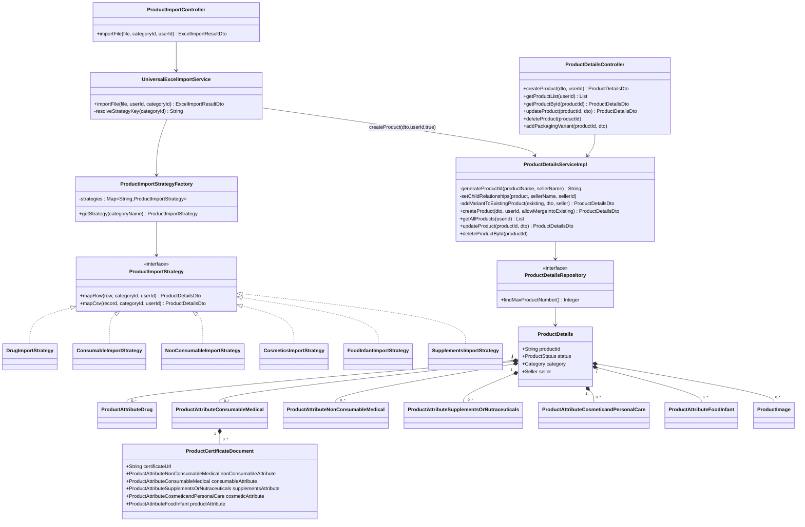
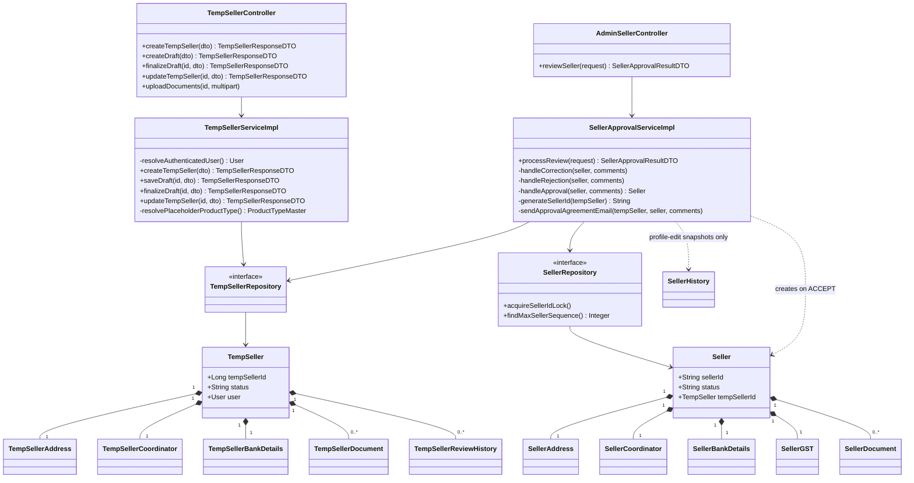
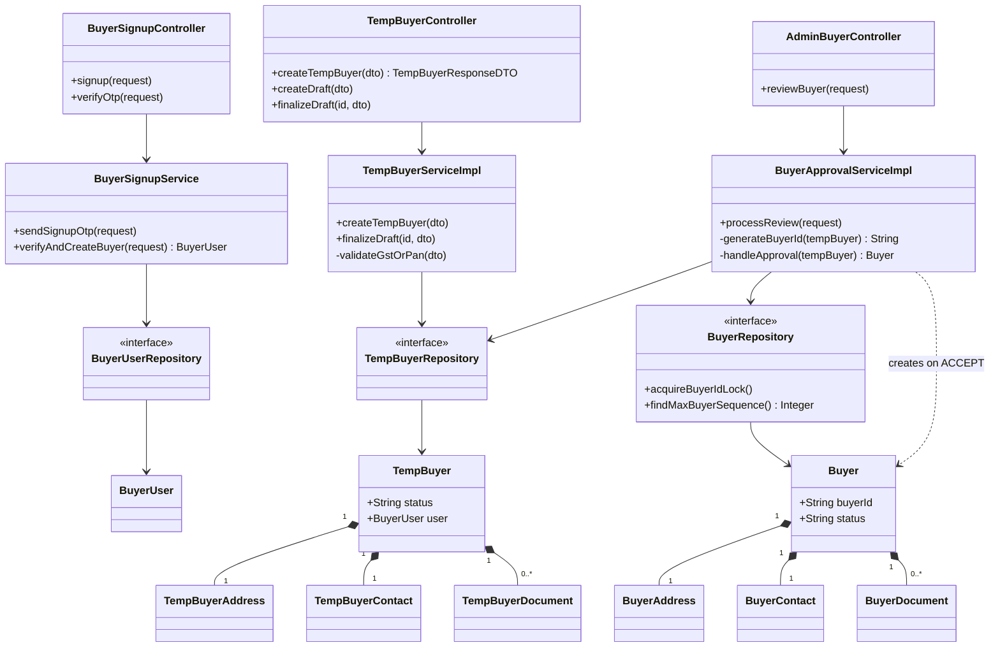
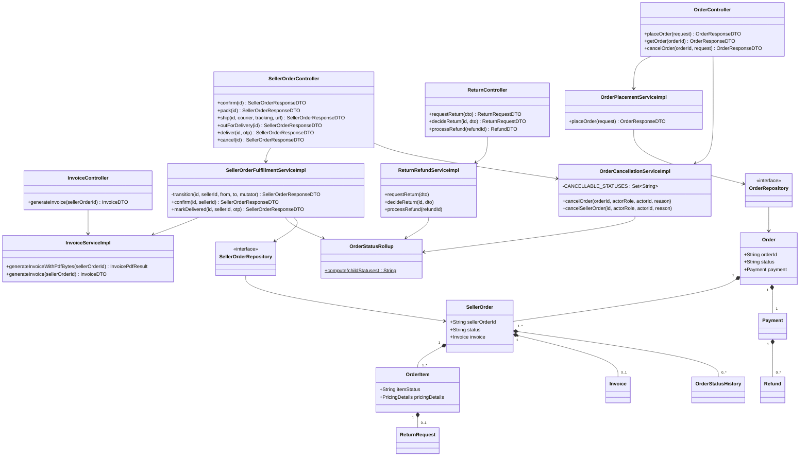
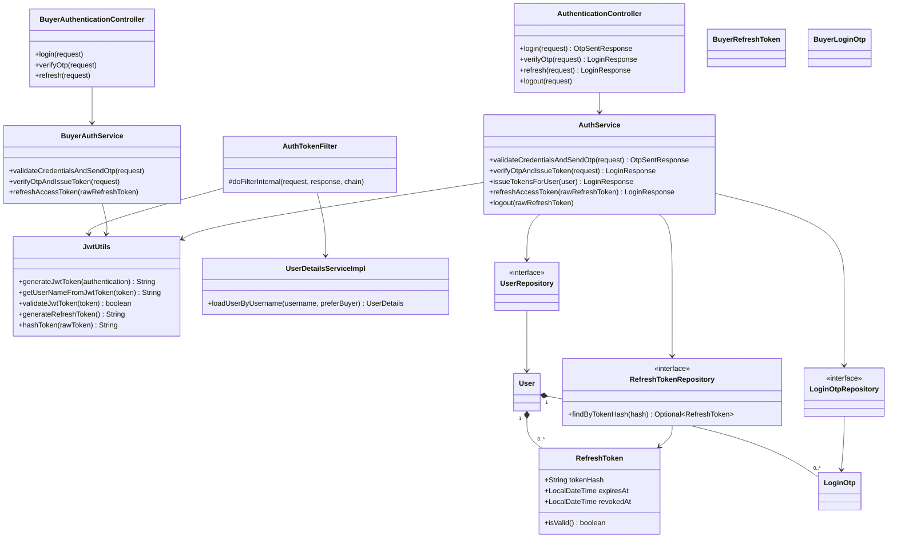
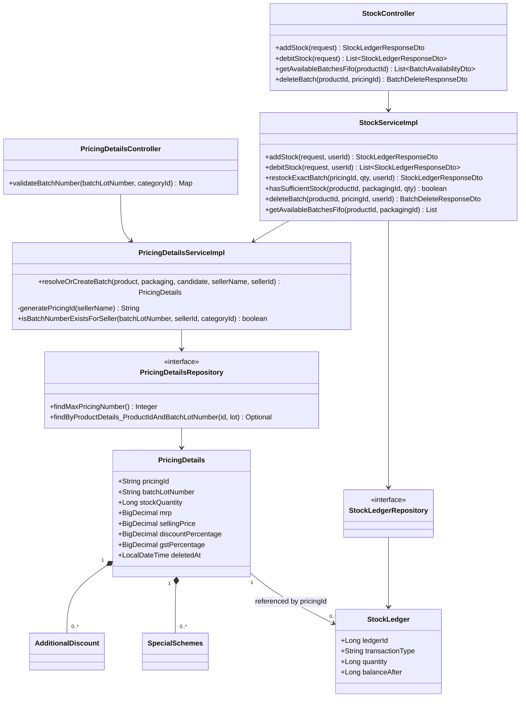
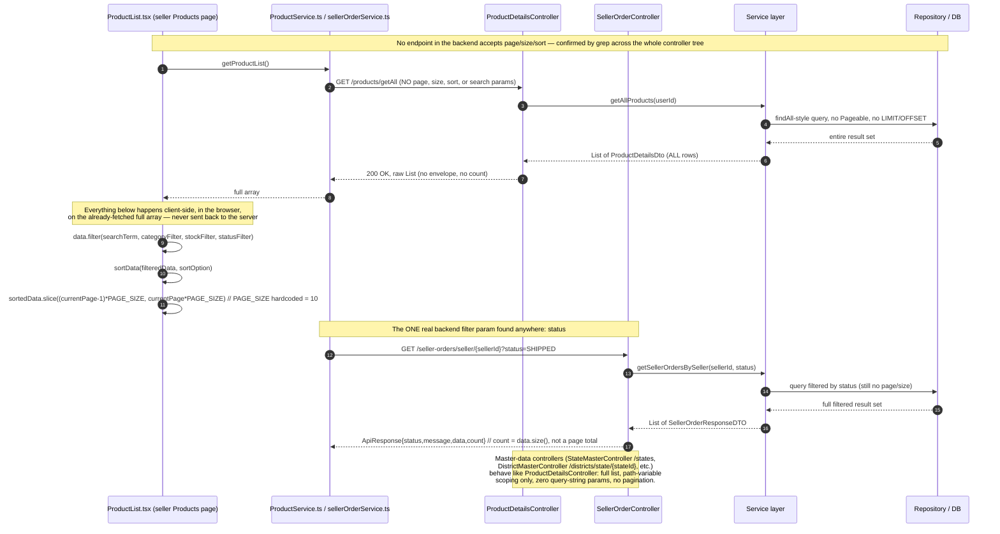

# Low-Level Design Document — Pharma Aggregator Marketplace

## 1. Document Control

| Field | Value |
|---|---|
| Document | Low-Level Design (LLD) |
| System | Pharma Aggregator Marketplace (`pharma-aggregator-server` Spring Boot backend + `pharma-aggregator-client` Next.js 16 frontend) |
| Scope | Full-stack: backend domain modules (product, order, seller/buyer onboarding, security, admin), and frontend routing/services/schemas/auth layers that consume them |
| Backend repo | `D:/Tiameds_MarketPlace/Backend/pharma-aggregator-server` (Java 17/21, Spring Boot 4.0.1 parent, PostgreSQL, Flyway, AWS S3, Twilio Verify) |
| Frontend repo | `D:/Tiameds_MarketPlace/Frontend/pharma-aggregator-client` (Next.js 16 App Router, React 19, TypeScript, Tailwind v4 + MUI + Bootstrap) |
| Backend base path | `/api/v1` (`server.servlet.context-path`, `src/main/resources/application.yml`) |
| Frontend API base | `NEXT_PUBLIC_API_URL` (`.env`: `http://localhost:8080/api/v1`) |
| Source basis | Direct reads of controller/service/entity/repository source files (paths cited inline) plus a prior structured discovery pass over both repos; every claim below is grounded in a cited file — nothing is inferred beyond what the code shows |
| Status labels used throughout | **IMPLEMENTED** (verified in source) · **PARTIALLY IMPLEMENTED** (exists but incomplete) · **NOT IDENTIFIED** (searched, not found — search basis stated) · **RECOMMENDATION — NOT CURRENTLY IMPLEMENTED** (a suggestion, never conflated with fact) |
| Known material gaps this document is honest about | No admin UI exists in the frontend (`src/services/admin/TestService.ts` is a one-line stub); Spring Security's active rule is `auth.anyRequest().permitAll()` (`config/SecurityConfig.java`) so almost all authorization is application-code-level, not framework-level; the backend has test-scope dependencies declared but effectively one smoke test; several frontend service calls target non-existent or malformed backend routes (documented in §7) |

---

## 2. Module Overview

The system is organized as 13 backend domain modules (one Spring Boot monolith, package-scoped) and 5 frontend cross-cutting layers. Each module table below lists package/path, responsibility, and its controllers/services/repositories/entities/DTOs/validators/dependencies as verified in source.

### M1 — Master / Reference Data

| Aspect | Detail |
|---|---|
| Package/Path | `controller/master`, `service/master`, `service/serviceImpl/master`, `entity/master`, `repository/master` |
| Responsibility | Read-only lookups for geography (State→District→Taluka) and seller/buyer/company/product/document type dropdowns consumed by registration wizards |
| Controllers | `BuyerTypeMasterController`, `CompanyTypeMasterController`, `DistrictMasterController`, `DocumentTypeMasterController`, `ProductTypeMasterController`, `SellerTypeMasterController`, `StateMasterController`, `TalukaMasterController` — all `GET`-only, no writes anywhere in the package |
| Services | One `*MasterService`/`*MasterServiceImpl` pair per entity; `ProductTypeMasterServiceImpl` is the only one that filters `isActive=true` via a stream (the rest either use `findAllByIsActiveTrue` — `BuyerTypeMasterService` — or return all rows with no filter — Company/Seller/Document type services) |
| Repositories | `StateMasterRepository`, `DistrictMasterRepository` (`findByStateStateId`), `TalukaMasterRepository` (`findByDistrictDistrictId`), plus one per remaining entity; `RoleMasterRepository` lives under `repository/auth`, not `repository/master` |
| Entities | `StateMaster` (`tbl_state_master`), `DistrictMaster` (`tbl_district_master`), `TalukaMaster` (`tbl_taluka_master`), `CompanyTypeMaster`, `SellerTypeMaster`, `ProductTypeMaster`, `BuyerTypeMaster` (FK `mandatoryDocumentTypeId` → `DocumentTypeMaster`), `DocumentTypeMaster`, `RoleMaster` (`tbl_role_master`, no controller anywhere) |
| DTOs | `*ResponseDTO` per entity; `BuyerTypeMasterController` is the only one wrapped in the shared `ApiResponse{status,message,data,count}` envelope — every sibling controller returns a raw `List` |
| Validators | None (read-only) |
| Dependencies | Consumed by M5 (Seller registration wizard), M7 (Buyer registration wizard), M2 (Category chain) |

### M2 — Product Catalog Core

| Aspect | Detail |
|---|---|
| Package/Path | `controller/product` (core), `service/product/productImpl`, `service/product/util`, `entity/product` |
| Responsibility | Multi-category product CRUD (Drug, Consumable Medical, Non-Consumable Medical, Supplements/Nutraceuticals, Cosmetic & Personal Care, Food & Infant Nutrition), Strategy-pattern bulk Excel/CSV import, per-category document/certificate/image upload |
| Controllers | `ProductDetailsController` (`/products/create`, `/getAll`, `/getById/{id}`, `/all`, `/update/{id}`, `/delete/{id}`, `/{id}/packaging`, `/subcategories/{categoryId}`), `ProductImportController` (`/products/import` — active), `ExcelProductImportController` (entirely commented out — dead), `ProductCategoryController`, `ProductImageController`, `ProductDocumentController`, `ProductUserManualController`, `NutritionalInformationImageController` |
| Services | `ProductDetailsServiceImpl` (core CRUD + merge logic), `UniversalExcelImportService` (import orchestrator), `ProductImportStrategyFactory` (bean-name lookup), `ProductImageService`, `ProductDocumentService`, `ProductUserManualServiceImpl` |
| Repositories | `ProductDetailsRepository` (incl. `findMaxProductNumber`), `ProductImageRepository`, `ProductCertificateDocumentRepository`, `ProductUserManualRepository`, one repo per attribute entity |
| Entities | `ProductDetails` (`tm_product_details`), `ProductAttributeDrug`, `ProductAttributeConsumableMedical`, `ProductAttributeNonConsumableMedical`, `ProductAttributeSupplementsOrNutraceuticals`, `ProductAttributeCosmeticandPersonalCare`, `ProductAttributeFoodInfant`, `ProductImage`, `ProductCertificateDocument` (5 nullable FKs, one per attribute type, no discriminator), `ProductUserManual` (Drug-only 1:1) |
| DTOs | `ProductDetailsDto` (shared create/update payload across all 6 categories) |
| Validators | Per-category "at least one certification" / "category FK non-null" checks inline in `ProductDetailsServiceImpl.setChildRelationships` (not a separate validator class) |
| Dependencies | M1 (Category, GST%), M3 (dosage forms, device categories, therapeutic categories, storage conditions), M5/M6 (Seller ownership), M11 (S3, Authentication principal) |

### M3 — Product Lookup / Attribute Masters

| Aspect | Detail |
|---|---|
| Package/Path | `controller/product` (lookup controllers), `service/product/MasterService`, `entity/product`, `entity/product/MedicalDeviceProductMaster`, `entity/product/CosmeticPersonalCareMasters` |
| Responsibility | ~20 independent lookup tables feeding category-specific product forms: `Category` (root), `DosageForm`, `PackType`, `TherapeuticCategoryMaster`/`TherapeuticSubcategoryMaster`, `Molecule`, `StorageConditionMaster`, `DeviceCategory`/`DeviceSubCategory`, `Certification`, `CountryMaster`, `HairType`/`SkinType`/`IntendedUseArea`, `AgeGroupMaster`, `Flavour`, `GstPercentageMaster`, `ProductFormMaster` vs. `ProductsFormMaster` (two distinct near-identically-named entities — do not conflate) |
| Controllers | `MastersController` (umbrella, 11 GETs, `/masters/**`), `StorageConditionController` (separate DTO shape from `/masters/storagecondition`), `TherapeuticController`, `DosageFormController`, `MoleculeController`, `PackTypeController`, `PackTypeUnitMasterController`, `AgeGroupController`, `FlavourController` (only CRUD-complete lookup controller), `NetQuantityUnitController` (returns raw entities, not DTOs), `ServingSizeUnitController`, `GstPercentageMasterController`, `ProductFormMasterController`, `ProductCategoryController`, `DrugCategoryController`, `StrengthUnitController` |
| Services | `MasterService` (god-service, 9 injected repositories, hand-rolled entity→DTO mapping) plus one focused service per remaining controller |
| Repositories | One JpaRepository per entity; `DimensionRepository` and the `MedicalDeviceType` repository exist but have **no controller endpoint** — reachable only from import-strategy/mapper code |
| Entities | Listed above; `Category` (`tm_category`) is the root FK target for most others |
| DTOs | Inconsistent shapes: raw entity (NetQuantityUnitController), `ApiResponse` envelope (Gst/PackTypeUnit/StrengthUnit controllers), raw `List<Dto>` (AgeGroup/DrugCategory) |
| Validators | None (read-only except Flavour CRUD) |
| Dependencies | Consumed by M2 |

### M4 — Stock & Pricing (Inventory)

| Aspect | Detail |
|---|---|
| Package/Path | `controller/product/StockController`, `controller/product/PricingDetailsController`, `service/product/productImpl/StockServiceImpl`, `service/product/productImpl/PricingDetailsServiceImpl`, `entity/product/StockLedger`, `entity/product/PricingDetails` |
| Responsibility | Batch/lot-level inventory: each physical batch is a `PricingDetails` row (own MRP/selling price/discount/GST/expiry/quantity); every movement is journaled as an immutable `StockLedger` row |
| Controllers | `StockController` (`/stock/add`, `/add-batches`, `/debit`, `/{productId}/total`, `/{productId}/batches`, `/{productId}/debited-total`, `/{productId}/added-total`, `DELETE /{productId}/batches/{pricingId}`), `PricingDetailsController` (`/pricing/validateBatchNumber`) |
| Services | `StockServiceImpl` (FIFO debit, restock-or-create dispatch, soft-delete), `PricingDetailsServiceImpl` (`resolveOrCreateBatch`, `generatePricingId`) |
| Repositories | `PricingDetailsRepository` (pessimistic-locked FIFO queries, `findMaxPricingNumber`, batch-exists-for-seller check), `StockLedgerRepository` (sum-by-type, lookups by reference/pricing id) |
| Entities | `PricingDetails` (`tm_pricing_details`, `@SQLRestriction("deleted_at IS NULL")`), `StockLedger` (`tbl_stock_ledger`, append-only), `AdditionalDiscount`/`SpecialSchemes` (persisted, cascade child of `PricingDetails`, never read by any pricing computation) |
| DTOs | `StockInRequestDto`, `StockDebitRequestDto`, `StockLedgerResponseDto`, `BatchAvailabilityDto`, `BatchDeleteResponseDto` |
| Validators | Inline in `StockServiceImpl`/`PricingDetailsServiceImpl` (packaging-required-if-multi-variant, expiry-match-on-restock, pre-lock sufficiency check) |
| Dependencies | M2 (`ProductDetails`, `PackagingDetails` FK), M5/M6 (seller ownership), consumed downstream by M9 (order debit/restock) |

### M5 — Seller Signup & Temp-Seller Registration (OTP pipeline)

| Aspect | Detail |
|---|---|
| Package/Path | `controller/auth/SignupController`, `controller/temp/seller`, `service/serviceImpl/temp/seller`, `entity/temp/seller` |
| Responsibility | Signup-first identity (`/auth/signup` → bare `User` row) followed by a much heavier `TempSeller` business registration staged for admin review |
| Controllers | `SignupController` (`/auth/signup`, `/verify-otp`), `TempSellerController` (create/read/update/delete/draft/finalize/verify/upload, ~25 endpoints), `TempSellerEmailOtpController`, `SMSOTPController` (Twilio-delegated), `IndependentEmailController` |
| Services | `SignupService`, `TempSellerServiceImpl` (`resolveAuthenticatedUser`, `createTempSeller`, `saveDraft`, `finalizeDraft`, `updateTempSeller`), `TempSellerEmailOtpService`, `TwilioOTPService` |
| Repositories | `TempSellerRepository`, `TempSellerReviewHistoryRepository`, `SellerTermsRepository` |
| Entities | `TempSeller` (`tbl_temp_seller`, 1:1 nullable `User` FK), `TempSellerAddress`, `TempSellerBankDetails`, `TempSellerCoordinator`, `TempSellerDocument` (`@PrePersist`/`@PreUpdate` computes `licenseStatus`), `TempSellerReviewHistory`, `TempSellerEmailOtp`, `PhoneOTP`, `SellerTerms`, `TempSellerStatus` (plain `String` constants, not a JPA enum) |
| DTOs | `TempSellerRequestDTO` (full, `@Valid`), `TempSellerDraftRequestDTO` (all-optional, no validation) |
| Validators | `SellerTypeFieldValidator` (hard-throws on bad master refs — run on create/finalize, skipped on draft save) |
| Dependencies | M1 (types/geography), M11 (JWT-authenticated user required), S3, SMTP, Twilio Verify |

### M6 — Seller Approval & Profile

| Aspect | Detail |
|---|---|
| Package/Path | `controller/admin/AdminSellerController`, `service/serviceImpl/admin/SellerApprovalServiceImpl`, `controller/seller/profile`, `service/profile/SellerProfileService`, `entity/seller`, `entity/seller/profile`, `entity/seller/history` |
| Responsibility | Two independent pipelines: (a) `TempSeller`→`Seller` initial-registration approval (ACCEPT/REJECT/CORRECTION state machine); (b) post-approval profile-edit requests (`PendingSeller`, auto-approved or admin-approved) |
| Controllers | `AdminSellerController` (`POST /admin/sellers/review`), `AdminSellerApprovalController` (`/admin/seller-requests/**`), `SellerProfileController` (`/sellers/**`) |
| Services | `SellerApprovalServiceImpl` (`processReview`, `handleApproval`, `generateSellerId`, two-phase S3 migration), `SellerProfileService` (`requiresAdminApproval`, `autoApproveUpdate` via raw `EntityManager` updates, `approveSellerUpdate`) |
| Repositories | `SellerRepository` (advisory-lock ID generation), `PendingSellerRepository`, `PendingSellerDocumentServiceImpl`'s repo, `SellerHistoryRepository` |
| Entities | `Seller` (`tbl_seller`), `SellerAddress`, `SellerCoordinator`, `SellerBankDetails`, `SellerGST`, `SellerDocument`, `SellerHistory` (insert-only audit snapshot), `PendingSeller` (`tbl_pending_seller`, status PENDING/AUTO_APPROVED/APPROVED/REJECTED/APPROVAL_FAILED), `PendingSellerDocument` |
| DTOs | `SellerApprovalRequestDTO`/`ResultDTO`, `SellerEditRequest`, `UpdateSellerProfileRequest` |
| Validators | `requiresAdminApproval()` diff logic (sellerName/address/licenses/GST/bank → requires approval; coordinator/companyType/phone/email/website/terms → auto-approve) |
| Dependencies | M5 (source `TempSeller`), M1, M11, S3, SMTP |

### M7 — Buyer Signup, Login & Temp-Buyer Registration

| Aspect | Detail |
|---|---|
| Package/Path | `controller/buyer`, `controller/temp/buyer`, `controller/admin/AdminBuyerController`, `service/buyer`, `service/serviceImpl/temp/buyer`, `service/serviceImpl/admin/BuyerApprovalServiceImpl`, `entity/buyer`, `entity/temp/buyer` |
| Responsibility | Fully isolated buyer identity stack (own tables/services/JWT client) mirroring M5/M6's structure end-to-end, including a parallel admin-approval state machine — **not** a simplified/approval-free variant |
| Controllers | `BuyerSignupController`, `BuyerAuthenticationController`, `BuyerProfileController`, `TempBuyerController` (~25 endpoints, draft/finalize/verify/upload), `AdminBuyerController` (`POST /admin/buyers/review`) |
| Services | `BuyerSignupService`, `BuyerAuthService`, `BuyerProfileService`, `TempBuyerServiceImpl`, `TempBuyerDocumentServiceImpl`, `TempBuyerContactService`, `BuyerRequestIdGeneratorService`, `BuyerApprovalServiceImpl` |
| Repositories | `BuyerUserRepository`, `BuyerLoginOtpRepository`, `BuyerSignupOtpRepository`, `BuyerRefreshTokenRepository`, `TempBuyerRepository`, `TempBuyerContactRepository`, `TempBuyerDocumentRepository`, `TempBuyerReviewHistoryRepository`, `BuyerRepository` (advisory lock key 54321) |
| Entities | `BuyerUser`, `BuyerSignupOtp`, `BuyerLoginOtp`, `BuyerRefreshToken`, `TempBuyer` (`TempBuyerStatus`: DRAFT/SUBMITTED/UNDER_REVIEW/APPROVED/CORRECTION_REQUIRED/REJECTED/SUSPENDED — `UNDER_REVIEW`/`SUSPENDED` declared but never set), `TempBuyerAddress`, `TempBuyerContact`, `TempBuyerDocument`, `TempBuyerReviewHistory`, `Buyer`, `BuyerAddress`, `BuyerContact`, `BuyerDeliveryAddress` (no controller/service found), `BuyerDocument` |
| DTOs | `BuyerSignupRequest`, `TempBuyerRequestDTO`, `TempBuyerDraftRequestDTO`, `BuyerApprovalRequestDTO` |
| Validators | GST-or-PAN-required-if-other-blank (`TempBuyerServiceImpl` lines ~512-521), password strength regex (`BuyerSignupRequest`) |
| Dependencies | M1, M11, S3, SMTP |

### M8 — Admin Controllers (Buyer/Seller/Order review & override)

| Aspect | Detail |
|---|---|
| Package/Path | `controller/admin/{AdminBuyerController,AdminSellerController,AdminOrderController}` |
| Responsibility | Single-endpoint admin actions: buyer/seller registration review, and an order-status force-override that bypasses the normal fulfillment state machine |
| Controllers | `AdminBuyerController` (`POST /admin/buyers/review`), `AdminSellerController` (`POST /admin/sellers/review`), `AdminOrderController` (`GET /admin/orders`, `POST /admin/orders/{orderId}/override`) |
| Services | Delegates to M6's `SellerApprovalServiceImpl`, M7's `BuyerApprovalServiceImpl`, and M9's `OrderQueryServiceImpl.adminOverride` |
| Entities | Shared with M6/M7/M9 |
| Dependencies | M6, M7, M9 |
| Frontend consumer | **NOT IDENTIFIED** — grepped the entire `pharma-aggregator-client/src` tree for `/admin/buyers`, `/admin/sellers`, `/admin/orders`: zero matches. No admin route/page/component exists anywhere in the Next.js app. These endpoints are backend-only or consumed by an undocumented external admin client (only inferred from an `app.admin-frontend-url` property, never located) |

### M9 — Order, Payment, Invoice, Return/Refund

| Aspect | Detail |
|---|---|
| Package/Path | `controller/order`, `service/order`, `service/order/orderImpl`, `service/order/support`, `entity/order` |
| Responsibility | Buyer checkout → per-seller `SellerOrder` fan-out → seller fulfillment state machine (OTP-gated delivery) → invoice generation on delivery → cancellation/return/refund; COD-only, no payment gateway |
| Controllers | `OrderController`, `SellerOrderController`, `InvoiceController`, `PaymentController`, `ReturnController` |
| Services | `OrderPlacementServiceImpl`, `SellerOrderFulfillmentServiceImpl`, `OrderCancellationServiceImpl`, `ReturnRefundServiceImpl`, `InvoiceServiceImpl`, `PaymentServiceImpl` (read-only), `OrderQueryServiceImpl` |
| Repositories | `OrderRepository` (advisory lock 98765), `PaymentRepository` (advisory lock 98766), `SellerOrderRepository`, `OrderItemRepository`, `InvoiceRepository`, `RefundRepository`, `ReturnRequestRepository`, `OrderStatusHistoryRepository` |
| Entities | `Order`, `OrderStatus` (PLACED/PARTIALLY_SHIPPED/SHIPPED/DELIVERED/CANCELLED — plain `String` constants), `SellerOrder`, `SellerOrderStatus` (PLACED→CONFIRMED→PACKED→SHIPPED→OUT_FOR_DELIVERY→DELIVERED, plus CANCELLED/RETURN_*/RETURNED/REFUNDED — `REFUNDED` never assigned), `OrderItem`, `OrderStatusHistory`, `Payment`, `PaymentStatus` (only `SUCCESS` ever assigned), `Refund`, `RefundStatus`, `ReturnRequest`, `ReturnStatus`, `Invoice` |
| DTOs | `PlaceOrderRequestDTO` (`idempotencyKey`), `CancelOrderRequestDTO`, `AdminOrderOverrideRequestDTO` |
| Validators | `OrderStatusRollup.compute` (pure function), `SellerOrderFulfillmentServiceImpl.transition` (private state-machine guard) |
| Dependencies | M4 (stock debit/restock), M6/M7 (Seller/Buyer FK), M10 (accepted quote → order), M11, S3 (invoices) |

### M10 — Quote Request (RFQ / Price Request)

| Aspect | Detail |
|---|---|
| Package/Path | `controller/quote`, `service/quote`, `entity/quote` |
| Responsibility | Single-table (`tbl_quote_request`) negotiation flow: buyer/guest submits → seller quotes once → buyer accepts/rejects once → downstream order placement |
| Controllers | `BuyerQuoteRequestController` (create/list/accept/reject), `SellerQuoteRequestController` (list/respond) |
| Services | `QuoteRequestService` (`create`, `respond`, `accept`, `reject`, `resolveOrCreateGuestBuyer`) |
| Repositories | `QuoteRequestRepository` |
| Entities | `QuoteRequest` (`requestType`: PRICE_REQUEST/RFQ discriminator; `status`: PENDING→QUOTED→ACCEPTED/REJECTED→ORDER_PLACED, `EXPIRED` never set) |
| DTOs | `QuoteRequestCreateDTO`, `SellerQuoteResponseDTO`, `QuoteRequestResponseDTO` |
| Validators | Bean-validation on `QuoteRequestCreateDTO` (productId/requestType/quantity/contactPerson/phone/email only) |
| Dependencies | M2 (Product FK), M7 (guest `BuyerUser` auto-provisioning), M9 (downstream order placement writes `ORDER_PLACED`/`orderId` back onto this entity) |

### M11 — Security & Auth Infrastructure

| Aspect | Detail |
|---|---|
| Package/Path | `security`, `config/SecurityConfig.java`, `config/CrossConfig.java`, `exception/*` |
| Responsibility | JWT issuance/validation, opaque rotating refresh tokens, password hashing, CORS, global exception mapping |
| Key classes | `JwtUtils` (HS256, `Keys.hmacShaKeyFor`), `AuthTokenFilter` (`preferBuyer` dual-identity resolution), `UserDetailsServiceImpl`, `UserDetailsImpl`, `AuthEntryPointJwt`, `SecurityConfig` (`anyRequest().permitAll()` live; role-scoped rule commented out) |
| Controllers | `AuthenticationController` (`/authentication/**`), `AuthController` (`/auth/reset-password`, `/forgot-password`, etc.), `BuyerAuthenticationController` |
| Services | `AuthService` (seller), `UserService`, `BuyerAuthService` |
| Repositories | `UserRepository`, `RefreshTokenRepository`, `LoginOtpRepository`, `RoleMasterRepository` |
| Entities | `User`, `RefreshToken` (`tokenHash` = SHA-256 of raw token), `LoginOtp` |
| Exception handling | `GlobalExceptionHandler` (`@RestControllerAdvice`) + `GlobalLogInExceptionHandler` (second, overlapping `@ControllerAdvice`) + `GlobalResponseHandler` (`ResponseBodyAdvice`, wraps 2xx bodies in `ApiResponse`) |
| Dependencies | Consumed by every other backend module |

### M12 — Database Config, Migrations & Seed Data

| Aspect | Detail |
|---|---|
| Package/Path | `src/main/resources/application*.yml`, `src/main/resources/db/migration` (Flyway), `src/main/resources/db/seed` (manual), `docs/*.sql` (manual, non-Flyway) |
| Responsibility | PostgreSQL datasource config per profile (dev/test/prod), Flyway-managed schema/seed for 3 tables, manual ad-hoc scripts for everything ADDED after initial `ddl-auto=update` dev/test convenience |
| Flyway migrations | `V1__buyer_type_and_document_type_seed.sql`, `V2__add_buyer_user_password_temporary_column.sql`, `V3__create_legal_content_table.sql` |
| Manual scripts | 8 files under `docs/` (`migration_add_*`, `seed_*`) — none follow Flyway's `V<n>__` convention, all outside Flyway's configured `classpath:db/migration` location, all headers instruct manual execution |
| `ddl-auto` | `update` (dev, test) vs `validate` (prod) — prod's `validate` is why the manual `docs/migration_*.sql` scripts exist |
| Dependencies | Underpins every backend module |

### M13 — Infrastructure & CI/CD

| Aspect | Detail |
|---|---|
| Package/Path | `Dockerfile`, `docker-compose.yml`, `deploy/tiamed-aggregator-task-defination.json`, `.github/workflows/*.yml` |
| Responsibility | Multi-stage Docker build (Maven/Temurin-17 → `eclipse-temurin:17-jre-alpine`), AWS ECS Fargate deployment for a `test` environment, GitHub Actions build+deploy pipeline (tests explicitly skipped via `-DskipTests`) |
| Cloud services evidenced | AWS S3 (SDK v2), AWS ECS Fargate, AWS ECR, AWS RDS (dev profile only), AWS Secrets Manager, AWS CloudWatch Logs, Twilio Verify |
| CI | `.github/workflows/qodana_code_quality.yml` (static analysis only) and `.github/workflows/tests.yml` (named for tests, actually a build+deploy pipeline — `mvn -DskipTests clean install`, no test execution anywhere in CI despite the filename) |
| Dependencies | Packages/deploys all backend modules |

### M14 — Frontend Routing, Pages & Layouts

| Aspect | Detail |
|---|---|
| Package/Path | `src/app/**` (App Router) |
| Responsibility | Obfuscated-slug role sections (`login_fhy26sb`, `seller_7a3b9f2c`, `buyer_e8d45a1b`), auth-guard layouts, onboarding-gate components |
| Key files | `seller_7a3b9f2c/layout.tsx` (client-side guard + back-button trap + inactivity timer wiring), `buyer_e8d45a1b/dashboard/layout.tsx` (client-side guard, modal-based), `src/proxy.ts` (dead — wrong filename/export, never wired as Next.js middleware) |
| Dependencies | M15, M16, M17 |

### M15 — Frontend API Client Layer & Services

| Aspect | Detail |
|---|---|
| Package/Path | `src/lib/api.ts`, `src/lib/buyerApi.ts`, `src/utils/api.ts`, `src/services/**` |
| Responsibility | Three independently-evolved axios clients: `lib/api.ts` (seller, full 401-refresh queue), `lib/buyerApi.ts` (buyer, structurally identical but isolated token set), `utils/api.ts` (used by every `product/*` service, Bearer-attach only, **no** refresh handling) |
| Dependencies | Every backend module's REST surface; M18 for `NEXT_PUBLIC_API_URL` |

### M16 — Frontend Validation Schemas & Forms

| Aspect | Detail |
|---|---|
| Package/Path | `src/schema/**` (Zod), forms under `src/app/**/components` |
| Responsibility | Per-domain Zod schemas mirroring `src/services/<domain>/`; only a minority of consumers use `react-hook-form` + `zodResolver` — most product-category forms and both registration wizards call `schema.parse()`/`safeParse()` by hand inside `useState`-driven submit handlers |
| Dependencies | M14 (forms), M15 (submission target) |

### M17 — Frontend Auth, Session & State Management

| Aspect | Detail |
|---|---|
| Package/Path | `src/services/seller/authService.ts`, `src/services/buyer/buyerAuthService.ts`, `src/hooks/useSessionManager.ts`, `src/utils/auth.ts` |
| Responsibility | Token storage/refresh orchestration, 30-minute seller inactivity auto-logout, manual JWT payload decode (`atob()`, no signature verification client-side — by design, verification is server-side) |
| Dependencies | M15 |

### M18 — Frontend Build, Env & Deployment Config

| Aspect | Detail |
|---|---|
| Package/Path | `next.config.ts` (`output: 'standalone'`), `Dockerfile`, `docker-compose.yml`, `.env`/`.env.example` |
| Responsibility | Standalone Next.js build packaged into a 3-stage Alpine Docker image; `.env.example` and `docs/*.md` document a dead env var (`NEXT_PUBLIC_BACKEND_URL`) never read by any `src/` file — only `NEXT_PUBLIC_API_URL` is live |
| Dependencies | Packages M14-M17 |

---

## 3. Class Diagrams / Component Diagrams

Six major modules, each as a Controller → Service → Repository → Entity chain with real class names verified against source.

### 3.1 Product Catalog Core (Strategy pattern for import)



### 3.2 Seller Onboarding & Approval



### 3.3 Buyer Onboarding & Approval



### 3.4 Order Lifecycle



### 3.5 Security / Auth Infrastructure



### 3.6 Stock & Pricing



---

## 4. Sequence Diagrams

Eight end-to-end flows, traced directly against source and verified by opening the cited controller/service files. Each diagram was generated from an actual read-through of the code path, not inferred from naming.

### 4.1 Authentication / Login (Seller & Buyer)

```mermaid
sequenceDiagram
    autonumber

    participant Browser as Browser (localStorage + document.cookie)
    participant SUI as Seller UI (LoginModals.tsx)
    participant SAuth as sellerAuthService.ts
    participant SApi as lib/api.ts (axios, seller)
    participant SCtrl as AuthenticationController (/authentication)
    participant SSvc as AuthService (seller, backend)
    participant Jwt as JwtUtils (shared, HS256)
    participant Mail as EmailService (SMTP, shared)
    participant SDB as tbl_user / tbl_login_otp / tbl_refresh_tokens
    participant AF as AuthTokenFilter (shared, on every request)

    participant BUI as Buyer UI (LoginForm / LoginOtpStep)
    participant BAuth as buyerAuthService.ts
    participant BApi as lib/buyerApi.ts (axios, buyer)
    participant BCtrl as BuyerAuthenticationController (/buyer/authentication)
    participant BSvc as BuyerAuthService (buyer, backend)
    participant BDB as tbl_buyer_user / tbl_buyer_login_otp / tbl_buyer_refresh_tokens

    Note over SUI,SDB: SELLER LOGIN — src/app/modals/LoginModals/LoginModals.tsx is the REAL, wired-up seller login UI.<br/>src/app/(auth)/login_fhy26sb/** is a separate, orphaned scaffold (fetch('/api/seller/...') routes that don't exist) — not part of this flow.

    rect rgb(235,245,255)
    Note over Browser,SDB: STEP 1 — password login, sends OTP
    Browser->>SUI: submit username + password
    SUI->>SAuth: sellerAuthService.login(credentials)
    SAuth->>SApi: POST /authentication/login {username,password}
    SApi->>SCtrl: forwarded (Bearer attach interceptor: no token yet, so no header)
    SCtrl->>SSvc: validateCredentialsAndSendOtp(loginRequest)
    SSvc->>SDB: findByUsername(username)
    SDB-->>SSvc: User row
    alt account locked or inactive
        SSvc-->>SCtrl: AccountLockedException / AccountInactiveException
        SCtrl-->>SApi: 403 {status,error,message}
    else credentials checked
        SSvc->>SSvc: AuthenticationManager.authenticate() — BCrypt check via Spring Security
        alt bad password
            SSvc->>SDB: increment failedLoginAttempts (lock account at 5 — MAX_LOGIN_FAILED_ATTEMPTS)
            SSvc-->>SCtrl: InvalidCredentialsException
            SCtrl-->>SApi: 401 {status,error,message}
        else password OK
            SSvc->>SDB: resetFailedLoginAttempts; invalidateAllOtpsForUser(user)
            SSvc->>SDB: save new LoginOtp (6-digit, isUsed=false, expiresAt=+5min, OTP_EXPIRY_MINUTES)
            SSvc->>Mail: sendCoordinatorOtp(user.username, otpCode)
            SSvc-->>SCtrl: OtpSentResponse{message, username}
            SCtrl-->>SApi: 200 {status:"SUCCESS", data:{message,username}}
            SApi-->>SAuth: response (checked for a nested 200-wrapped 401 failure shape)
            SAuth->>Browser: localStorage.setItem("otpUsername", username)
            SAuth-->>SUI: OtpSentResponse — show OTP entry screen
        end
    end
    end

    rect rgb(235,255,240)
    Note over Browser,SDB: STEP 2 — OTP verification, JWT + refresh-token issuance
    Browser->>SUI: submit 6-digit OTP
    SUI->>SAuth: sellerAuthService.verifyOtp({username, otp})
    SAuth->>SApi: POST /authentication/verify-otp {username, otp}
    SApi->>SCtrl: forwarded
    SCtrl->>SSvc: verifyOtpAndIssueToken(request)
    SSvc->>SDB: findActiveOtpByUser(user) — unused AND unexpired AND unlocked
    alt no active OTP found
        SSvc-->>SCtrl: OtpExpiredException
        SCtrl-->>SApi: 410 Gone
    else OTP row found
        alt otp.otpCode != request.otp
            SSvc->>SDB: incrementFailedAttempts; lock OTP row at 3 (MAX_OTP_FAILED_ATTEMPTS)
            SSvc-->>SCtrl: OtpInvalidException (401) or OtpLockedException (429, must login again)
            SCtrl-->>SApi: 401 / 429 {status,error,message}
        else OTP matches
            SSvc->>SDB: markOtpAsUsed(otpId); updateLastLogin(userId, now)
            SSvc->>Jwt: generateJwtToken(authentication)
            Note right of Jwt: HS256, key = HMAC(app.jwt.secret).<br/>Claims: sub=username, iat, exp only — NO roles/userId embedded.<br/>app.jwt.expiration in application-dev.yml = 86400000ms (24h, commented as a "temporary" override of an intended 30 min)
            Jwt-->>SSvc: accessToken (signed JWT)
            SSvc->>Jwt: generateRefreshToken()
            Note right of Jwt: 64 random bytes (SecureRandom), base64url-encoded — an OPAQUE token, not a JWT
            Jwt-->>SSvc: rawRefreshToken
            SSvc->>Jwt: hashToken(rawRefreshToken) — SHA-256
            SSvc->>SDB: save RefreshToken{tokenHash (raw never stored), expiresAt=now+app.jwt.refresh-expiration (7 days)}
            SSvc-->>SCtrl: LoginResponse{accessToken, refreshToken(raw), userId, username, roles, passwordTemporary, message}
            SCtrl-->>SApi: 200 {status:"SUCCESS", data:LoginResponse}
            SApi-->>SAuth: response
            alt loginData.passwordTemporary === true
                SAuth->>Browser: do NOT store accessToken/refreshToken; clear any stale ones; deleteCookie("token")
                SAuth-->>SUI: caller routes to first-time password-reset step (POST /auth/reset-password)
            else normal login
                SAuth->>Browser: localStorage.setItem(accessToken, refreshToken, user, lastLogin)
                SAuth->>Browser: decode JWT payload via atob() to read exp → localStorage.setItem("tokenExpiresAt", exp*1000)
                SAuth->>Browser: setCookie("token", accessToken, 1 day) — plain document.cookie, NOT httpOnly, SameSite=Lax
                SAuth-->>SUI: LoginResponse — redirect into /seller_7a3b9f2c/dashboard
            end
        end
    end
    end

    Note over BUI,BDB: BUYER LOGIN — src/app/buyer_e8d45a1b/login/page.tsx renders null; a global BuyerLoginModalProvider (mounted in root layout.tsx) opens the actual modal built from these same LoginForm/LoginOtpStep components. Structurally mirrors seller login but is fully isolated (own tables, own controller, own axios client, own localStorage key prefix "buyer*").

    rect rgb(255,245,235)
    Note over Browser,BDB: STEP 1 — password login, sends OTP (buyer)
    Browser->>BUI: submit email + password
    BUI->>BAuth: buyerAuthService.login(credentials)
    BAuth->>BApi: POST /buyer/authentication/login
    BApi->>BCtrl: forwarded
    BCtrl->>BSvc: validateCredentialsAndSendOtp(loginRequest)
    BSvc->>BDB: findByEmail(username)
    BDB-->>BSvc: BuyerUser row
    alt locked / inactive
        BSvc-->>BCtrl: AccountLockedException / AccountInactiveException (403)
    else
        BSvc->>BSvc: passwordEncoder.matches(password, buyerUser.passwordHash) — manual BCrypt check, NOT Spring Security's AuthenticationManager
        alt bad password
            BSvc->>BDB: increment failedLoginAttempts (lock at 5)
            BSvc-->>BCtrl: InvalidCredentialsException (401)
        else password OK
            BSvc->>BDB: resetFailedLoginAttempts; invalidateAllOtpsForBuyerUser(buyerUser)
            BSvc->>BDB: save new BuyerLoginOtp (6-digit, +5min expiry)
            BSvc->>Mail: sendBuyerOtp(email, otpCode)
            BSvc-->>BCtrl: BuyerOtpSentResponse{message, username}
            BCtrl-->>BApi: 200 {status:"SUCCESS", data:{...}}
            BApi-->>BAuth: response
            BAuth->>Browser: localStorage.setItem("buyerOtpUsername", username)
            BAuth-->>BUI: show OTP entry screen
        end
    end
    end

    rect rgb(250,240,255)
    Note over Browser,BDB: STEP 2 — OTP verification, JWT + refresh-token issuance (buyer)
    Browser->>BUI: submit 6-digit OTP
    BUI->>BAuth: buyerAuthService.verifyOtp({username, otp})
    BAuth->>BApi: POST /buyer/authentication/verify-otp
    BApi->>BCtrl: forwarded
    BCtrl->>BSvc: verifyOtpAndIssueToken(request)
    BSvc->>BDB: findActiveOtpByBuyerUser(buyerUser)
    alt no active OTP
        BSvc-->>BCtrl: OtpExpiredException (410)
    else
        alt otp mismatch
            BSvc->>BDB: incrementFailedAttempts; lock at 3 attempts
            BSvc-->>BCtrl: OtpInvalidException (401) / OtpLockedException (429)
        else OTP matches
            BSvc->>BDB: markOtpAsUsed; updateLastLogin
            BSvc->>BSvc: manually build UserDetailsImpl{id=buyerUserId, authorities=[ROLE_BUYER]} — no AuthenticationManager/UserDetailsServiceImpl involved
            BSvc->>Jwt: generateJwtToken(authentication) — same shared JwtUtils/HS256 key as seller
            Jwt-->>BSvc: accessToken
            BSvc->>Jwt: generateRefreshToken() + hashToken()
            Jwt-->>BSvc: rawRefreshToken
            BSvc->>BDB: save BuyerRefreshToken{tokenHash, expiresAt=+7 days}
            BSvc-->>BCtrl: BuyerLoginResponse{accessToken, refreshToken(raw), buyerUserId, username, phone, roles, passwordTemporary}
            BCtrl-->>BApi: 200 {status:"SUCCESS", data:...}
            BApi-->>BAuth: response
            alt passwordTemporary === true
                BAuth-->>BUI: no tokens stored — route to reset-password (temp password from e.g. a guest quote-request account)
            else
                BAuth->>Browser: localStorage.setItem(buyerUser, buyerLastLogin, buyerAccessToken, buyerRefreshToken, buyerTokenExpiresAt)
                BAuth->>Browser: setCookie("buyerToken", accessToken, 1 day) — separate cookie name from seller's "token"
                BAuth-->>BUI: redirect — /buyer_e8d45a1b/dashboard (client-side guard in dashboard/layout.tsx checks buyerAccessToken+buyerRefreshToken)
            end
        end
    end
    end

    Note over Browser,AF: SUBSEQUENT AUTHENTICATED REQUESTS — Authorization header attach (both roles)
    rect rgb(245,245,245)
    Browser->>SApi: any seller-domain call (request interceptor)
    SApi->>SApi: reads localStorage("accessToken") → sets header Authorization: Bearer <token>
    SApi->>AF: request with Bearer token
    Note right of AF: AuthTokenFilter parses the Bearer header, jwtUtils.validateJwtToken(), then<br/>userDetailsService.loadUserByUsername(username, preferBuyer) — preferBuyer=true only if the<br/>request URI contains "/buyer/", so an email registered as both buyer and seller resolves correctly.<br/>NOTE: SecurityConfig.filterChain() sets anyRequest().permitAll() — Spring Security enforces<br/>NOTHING at the HTTP layer; this filter only populates SecurityContext for app-code checks to read.
    AF-->>SApi: 200 (protected data) — normal case
    Browser->>BApi: any buyer-domain call (request interceptor)
    BApi->>BApi: reads localStorage("buyerAccessToken") → sets Authorization: Bearer <token>
    BApi->>AF: request with Bearer token (same shared filter/JwtUtils, different token/table)
    end

    Note over Browser,SDB: 401 / REFRESH HANDLING — src/lib/api.ts response interceptor (seller)
    rect rgb(255,235,235)
    AF-->>SApi: 401 Unauthorized (expired/invalid access token)
    alt request URL contains "/refresh", or is /authentication/login, /authentication/verify-otp, or /auth/signup
        SApi-->>Browser: reject as-is (treated as a normal auth failure, NOT session expiry — no refresh attempted)
    else any other protected call, and not already retried
        alt a refresh is already in flight (isRefreshing)
            SApi->>SApi: push {resolve,reject} onto failedQueue and wait
        else first 401 to arrive
            SApi->>SApi: set _retry=true, isRefreshing=true
            alt no refreshToken in localStorage
                SApi->>Browser: clear all seller auth localStorage keys + cookie "token"; redirect "/?showLogin=true&session=expired"
            else refreshToken present
                SApi->>SCtrl: raw axios.post(/authentication/refresh, {refreshToken}) — bypasses the `api` instance itself to avoid interceptor recursion
                SCtrl->>SSvc: refreshAccessToken(rawRefreshToken)
                SSvc->>Jwt: hashToken(rawRefreshToken)
                SSvc->>SDB: findByTokenHash(hash)
                alt not found, or !isValid() (revoked or past expiresAt)
                    SSvc-->>SCtrl: RefreshTokenException
                    SCtrl-->>SApi: 401 {message}
                    SApi->>Browser: clear auth keys + cookie + sessionStorage.clear(); redirect "/?showLogin=true&session=expired"
                else valid
                    SSvc->>SDB: stored.setRevokedAt(now) — ROTATE: old refresh token is now dead
                    SSvc->>Jwt: generateJwtToken(new auth) + generateRefreshToken() (new raw)
                    SSvc->>SDB: save new RefreshToken{tokenHash of new raw, +7 days}
                    SSvc-->>SCtrl: LoginResponse{new accessToken, new refreshToken}
                    SCtrl-->>SApi: 200 {accessToken, refreshToken}
                    SApi->>Browser: localStorage.setItem(accessToken, refreshToken); cookie "token" updated
                    SApi->>SApi: processQueue() — replays every request that had queued during the refresh
                    SApi->>AF: retry the original failed request with new Bearer token
                    AF-->>SApi: 200 (success)
                end
            end
        end
    end
    end

    Note over Browser,BDB: 401 / REFRESH HANDLING — src/lib/buyerApi.ts response interceptor (buyer, structurally identical, separate token set)
    rect rgb(255,240,245)
    AF-->>BApi: 401 Unauthorized
    alt url is /refresh, /buyer/authentication/login, /buyer/authentication/verify-otp, or /buyer/auth/signup
        BApi-->>Browser: reject as-is
    else
        BApi->>BApi: queue concurrent 401s the same way (isRefreshing/failedQueue)
        alt no buyerRefreshToken
            BApi->>Browser: clear buyerAccessToken/buyerRefreshToken/buyerTokenExpiresAt/buyerUser + cookie "buyerToken"; redirect "/buyer_e8d45a1b/login?session=expired"
        else
            BApi->>BCtrl: raw axios.post(/buyer/authentication/refresh, {refreshToken})
            BCtrl->>BSvc: refreshAccessToken(rawRefreshToken)
            BSvc->>BDB: findByTokenHash(hash); check isValid()
            alt invalid/expired/revoked
                BSvc-->>BCtrl: RefreshTokenException (401)
                BApi->>Browser: clear buyer auth keys + cookie; redirect to buyer login
            else valid
                BSvc->>BDB: revoke old row (setRevokedAt)
                BSvc->>BSvc: issueTokensForUser(buyerUser) — new access+refresh pair, new BuyerRefreshToken row persisted
                BCtrl-->>BApi: 200 {accessToken, refreshToken}
                BApi->>Browser: localStorage updated; cookie "buyerToken" updated
                BApi->>AF: retry original request with new Bearer token
            end
        end
    end
    end

    Note over SApi,BApi: NOT part of this flow but adjacent: src/utils/api.ts is a THIRD axios client (used by every product/* service, not by login) that attaches the Bearer token but has NO response interceptor at all — a 401 hit through it does not auto-refresh or redirect.
```

### 4.2 Seller Onboarding (Registration → OTP → Admin Approval → Dashboard Access)

```mermaid
sequenceDiagram
    autonumber
    actor Seller
    participant SignupUI as SignupForm.tsx<br/>(seller_7a3b9f2c/components)
    participant RegisterUI as SellerRegister.tsx<br/>(seller_7a3b9f2c/components)
    participant CoordUI as CoordinatorForm.tsx
    participant AuthSvc as sellerAuthService<br/>(src/services/seller/authService.ts, uses lib/api.ts)
    participant RegSvc as sellerRegService<br/>(sellerRegistrationService.ts)
    participant SignupCtrl as SignupController<br/>(/auth/signup)
    participant AuthCtrl as AuthenticationController<br/>(/authentication)
    participant EmailOtpCtrl as TempSellerEmailOtpController<br/>(/temp-seller/email-otp)
    participant SmsOtpCtrl as SMSOTPController<br/>(/otp) + Twilio Verify
    participant TempCtrl as TempSellerController<br/>(/temp-sellers)
    participant TempSvc as TempSellerServiceImpl
    participant DB as tbl_temp_seller (+ address/<br/>coordinator/bankDetails/documents)
    participant S3 as AWS S3<br/>(tempsellers/{REQ_ID}/...)
    actor Admin
    participant AdminCtrl as AdminSellerController<br/>(/admin/sellers/review)
    participant ApprovalSvc as SellerApprovalServiceImpl
    participant SellerDB as tbl_seller (+ child tables)

    rect rgb(235,245,255)
    note over Seller,SignupCtrl: Phase 1 — Signup-first identity (must precede any TempSeller)
    Seller->>SignupUI: Enter fullName/email/password
    SignupUI->>AuthSvc: sendSignupOtp()
    AuthSvc->>SignupCtrl: POST /auth/signup
    SignupCtrl-->>AuthSvc: OTP emailed
    Seller->>SignupUI: Enter signup OTP
    SignupUI->>AuthSvc: verifySignupOtp()
    AuthSvc->>SignupCtrl: POST /auth/signup/verify-otp
    SignupCtrl-->>AuthSvc: User created in tbl_user (no tokens issued)
    note over Seller,AuthCtrl: Seller must now log in separately (2-step OTP login)
    Seller->>AuthSvc: login(username,password)
    AuthSvc->>AuthCtrl: POST /authentication/login
    AuthCtrl-->>AuthSvc: password OK, login OTP emailed (tbl_login_otp)
    Seller->>AuthSvc: verifyOtp(code)
    AuthSvc->>AuthCtrl: POST /authentication/verify-otp
    AuthCtrl-->>AuthSvc: accessToken + refreshToken (JWT, subject-only claims)
    AuthSvc-->>AuthSvc: store accessToken/refreshToken/user in localStorage<br/>+ mirror "token" into document.cookie
    end

    rect rgb(255,248,235)
    note over Seller,DB: Phase 2 — TempSeller registration wizard (SellerRegister.tsx, 5 steps)
    Seller->>RegisterUI: Open wizard (embedded in OnboardingGate or standalone)
    RegisterUI->>RegSvc: getTempSellerByUserId(userId)
    RegSvc->>TempCtrl: GET /temp-sellers/user/{userId}
    alt no prior draft (404)
        TempCtrl-->>RegSvc: 404 Not Found (swallowed as "nothing to resume")
    else DRAFT row exists
        TempCtrl-->>RegSvc: TempSeller row (status=DRAFT)
        RegSvc-->>RegisterUI: resume formData + tempSellerId
    end

    Seller->>CoordUI: Enter coordinator email/mobile
    CoordUI->>RegSvc: sendEmailOtp({email})
    RegSvc->>EmailOtpCtrl: POST /temp-seller/email-otp/send
    EmailOtpCtrl-->>RegSvc: 6-digit code emailed (tbl_temp_seller_email_otp, 5 min expiry)
    Seller->>CoordUI: Enter emailed OTP
    CoordUI->>RegSvc: verify email OTP
    RegSvc->>EmailOtpCtrl: POST /temp-seller/email-otp/verify
    EmailOtpCtrl-->>CoordUI: verified=true (self-hosted check, no attempt-lock)

    CoordUI->>RegSvc: sendSMSOtp({phone})
    RegSvc->>SmsOtpCtrl: POST /otp/send
    SmsOtpCtrl->>SmsOtpCtrl: Twilio Verify sends SMS (PhoneOTP audit row, 5 min)
    Seller->>CoordUI: Enter SMS OTP
    CoordUI->>RegSvc: verify SMS OTP
    RegSvc->>SmsOtpCtrl: POST /otp/verify
    SmsOtpCtrl->>SmsOtpCtrl: Twilio VerificationCheck.setCode() (server stores no code)
    SmsOtpCtrl-->>CoordUI: verified=true

    opt Seller clicks "Save Draft" at any step
        RegisterUI->>RegSvc: createDraftTempSeller() / updateDraftTempSeller()
        RegSvc->>TempCtrl: POST /temp-sellers/draft  or  PUT /temp-sellers/draft/{id}
        TempCtrl->>TempSvc: saveDraft(tempSellerId, dto)  [no @Valid, no SellerTypeFieldValidator]
        TempSvc->>DB: INSERT/UPDATE status=DRAFT (bad master-data ids logged & skipped, not thrown)
        DB-->>TempSvc: tempSellerId
        TempSvc-->>RegisterUI: TempSellerResponseDTO
    end

    Seller->>RegisterUI: Complete all 5 steps, click Submit
    RegisterUI->>RegSvc: createTempSeller(request)  OR  finalizeDraftTempSeller(tempSellerId, request)
    alt no existing draft
        RegSvc->>TempCtrl: POST /temp-sellers  (@Valid full TempSellerRequestDTO)
        TempCtrl->>TempSvc: createTempSeller(dto)
        TempSvc->>TempSvc: resolveAuthenticatedUser() — reads SecurityContext<br/>(AuthTokenFilter-populated); throws 401 if no valid Bearer JWT
        TempSvc->>TempSvc: sellerTypeFieldValidator.validate() (hard-throws on bad master refs)
    else existing DRAFT row
        RegSvc->>TempCtrl: POST /temp-sellers/draft/{tempSellerId}/finalize (@Valid)
        TempCtrl->>TempSvc: finalizeDraft(tempSellerId, dto)
        TempSvc->>TempSvc: guard: current status must be DRAFT, else throw
        TempSvc->>TempSvc: sellerTypeFieldValidator.validate() (same full validation as create)
    end
    TempSvc->>DB: persist TempSeller + address + coordinator + bankDetails<br/>+ documents (status = OPEN)
    TempSvc-->>TempSvc: sendConfirmationEmail() via IndependentEmailService (SMTP)
    TempSvc-->>RegisterUI: TempSellerResponseDTO {tempSellerId, sellerRequestId, status:"OPEN"}

    RegisterUI->>RegSvc: getTempSellerById(tempSellerId)
    RegSvc->>TempCtrl: GET /temp-sellers/{id}
    TempCtrl-->>RegisterUI: full row incl. per-document ids (for file-upload targeting)

    RegisterUI->>RegSvc: uploadDocuments(tempSellerId, multipart)
    RegSvc->>TempCtrl: POST /temp-sellers/{tempSellerId}/documents/upload<br/>(sellerImage, gstFile, bankFile, companyRegistrationCertificate,<br/>authorizationLetter, licenseFiles[]+licenseNames[]+documentIds[])
    TempCtrl->>S3: store each file under tempsellers/{REQ_ID}/{gst|bankdocument|<br/>companyregistrationcertificate|authorizationletter|licenses|sellerimage}/...
    S3-->>TempCtrl: S3 URLs
    TempCtrl-->>DB: replace "PENDING" placeholder URLs with real S3 URLs
    TempCtrl-->>RegisterUI: upload success
    RegisterUI-->>Seller: Success modal — "Application submitted" (status still OPEN)
    note over RegisterUI,TempCtrl: If document upload fails, RegisterUI calls<br/>DELETE /temp-sellers/{id} to roll back the just-created row
    end

    rect rgb(255,238,238)
    note over Admin,SellerDB: Phase 3 — Admin review (AdminSellerController / SellerApprovalServiceImpl)
    Admin->>AdminCtrl: POST /admin/sellers/review<br/>{id, status: ACCEPT | REJECT | CORRECTION, comments}
    AdminCtrl->>ApprovalSvc: processReview(request)
    alt status = CORRECTION
        ApprovalSvc->>DB: tempSeller.status = CORRECTION_REQUIRED
        ApprovalSvc->>ApprovalSvc: saveReviewHistory(CORRECTION_REQUIRED) [tbl_temp_seller_review_history]
        ApprovalSvc-->>Seller: HTML email with correction link (ADMIN_FRONTEND_URL/SellerCorrection/...)
        note over Seller,TempCtrl: Seller edits via PUT /temp-sellers/{id} (updateTempSeller)<br/>— only allowed from CORRECTION_REQUIRED (throws for APPROVED/<br/>REJECTED/RESUBMITTED/OPEN) — sets status = RESUBMITTED,<br/>looping back to Admin review
    else status = REJECT
        ApprovalSvc->>DB: tempSeller.status = REJECTED
        ApprovalSvc->>ApprovalSvc: saveReviewHistory(REJECTED)
        ApprovalSvc-->>Seller: HTML rejection email with reasons
    else status = ACCEPT
        ApprovalSvc->>ApprovalSvc: handleApproval(tempSeller, comments)
        ApprovalSvc->>ApprovalSvc: signupUser = tempSeller.getUser();<br/>throw ApplicationException if null (no orphaned-row auto-fix)
        ApprovalSvc->>ApprovalSvc: generateSellerId(): [2 chars sellerName][3 chars<br/>sellerTypeAbbreviation][4-digit global seq]<br/>via pg_advisory_xact_lock(12345) + MAX(sequence)+1
        ApprovalSvc->>SellerDB: PHASE 1 — INSERT Seller + SellerAddress + SellerCoordinator<br/>+ SellerBankDetails + SellerGST + SellerDocument rows,<br/>still pointing at OLD tempsellers/{REQ_ID}/... S3 URLs;<br/>seller.status="APPROVED", approvedAt=now, user=signupUser
        ApprovalSvc->>DB: tempSeller.status = APPROVED (flipped immediately after<br/>Phase 1, BEFORE any email/PDF I/O — non-atomic by design)
        ApprovalSvc->>ApprovalSvc: saveReviewHistory(APPROVED)
        ApprovalSvc->>S3: PHASE 2 — copy each file tempsellers/{REQ_ID}/... →<br/>sellers/{SELLER_ID}/{sellerimage|gst|bankdocument|<br/>licenses|companyregistrationcertificate}/..., then delete old object<br/>(best-effort: failures logged, never roll back the approval)
        S3-->>SellerDB: update SellerDocument/SellerGST/SellerBankDetails<br/>URLs to new sellers/{SELLER_ID}/... paths
        ApprovalSvc->>ApprovalSvc: sendApprovalAgreementEmail() — fetch SellerTerms PDF,<br/>email seller ID + login link (try/catch: failure never<br/>undoes the already-committed approval)
        ApprovalSvc-->>Seller: Approval email with Seller ID + PDF agreement attached<br/>("log in using the email/password you created during signup" —<br/>no new credentials are issued at approval time)
    end
    ApprovalSvc-->>AdminCtrl: SellerApprovalResultDTO {tempSellerId, userId, sellerId, status}
    end

    rect rgb(235,255,238)
    note over Seller,SellerDB: Phase 4 — First dashboard access post-approval
    Seller->>AuthSvc: login(username,password) [/authentication/login]
    AuthSvc->>AuthSvc: verifyOtp(code) [/authentication/verify-otp] → accessToken/refreshToken stored
    Seller->>RegisterUI: Navigate to /seller_7a3b9f2c/dashboard
    note over RegisterUI: seller_7a3b9f2c/layout.tsx guard: checks localStorage<br/>accessToken + refreshToken + sellerAuthService.isAuthenticated();<br/>redirects to /?showLogin=true if any are missing
    RegisterUI->>RegSvc: useSellerOnboardingStatus() → sellerProfileService.getCurrentSellerProfile()
    RegSvc->>SellerDB: GET /sellers/user/{userId}
    alt Seller row exists (approved)
        SellerDB-->>RegSvc: 200 SellerProfile
        RegSvc-->>RegisterUI: status = "approved"
        RegisterUI-->>Seller: OnboardingGate shows one-time "Registration Complete" screen<br/>(dismiss sets localStorage sellerRegistrationCompleteSeen_{userId})<br/>then renders the real dashboard Overview
    else no Seller row yet
        SellerDB-->>RegSvc: 404 (falls back to GET /temp-sellers/user/{userId})
        RegSvc-->>RegisterUI: status = "pending" (or "draft" if TempSeller.status=DRAFT)
        RegisterUI-->>Seller: OnboardingGate shows "Application Under Review" (blocks dashboard)
    end
    end
```

### 4.3 Buyer Onboarding (Signup → OTP → Organization Registration → Admin Approval)

```mermaid
sequenceDiagram
    autonumber
    actor Buyer
    participant SignupUI as buyer_e8d45a1b/signup<br/>(SignupForm, SignupOtpStep)
    participant BuyerApi as src/lib/buyerApi.ts
    participant SignupCtl as BuyerSignupController<br/>/buyer/auth/signup
    participant SignupSvc as BuyerSignupService
    participant LoginUI as Login modal<br/>(buyer_e8d45a1b/login)
    participant AuthCtl as BuyerAuthenticationController<br/>/buyer/authentication
    participant AuthSvc as BuyerAuthService
    participant Gate as BuyerOnboardingGate.tsx
    participant Wizard as BuyerRegister.tsx<br/>(Org -> Contact -> Compliance -> Review)
    participant TempCtl as TempBuyerController<br/>/temp-buyers
    participant TempSvc as TempBuyerServiceImpl
    participant AdminCtl as AdminBuyerController<br/>/admin/buyers/review
    participant ApprovalSvc as BuyerApprovalServiceImpl
    participant DB as tbl_buyer_user / tbl_temp_buyer / tbl_buyer

    Note over Buyer,SignupSvc: Layer 1 — Account signup (identical shape to seller's SignupController)
    Buyer->>SignupUI: fill fullName/email/phone/password
    SignupUI->>BuyerApi: POST /buyer/auth/signup
    BuyerApi->>SignupCtl: forward request
    SignupCtl->>SignupSvc: sendSignupOtp()
    SignupSvc->>DB: existsByEmail? (409 if taken)
    SignupSvc->>DB: save BuyerSignupOtp (otp, 5min expiry, bcrypt pwd hash)
    SignupSvc-->>Buyer: email OTP sent
    Buyer->>SignupUI: enter 6-digit OTP
    SignupUI->>BuyerApi: POST /buyer/auth/signup/verify-otp
    BuyerApi->>SignupCtl: forward request
    SignupCtl->>SignupSvc: verifyAndCreateBuyer()
    SignupSvc->>DB: validate OTP (unused, unexpired, matches)
    SignupSvc->>DB: re-check existsByEmail (race guard)
    SignupSvc->>DB: INSERT BuyerUser (emailVerified=true, phoneVerified=false)
    SignupSvc-->>SignupUI: "Account created. Please log in." (no tokens)
    SignupUI-->>Buyer: toast + open login modal

    Note over Buyer,AuthSvc: Login — password then email OTP then JWT (fully isolated from seller/tbl_user)
    Buyer->>LoginUI: email + password
    LoginUI->>BuyerApi: POST /buyer/authentication/login
    BuyerApi->>AuthCtl: forward
    AuthCtl->>AuthSvc: validateCredentialsAndSendOtp()
    AuthSvc->>DB: PasswordEncoder.matches() (manual, not AuthenticationManager)
    AuthSvc->>DB: invalidate prior OTPs, save new BuyerLoginOtp, email it
    Buyer->>LoginUI: enter login OTP
    LoginUI->>BuyerApi: POST /buyer/authentication/verify-otp
    BuyerApi->>AuthCtl: forward
    AuthCtl->>AuthSvc: verifyOtpAndIssueToken() (max 3 attempts, else OTP locked)
    AuthSvc->>DB: issue JWT accessToken + rotated SHA-256-hashed refreshToken
    AuthSvc-->>LoginUI: BuyerLoginResponse {accessToken, refreshToken, buyerUserId}
    LoginUI-->>Buyer: store buyerAccessToken/buyerRefreshToken + buyerToken cookie

    Note over Buyer,ApprovalSvc: Layer 2 — Organization registration (parallel state machine to seller's, NOT a stub)
    Buyer->>Gate: visit /buyer_e8d45a1b/dashboard
    Gate->>BuyerApi: GET /temp-buyers/user/{buyerUserId}
    BuyerApi->>TempCtl: forward (via useBuyerOnboardingStatus)
    TempCtl->>TempSvc: findByUserId()
    alt no TempBuyer yet
        TempSvc-->>Gate: 404 -> status "draft", tempBuyer=null
        Gate-->>Buyer: BuyerWelcomeOverview ("Register Your Business")
        Buyer->>Wizard: start 3-step wizard + Review
        loop each step
            Wizard->>BuyerApi: POST/PUT /temp-buyers/draft(/{id})
            BuyerApi->>TempCtl: forward (no bean validation, status=DRAFT)
        end
        Wizard->>BuyerApi: POST /temp-buyers/draft/{id}/finalize
        BuyerApi->>TempCtl: forward
        TempCtl->>TempSvc: finalizeDraft() (validate buyerType, GST-or-PAN)
        TempSvc->>DB: status DRAFT -> SUBMITTED
    else TempBuyer exists
        TempSvc-->>Gate: status (submitted/under_review/correction_required/rejected/approved)
        Gate-->>Buyer: BuyerStatusBanner / hub / checklist per status
    end

    Note over AdminCtl,DB: Admin review (outside buyer's own UI)
    AdminCtl->>ApprovalSvc: processReview(ACCEPT|REJECT|CORRECTION)
    alt ACCEPT
        ApprovalSvc->>DB: generate Buyer ID (advisory lock 54321)
        ApprovalSvc->>DB: INSERT Buyer+BuyerAddress+BuyerContact+BuyerDocument; TempBuyer -> APPROVED (Phase 1, committed)
        ApprovalSvc-->>DB: best-effort: migrate S3 files tempbuyers/{REQ_ID}/... -> buyers/{BUYER_ID}/..., email welcome (Phase 2, failures only logged)
    else REJECT / CORRECTION
        ApprovalSvc->>DB: TempBuyer -> REJECTED / CORRECTION_REQUIRED
        ApprovalSvc-->>DB: best-effort email notice
    end
    ApprovalSvc->>DB: INSERT TempBuyerReviewHistory (reviewedBy="ADMIN")

    Gate->>Buyer: status=approved -> one-time "Congratulations" screen -> real dashboard
    Buyer->>BuyerApi: GET /temp-buyers/user/{buyerUserId} (profile page, read-only, no edit flow)
```

### 4.4 Product Creation, Category-Specific Attributes & Import

```mermaid
sequenceDiagram
    autonumber
    actor Seller
    participant AddProduct as AddProduct.tsx<br/>(products/add/page.tsx)
    participant MedForm as MedicalDevicesForm.tsx<br/>(consumable/non-consumable radio)
    participant CatForm as Category Form<br/>(DrugForm / ConsumableForm / NonConsumableForm /<br/>SupplementForm / CosmeticForm / FoodInfantForm)
    participant Svc as utils/api.ts client<br/>(ProductService.ts / ConsumbaleService.ts / etc.)
    participant PDC as ProductDetailsController<br/>(/products/create)
    participant PDS as ProductDetailsServiceImpl
    participant DB as tm_product_details +<br/>per-category attribute tables
    participant PIC as ProductImageController<br/>(/product-images/{productId})
    participant PImgSvc as ProductImageService (+S3Service)
    participant DocCtl as ProductUserManualController /<br/>ProductDocumentController /<br/>NutritionalInformationImageController
    participant DocSvc as ProductUserManualServiceImpl /<br/>ProductDocumentService (+S3Service)

    rect rgb(235,245,255)
    Note over Seller,CatForm: Manual entry path
    Seller->>AddProduct: Click "Add Product" -> pick category
    AddProduct->>CatForm: render (Drugs/Supplements/FoodInfant/Cosmetic directly;<br/>Medical Devices via MedForm radio -> Consumable/NonConsumable)
    Seller->>CatForm: Fill product/category-attribute/packaging fields,<br/>select images, certificate files, brochure/user-manual
    CatForm->>CatForm: Client-side validate (zod schema for Drug/Supplement;<br/>hand-rolled validate() for Consumable/NonConsumable/Cosmetic)
    end

    CatForm->>Svc: createDrugProduct / createConsumableProduct / ... (payload)
    Note right of CatForm: payload omits packaging/pricing at create time —<br/>attached later from the product view page.<br/>Certificate entries sent as {certificationId, certificateUrl:"PENDING"}
    Svc->>PDC: POST /products/create (Bearer token, JSON)
    PDC->>PDS: createProduct(dto, userId, allowMergeIntoExisting=false)
    PDS->>PDS: look up Seller by userId, Category by categoryId
    PDS->>PDS: generateProductId() = 2-letter seller prefix +<br/>3-letter product-name fragment + 5-digit global sequence
    PDS->>PDS: setChildRelationships(): per-category attribute checks<br/>(NonConsumable/Supplement/FoodInfant require certifications<br/>non-empty + category FK non-null; Consumable/Cosmetic check<br/>certifications != null only — empty list passes, dead check)
    PDS->>DB: save ProductDetails (status defaults PUBLISHED)<br/>+ cascaded attribute + placeholder ProductCertificateDocument rows
    DB-->>PDS: saved entity (productId, productAttributeId per category)
    PDS-->>PDC: ProductDetailsDto
    PDC-->>Svc: 200 OK { productId, productAttribute*[0].productAttributeId,<br/>certificateDocuments[] }
    Svc-->>CatForm: response.data

    CatForm->>CatForm: extract productId + productAttributeId from response

    opt images selected
        CatForm->>Svc: uploadProductImages(productId, files) /<br/>uploadSupplementProductImages(...)
        Svc->>PIC: POST /product-images/{productId} (multipart "images")
        PIC->>PImgSvc: uploadImages(productId, files)
        PImgSvc->>PImgSvc: validate each file non-empty + contentType startsWith "image/"
        PImgSvc->>DB: S3Service.uploadFile() per file, then save ProductImage rows
        PImgSvc-->>PIC: list of image URLs
        PIC-->>Svc: 200 OK
    end

    alt Drug category
        opt user manual file selected
            CatForm->>Svc: uploadProductUserManual(productAttributeId, file)
            Svc->>DocCtl: POST /userManual/{productAttributeId} (multipart "file")
            DocCtl->>DocSvc: uploadManual() — upsert 1:1 ProductUserManual
            DocSvc->>DB: S3 upload + save ProductUserManual row
        end
    else Food & Infant category
        opt user manual file selected
            CatForm->>Svc: uploadFoodInfantUserManual(productAttributeId, file)
            Svc->>DocCtl: POST /userManual/new/{productAttributeId}
            DocCtl->>DocSvc: uploadUserManual() — sets product_user_manual<br/>column directly on ProductAttributeFoodInfant
        end
        CatForm->>Svc: uploadNutritionalInformationImage(attributeId, categoryId, image)
        Svc->>DocCtl: POST /nutritionalInformationImage/{productAttributeId}
    else Supplement category
        opt nutritional image / brochure selected
            CatForm->>Svc: uploadNutritionalInformationImage(...) /<br/>uploadSupplementBrochure(attributeId, file)
            Svc->>DocCtl: POST /nutritionalInformationImage/{id} /<br/>POST /product-documents/supplements/{id}/brochure
        end
    else Consumable / Non-Consumable / Cosmetic category
        opt brochure file selected
            CatForm->>Svc: uploadConsumableBrochure / uploadNonConsumableBrochure /<br/>uploadCosmeticBrochure(attributeId, file)
            Svc->>DocCtl: POST /product-documents/{category}/{attributeId}/brochure
            DocCtl->>DocSvc: uploadXxxBrochure() — deleteIfRealUrl(existing),<br/>S3 upload, overwrite brochurePath column in place
        end
    end

    opt certificate files selected (Consumable/NonConsumable/Supplements/Cosmetic/Food)
        loop for each certificate with a new file
            CatForm->>Svc: uploadConsumableCertificate(attributeId, productCertificateDocumentId, file)<br/>(analogous uploadXxxCertificate/uploadFoodInfantCertificates for other categories)
            Svc->>DocCtl: POST /product-documents/{category}/{attributeId}/certificates<br/>(multipart: documentIds[] + certificateFiles[], same order)
            DocCtl->>DocSvc: uploadXxxCertificates()
            DocSvc->>DB: look up existing ProductCertificateDocument by documentId,<br/>verify it belongs to this productAttributeId (else 400),<br/>deleteIfRealUrl(old S3 object), S3 upload,<br/>overwrite certificateUrl in place (no new row)
        end
    end

    CatForm-->>Seller: show success modal / navigate to product view

    rect rgb(255,245,230)
    Note over Seller,DB: Bulk Excel/CSV import path (separate entry point)
    participant DF as DashboardFilters.tsx<br/>("Add Product" dropdown -> Excel/CSV)
    participant Ext as fetch() direct call<br/>(bypasses lib/api.ts AND utils/api.ts)
    participant PIC2 as ProductImportController<br/>(/products/import)
    participant UES as UniversalExcelImportService
    participant Fac as ProductImportStrategyFactory
    participant Strat as *ImportStrategy<br/>(Drug/Consumable/NonConsumable/<br/>Cosmetics/FoodInfant/Supplements)

    Seller->>DF: pick category + choose "Excel/CSV" method,<br/>upload .xlsx/.xls/.csv file
    DF->>Ext: POST hardcoded https://api-test-aggreator.tiameds.ai/api/v1/products/import<br/>(FormData: file, categoryId; Authorization: Bearer accessToken from localStorage)
    Note right of DF: BUG: IMPORT_API_URL is a hardcoded external<br/>staging host, NOT built from NEXT_PUBLIC_API_URL —<br/>unlike every other product service in this app
    Ext->>PIC2: POST /products/import (multipart file + categoryId)
    PIC2->>UES: importFile(file, userId, categoryId)
    UES->>UES: resolveStrategyKey(categoryId) via Category.categoryName<br/>(e.g. "CONSUMABLE MEDICAL DEVICES & EQUIPMENT" -> "CONSUMABLE")
    UES->>Fac: getStrategy(strategyKey)
    Fac-->>UES: matching @Component bean (case-insensitive key match)
    UES->>UES: open workbook/CSV; skip sheets named "Master"/"Masters";<br/>data rows start at index 2 (rows 0/1 are headers)
    loop for each data row with a non-blank Product Name
        UES->>Strat: mapRow(row, categoryId, userId) / mapCsv(record, categoryId, userId)
        Strat->>Strat: validateMandatoryExcel/Csv() — collects ALL violations,<br/>then throws ValidationException (not fail-fast).<br/>Placeholder ProductCertificateDocument rows built with<br/>certificateUrl="NOT_UPLOADED" / brochurePath="NOT_UPLOADED"
        Strat-->>UES: ProductDetailsDto (or ValidationException caught per-row)
        UES->>PDS: createProduct(dto, userId, allowMergeIntoExisting=true)
        Note right of PDS: true: same seller+productName+manufacturerName+categoryId<br/>merges as a new packaging/pricing variant via<br/>addVariantToExistingProduct() instead of a new row
        PDS->>DB: save (new product OR merged packaging/pricing variant)
        UES->>UES: record success, or capture row error (rowNumber, productName, message)
    end
    UES-->>PIC2: ExcelImportResultDto (totalRows, successCount, failureCount, errors[])
    PIC2-->>Ext: 200 OK
    Ext-->>DF: parse response, show per-row validation errors if any
    Note over Seller: Certificate/brochure/user-manual/image files still need<br/>the same per-category upload endpoints above —<br/>the Excel path does not upload any binary files itself
    end
```

### 4.5 Stock / Batch Management

```mermaid
sequenceDiagram
    autonumber
    actor Seller
    participant PV as ProductView1.tsx<br/>(Stock Management section)
    participant SUM as StockUpdateModal.tsx<br/>(wizard: restock existing / create new batch)
    participant BSUM as BatchStockUpdateModal.tsx<br/>(quick per-batch +/- update)
    participant Svc as StockService.ts<br/>(addStock / getAvailableBatches / deleteBatch)
    participant Api as utils/api.ts<br/>(axios, Bearer token, NO 401 refresh)
    participant SC as StockController<br/>(/stock/**)
    participant SS as StockServiceImpl
    participant PDS as PricingDetailsServiceImpl<br/>(resolveOrCreateBatch)
    participant PD as PricingDetails<br/>(tm_pricing_details = the batch/lot)
    participant SL as StockLedger<br/>(tbl_stock_ledger, append-only)

    Note over PV: AddBatchModal.tsx is dead code on this branch —<br/>its main modal component was removed (commit "remove AddBatchModal<br/>integration"); only orphaned unused helper JSX remains, imported nowhere.

    Seller->>PV: Open product, view "Stock Management" batch list
    PV->>Svc: getAvailableBatches(productId)
    Svc->>Api: GET /stock/{productId}/batches
    Api->>SC: GET /stock/{productId}/batches
    SC->>SS: getAvailableBatchesFifo(productId, packagingId?)
    SS->>PD: findBy...StockQuantityGreaterThanOrderByManufacturingDateAsc
    PD-->>SS: batches (FIFO by manufacturingDate, deleted_at IS NULL)
    SS-->>SC: List<BatchAvailabilityDto>
    SC-->>PV: 200 batches

    alt Row-level "Update Stock" (quick +/- on one known batch)
        Seller->>PV: Click "Update Stock" on a batch row
        PV->>BSUM: open with batch (pricingId already known client-side)
        Seller->>BSUM: Enter +/- quantity, confirm
        BSUM->>Svc: addStock({productId, packagingId, batchLotNumber,<br/>manufacturingDate, expiryDate, quantity,<br/>referenceType:"MANUAL_STOCK_UPDATE"})
    else Wizard "Update Stock" — restock an existing batch
        Seller->>PV: Click top-level "Update Stock"
        PV->>SUM: open (step 1: choose update type)
        Seller->>SUM: Pick "Existing batch", select from list, enter quantity
        SUM->>Svc: addStock({productId, packagingId, batchLotNumber,<br/>manufacturingDate, expiryDate, quantity,<br/>referenceType:"MANUAL_STOCK_UPDATE"})
    else Wizard "Update Stock" — create a brand-new batch
        Seller->>PV: Click top-level "Update Stock"
        PV->>SUM: open (step 1: choose update type)
        Seller->>SUM: Pick "New batch": lot number, mfg/expiry dates, qty,<br/>MRP, selling price, discount%, special discounts,<br/>shelf life, new packagingDetails
        SUM->>Svc: validateBatchNumber (GET /pricing/validateBatchNumber) [pre-check]
        SUM->>Svc: addStock({productId, packagingDetails{...},<br/>batchLotNumber, manufacturingDate, expiryDate, quantity,<br/>mrp, sellingPrice, discountPercentage, specialDiscounts[],<br/>shelfLifeMonths/Days, dateOfStockEntry,<br/>referenceType:"MANUAL_STOCK_UPDATE"})
    end

    Svc->>Api: POST /stock/add  (Bearer token attached; no refresh-on-401)
    Api->>SC: POST /stock/add
    SC->>SS: addStock(StockInRequestDto, userId)
    SS->>SS: load Seller by userId, load ProductDetails by productId
    SS->>SS: verify product.seller == calling seller (else 401 Unauthorized)

    alt packagingId given
        SS->>SS: resolvePackaging() — must belong to this product
    else packagingDetails given (new-batch flow)
        SS->>PD: PackagingDetailsService.resolveOrCreatePackaging(...)
    end

    SS->>PDS: resolveOrCreateBatch(product, packaging, candidatePricingDetails,<br/>sellerName, sellerId)
    PDS->>PD: lookup by (productId[, packagingId], batchLotNumber)

    alt Batch lot number already exists in scope
        alt existing.expiryDate != candidate.expiryDate
            PDS-->>SS: throw BadRequestException("...different expiry date")
            SS-->>SC: 400 error
            SC-->>Api: 400
            Api-->>Svc: reject
            Svc-->>SUM: extractErrorMessage(err) shown inline
        else expiry matches — RESTOCK
            PDS->>PD: existing.stockQuantity += candidate.stockQuantity
            Note over PDS,PD: mrp/sellingPrice/discountPercentage/gstPercentage/finalPrice<br/>are NOT touched on restock — no pricing recalculation happens here.
            PDS-->>SS: existing PricingDetails (updated qty)
        end
    else No such batch yet — CREATE
        PDS->>PD: generatePricingId() = <2-letter seller prefix>BTCH<5-digit seq><br/>(synchronized, mirrors ProductDetails' own generator)
        PDS->>PD: set productDetails, packagingDetails, dateOfStockEntry (default=today),<br/>createdBy, createdDate; mrp/sellingPrice/discountPercentage/gstPercentage<br/>are taken as-is from the request — still no computed/derived pricing
        PDS-->>SS: new PricingDetails (unsaved)
    end

    SS->>PD: pricingDetailsRepository.save(batch)
    SS->>SL: buildLedgerRow(batch, product, seller, userId,<br/>STOCK_IN, quantity, batch.stockQuantity, referenceId, referenceType)
    SS->>SL: stockLedgerRepository.save(ledger)  — append-only audit row
    SS-->>SC: StockLedgerResponseDto{ledgerId, pricingId, batchLotNumber,<br/>transactionType=STOCK_IN, quantity, balanceAfter, ...}
    SC-->>Api: 200 OK
    Api-->>Svc: response.data
    Svc-->>SUM: StockLedgerResponse
    Svc-->>BSUM: StockLedgerResponse

    SUM->>SUM: setResult({batchNumber, previousStock = balanceAfter-quantity,<br/>addedStock = quantity, updatedStock = balanceAfter}) → SuccessView
    BSUM->>BSUM: same derived-preview success view
    SUM->>PV: onSuccess() -> refetchProduct()
    BSUM->>PV: onSuccess() -> refetchProduct()
    PV->>Svc: getDrugProductById(productId) — re-render Stock Management table

    Note over SC,SL: No pricing recalculation is triggered anywhere in this flow.<br/>PricingDetails.finalPrice is never computed/set by any live code path<br/>(only commented-out Excel-import setters exist). GST/discount math for a<br/>batch's sellingPrice/discountPercentage/gstPercentage only happens later,<br/>at order time, in OrderPlacementServiceImpl — not on stock add/restock.

    opt Delete a batch (soft delete)
        Seller->>PV: Click "Delete" on a batch row
        PV->>Svc: deleteBatch(productId, pricingId)
        Svc->>Api: DELETE /stock/{productId}/batches/{pricingId}
        Api->>SC: DELETE /stock/{productId}/batches/{pricingId}
        SC->>SS: deleteBatch(productId, pricingId, userId)
        SS->>SS: verify ownership; load batch; verify batch belongs to product
        alt batch.stockQuantity > 0
            SS->>SL: write STOCK_OUT ledger row (quantity=previousQty,<br/>balanceAfter=0, referenceType="BATCH_DELETED")
        end
        SS->>PD: set deletedBy, deletedAt (stockQuantity left untouched —<br/>@SQLRestriction("deleted_at IS NULL") excludes it from all totals/availability)
        SS-->>SC: BatchDeleteResponseDto
        SC-->>PV: 200 OK
        PV->>Svc: refetchProduct()
    end
```

### 4.6 Order Lifecycle (Placement → Fulfillment → Invoice → Cancellation → Return/Refund)

```mermaid
sequenceDiagram
    autonumber

    actor Buyer
    participant BuyerUI as Buyer UI<br/>(checkout/page.tsx,<br/>orders/page.tsx,<br/>OrderDetailContent.tsx)
    participant OrderCtrl as OrderController<br/>(/orders)
    participant PlaceSvc as OrderPlacementServiceImpl
    participant StockSvc as StockService<br/>(FIFO debit/restock)
    participant OrderDB as Order / SellerOrder /<br/>OrderItem / Payment (DB)

    actor Seller
    participant SellerUI as Seller UI<br/>(seller_7a3b9f2c/orders/page.tsx)
    participant SOCtrl as SellerOrderController<br/>(/seller-orders)
    participant FulfillSvc as SellerOrderFulfillmentServiceImpl
    participant Twilio as TwilioOTPService

    participant InvCtrl as InvoiceController<br/>(/invoices)
    participant InvSvc as InvoiceServiceImpl
    participant S3 as S3Service

    participant PayCtrl as PaymentController<br/>(/payments)

    participant APIClient as No frontend caller found<br/>(returns/refunds/invoices/payments<br/>are backend-only today)
    participant RetCtrl as ReturnController<br/>(/returns)
    participant RetSvc as ReturnRefundServiceImpl
    participant CancelSvc as OrderCancellationServiceImpl

    Note over OrderCtrl,RetCtrl: SecurityConfig.filterChain = anyRequest().permitAll()<br/>(no @PreAuthorize anywhere in this flow) — only<br/>SellerOrderController resolves the actor from the JWT;<br/>everywhere else actorId/buyerId/sellerId is trusted from the request body.

    rect rgb(235,245,255)
    Note over Buyer,OrderDB: 1. ORDER PLACEMENT — POST /orders (real UI: checkout/page.tsx -> orderService.placeOrder)
    Buyer->>BuyerUI: Checkout cart (or "Place Order" from an ACCEPTED QuoteRequest)
    BuyerUI->>OrderCtrl: POST /orders {buyerId, lines[] or quoteRequestId, idempotencyKey}
    OrderCtrl->>PlaceSvc: placeOrder(request)
    alt idempotencyKey already used
        PlaceSvc-->>OrderCtrl: return the ORIGINAL Order unchanged (no duplicate)
    else new order
        PlaceSvc->>PlaceSvc: resolve product/seller/packaging server-side per line<br/>(sellerId never trusted from client)
        PlaceSvc->>StockSvc: hasSufficientStock() then debitStock() (FIFO, per line)
        StockSvc-->>PlaceSvc: debited batches (1 line may span multiple batches)
        Note right of PlaceSvc: A line that can't be fulfilled is dropped into<br/>rejectedLines instead of failing the whole order<br/>(BadRequestException only if EVERY line fails)
        PlaceSvc->>PlaceSvc: group resulting OrderItems by sellerId<br/>(LinkedHashMap) -> build one SellerOrder per seller<br/>id = SORD-{orderId-suffix}-{seq}, status=PLACED
        PlaceSvc->>OrderDB: save Order (status=OrderStatus.PLACED,<br/>id=ORD-yyyyMMdd-##### via pg advisory lock 98765)
        PlaceSvc->>OrderDB: save Payment (provider=COD,<br/>status=PaymentStatus.SUCCESS, paidAt=now,<br/>id=PAY-yyyyMMdd-##### via advisory lock 98766)
        Note right of OrderDB: COD-only build, no gateway/webhook —<br/>every order is settled SUCCESS immediately.<br/>Invoice is NOT generated here (only on delivery).
        PlaceSvc-->>OrderCtrl: OrderResponseDTO (+ rejectedLines[])
    end
    OrderCtrl-->>BuyerUI: 201 Created
    BuyerUI-->>Buyer: order confirmation
    end

    rect rgb(235,255,240)
    Note over Seller,Twilio: 2. SELLER-ORDER FULFILLMENT — real UI: seller_7a3b9f2c/orders/page.tsx -> sellerOrderService.ts
    Seller->>SellerUI: Confirm order
    SellerUI->>SOCtrl: PATCH /seller-orders/{id}/confirm (JWT -> sellerId, ownership checked)
    SOCtrl->>FulfillSvc: confirm(sellerOrderId, sellerId)
    FulfillSvc->>FulfillSvc: require PLACED -> set CONFIRMED,<br/>write OrderStatusHistory, recompute Order rollup
    FulfillSvc-->>SellerUI: SellerOrder(CONFIRMED)

    SellerUI->>SOCtrl: PATCH /seller-orders/{id}/pack
    SOCtrl->>FulfillSvc: pack(): require CONFIRMED -> PACKED

    SellerUI->>SOCtrl: PATCH /seller-orders/{id}/ship {courierName, trackingNumber, trackingUrl}
    SOCtrl->>FulfillSvc: ship(): require PACKED -> SHIPPED (records courier info)

    SellerUI->>SOCtrl: PATCH /seller-orders/{id}/out-for-delivery
    SOCtrl->>FulfillSvc: markOutForDelivery(): require SHIPPED -> OUT_FOR_DELIVERY
    FulfillSvc->>Twilio: sendOTP(buyer delivery phone) [best-effort, failure only logged]

    Seller->>SellerUI: Buyer reads OTP aloud at doorstep
    opt buyer says OTP never arrived
        SellerUI->>SOCtrl: PATCH /seller-orders/{id}/resend-delivery-otp
        SOCtrl->>FulfillSvc: resendDeliveryOtp() (only while OUT_FOR_DELIVERY, not a status transition)
        FulfillSvc->>Twilio: sendOTP() again (failure IS surfaced this time)
    end

    SellerUI->>SOCtrl: PATCH /seller-orders/{id}/deliver {otp}
    SOCtrl->>FulfillSvc: markDelivered(sellerOrderId, sellerId, otp)
    FulfillSvc->>Twilio: verifyOTP(phone, otp)
    Twilio-->>FulfillSvc: valid (else BadRequestException BEFORE any state mutation)
    FulfillSvc->>InvSvc: generateInvoiceWithPdfBytes(sellerOrderId) [best-effort,<br/>try/catch — a PDF/S3 failure never blocks DELIVERED]
    InvSvc->>S3: uploadFileFromResource(invoice PDF)
    InvSvc->>OrderDB: save Invoice (INV-{sellerId}-{FYstartYY}{FYendYY}-#####,<br/>one per SellerOrder, sequential per seller per FY)
    FulfillSvc->>OrderDB: SellerOrder OUT_FOR_DELIVERY -> DELIVERED,<br/>deliveredAt=now, recompute Order rollup
    FulfillSvc-->>SellerUI: SellerOrder(DELIVERED)
    end

    rect rgb(255,250,230)
    Note over APIClient,S3: 3. INVOICE — no frontend UI calls this;<br/>only reachable via a direct API client
    APIClient->>InvCtrl: POST /invoices/generate/{sellerOrderId}
    InvCtrl->>InvSvc: generateInvoice()
    alt Invoice already exists for this SellerOrder
        InvSvc->>S3: GET existing PDF bytes (plain java.net.http.HttpClient)
        InvSvc-->>InvCtrl: same Invoice (idempotent — no duplicate numbering)
    else no invoice yet
        InvSvc->>OrderDB: create Invoice as in step 2
    end
    APIClient->>InvCtrl: GET /invoices/{invoiceId}
    InvCtrl-->>APIClient: invoiceNumber, invoiceFileUrl, generatedAt

    APIClient->>PayCtrl: GET /payments/{paymentId}
    PayCtrl-->>APIClient: Payment row (read-only; class javadoc says<br/>no gateway/webhook is integrated — COD-only)
    end

    rect rgb(255,235,235)
    Note over Buyer,OrderDB: 4. CANCELLATION — real UI: OrderDetailContent.tsx / seller orders page<br/>only legal while SellerOrder is PLACED, CONFIRMED or PACKED
    alt buyer cancels whole Order
        BuyerUI->>OrderCtrl: POST /orders/{orderId}/cancel {actorRole:BUYER, actorId, reason}
        OrderCtrl->>CancelSvc: cancelOrder() — SELLER role is REJECTED on this endpoint,<br/>ADMIN unrestricted
    else buyer or seller cancels one SellerOrder
        BuyerUI->>SOCtrl: (buyer, via buyerApi) PATCH /seller-orders/{id}/cancel
        SellerUI->>SOCtrl: (seller) PATCH /seller-orders/{id}/cancel
        SOCtrl->>CancelSvc: cancelSellerOrder()
    end
    CancelSvc->>StockSvc: restockExactBatch() per OrderItem (by pricingId)
    CancelSvc->>OrderDB: OrderItem.itemStatus=CANCELLED,<br/>SellerOrder.status=CANCELLED
    opt Payment.status == SUCCESS
        CancelSvc->>OrderDB: create Refund(status=REQUESTED,<br/>orderItem=null i.e. whole-seller-order scope,<br/>amount=sellerOrder.grandTotal)
    end
    CancelSvc->>OrderDB: recompute Order rollup (OrderStatusRollup.compute)
    end

    rect rgb(245,235,255)
    Note over APIClient,RetSvc: 5. RETURN / REFUND — no frontend UI calls /returns anywhere in this repo
    APIClient->>RetCtrl: POST /returns {orderItemId, buyerId, reason}
    RetCtrl->>RetSvc: requestReturn()
    RetSvc->>RetSvc: require SellerOrder.status==DELIVERED AND<br/>now <= deliveredAt + 7 days (RETURN_WINDOW_DAYS, hardcoded placeholder)
    RetSvc->>OrderDB: create ReturnRequest(status=REQUESTED),<br/>SellerOrder DELIVERED -> RETURN_REQUESTED

    APIClient->>RetCtrl: PATCH /returns/{id}/decision {sellerId, approve, comment}
    RetCtrl->>RetSvc: decideReturn() — only legal while ReturnRequest==REQUESTED
    alt approve = true
        RetSvc->>OrderDB: ReturnRequest -> APPROVED,<br/>SellerOrder -> RETURN_APPROVED
        RetSvc->>OrderDB: create Refund(status=REQUESTED, orderItem=that item,<br/>amount=item.lineTotal), linked to the ReturnRequest
    else approve = false
        RetSvc->>OrderDB: ReturnRequest -> REJECTED,<br/>SellerOrder -> RETURN_REJECTED (terminal — no Refund)
    end

    APIClient->>RetCtrl: POST /returns/refunds/{refundId}/process
    RetCtrl->>RetSvc: processRefund() — idempotent no-op if already COMPLETED
    RetSvc->>OrderDB: Refund.status=COMPLETED, processedAt=now
    RetSvc->>StockSvc: restockExactBatch() (unconditional — no "resellable" flag exists)
    RetSvc->>OrderDB: SellerOrder -> RETURNED (actorRole=SYSTEM, terminal state)
    Note right of OrderDB: Payment.status is NEVER updated to REFUNDED here —<br/>PaymentStatus.REFUNDED/PARTIALLY_REFUNDED and<br/>SellerOrderStatus.REFUNDED are declared but dead code.<br/>ReturnStatus.PICKED_UP/CLOSED are also declared but never set —<br/>an approved ReturnRequest stays APPROVED forever.
    end
```

### 4.7 Buyer/Seller Quote Request Workflow

```mermaid
sequenceDiagram
    autonumber
    actor Buyer as Buyer / Guest
    participant FE_B as Frontend: Product Page<br/>(RequestPriceForm / GetQuoteForm)
    participant BQC as BuyerQuoteRequestController
    participant QRS as QuoteRequestService
    participant DB as tbl_quote_request
    actor Seller as Seller
    participant FE_S as Frontend: Conversions Page
    participant SQC as SellerQuoteRequestController
    participant FE_B2 as Frontend: Buyer RFQ Page
    participant FE_CO as Frontend: Checkout Page
    participant OPS as OrderPlacementServiceImpl

    Note over Buyer,DB: 1. Submission (PRICE_REQUEST or RFQ)
    Buyer->>FE_B: Fill form (product, qty, contact info,<br/>+ type-specific fields)
    FE_B->>BQC: POST /buyer/quote-requests (guest allowed)
    BQC->>BQC: resolveOptionalBuyerUserId()<br/>(JWT if ROLE_BUYER, else null)
    BQC->>QRS: create(buyerUserId?, dto)
    alt buyerUserId == null (guest)
        QRS->>QRS: resolveOrCreateGuestBuyer()<br/>(match by email, or auto-provision<br/>BuyerUser + temp password, email it)
    end
    QRS->>QRS: seller = product.getSeller()<br/>(buyer never chooses seller)
    QRS->>DB: save QuoteRequest(status=PENDING)
    QRS-->>Buyer: best-effort confirmation email
    QRS-->>Seller: best-effort new-request email
    QRS-->>FE_B: QuoteRequestResponseDTO

    Note over Seller,DB: 2. Seller responds (one-shot, PENDING only)
    Seller->>FE_S: Open Conversions / Quote Requests
    FE_S->>SQC: GET /seller/quote-requests
    SQC->>QRS: listForSeller(sellerId from JWT)
    QRS->>DB: findBySeller_SellerId...
    DB-->>FE_S: list (incl. this PENDING request)
    Seller->>FE_S: Enter quotedPrice, validUntil, notes
    FE_S->>SQC: PATCH /seller/quote-requests/{id}/respond
    SQC->>QRS: respond(id, sellerId, dto)
    alt status != PENDING
        QRS-->>SQC: 400 "already responded to"
    else status == PENDING
        QRS->>DB: set quotedPrice/quoteValidUntil/sellerNotes,<br/>status=QUOTED
        QRS-->>Buyer: best-effort "you've received a quote" email
        QRS-->>FE_S: updated DTO
    end

    Note over Buyer,DB: 3. Buyer accepts or rejects (QUOTED only)
    Buyer->>FE_B2: Open RFQ dashboard
    FE_B2->>BQC: GET /buyer/quote-requests
    BQC->>QRS: listForBuyer(buyerUserId from JWT)
    QRS->>DB: findByBuyerUser_BuyerUserId...
    DB-->>FE_B2: list (incl. this QUOTED request)
    alt Buyer accepts
        Buyer->>FE_B2: Click Accept
        FE_B2->>BQC: PATCH /buyer/quote-requests/{id}/accept
        BQC->>QRS: accept(id, buyerUserId)
        alt status != QUOTED
            QRS-->>BQC: 400 "Only a quoted request can be accepted"
        else status == QUOTED
            QRS->>DB: status=ACCEPTED
        end
    else Buyer rejects
        Buyer->>FE_B2: Click Reject
        FE_B2->>BQC: PATCH /buyer/quote-requests/{id}/reject
        BQC->>QRS: reject(id, buyerUserId)
        alt status != QUOTED
            QRS-->>BQC: 400 "Only a quoted request can be rejected"
        else status == QUOTED
            QRS->>DB: status=REJECTED
        end
    end

    Note over Buyer,OPS: 4. Accepted quote → Order (separate downstream flow)
    Buyer->>FE_B2: Click "Place Order" (only if org approved)
    FE_B2->>FE_CO: navigate /checkout?quoteRequestId={id}
    FE_CO->>OPS: place order referencing quoteRequestId
    alt status == ORDER_PLACED already
        OPS-->>FE_CO: error "already placed as order <orderId>"
    else status != ACCEPTED
        OPS-->>FE_CO: error (not accepted)
    else status == ACCEPTED
        OPS->>OPS: build order line item from<br/>product/quantity/quotedPrice
        OPS->>DB: status=ORDER_PLACED, orderId=&lt;new order id&gt;
        OPS-->>FE_CO: Order created
    end
```

### 4.8 Master Data Retrieval — No Pagination/Sorting Convention (as-built)



---

## 5. Method-Level Design

Business-critical methods only, each verified by directly reading the method body (file/line cited in Business Logic where useful).

| Method | Class | Input | Output | Validation | Business Logic | Exceptions | DB Interaction |
|---|---|---|---|---|---|---|---|
| `processReview` | `SellerApprovalServiceImpl` (`.../service/serviceImpl/admin/SellerApprovalServiceImpl.java:74`) | `SellerApprovalRequestDTO{id,status,comments}` | `SellerApprovalResultDTO` | `status.toUpperCase()` must be `ACCEPT`/`REJECT`/`CORRECTION` | Switches to `handleCorrection`/`handleRejection`/`handleApproval`; always returns `tempSellerId` + real generated `sellerId` (unrelated values) | `NotFoundException("Seller not found")`; `ApplicationException("Invalid Status")` for anything else | SELECT `TempSeller` by id; downstream INSERT/UPDATE per branch; `@Transactional` |
| `handleApproval` (private) | `SellerApprovalServiceImpl:380` | `TempSeller`, `comments` | `Seller` | `tempSeller.getUser() != null` (signup-first invariant) | Phase 1: persist `Seller`+children via `mapAndPersistSeller`, flip `TempSeller.status=APPROVED` immediately; Phase 2 (after commit-worthy state): best-effort S3 migration + agreement email, wrapped in its own try/catch so failure never undoes the approval | `ApplicationException` if `signupUser == null` | INSERT `tbl_seller`+children; UPDATE `tbl_temp_seller.status`; INSERT `tbl_temp_seller_review_history` |
| `generateSellerId` (private) | `SellerApprovalServiceImpl:672` | `TempSeller` | `String` | none (assumes `sellerName`/`sellerType` populated) | `[first 2 alpha chars of sellerName, uppercased][first 3 chars of sellerTypeAbbreviation, uppercased][4-digit zero-padded global sequence]`; sequence via `sellerRepo.findMaxSellerSequence()+1` guarded by `sellerRepo.acquireSellerIdLock()` (`pg_advisory_xact_lock(12345)`) | none thrown directly | Native `SELECT MAX(sequence)`; advisory lock acquired first to prevent duplicate IDs under concurrent approvals |
| `generateProductId` (private, `synchronized`) | `ProductDetailsServiceImpl:375` | `productName`, `sellerName` | `String` | none | 2-letter seller-name prefix (alpha-only, uppercased, X-padded) + 3-letter product-name fragment + 5-digit zero-padded global sequence from `productRepo.findMaxProductNumber()` | none | Native `SELECT MAX` query |
| `createProduct` | `ProductDetailsServiceImpl:59` | `ProductDetailsDto dto, Long userId, boolean allowMergeIntoExisting` | `ProductDetailsDto` | Per-category checks inline in `setChildRelationships` (certifications non-empty + category FK for NonConsumable/Supplement/FoodInfant; certifications `!= null` only — a no-op given the entity's default empty-list initializer — for Consumable/Cosmetic) | If `allowMergeIntoExisting=true` and an existing product matches seller+productName+manufacturerName+categoryId, delegates to `addVariantToExistingProduct` (packaging/pricing only); else generates `productId` and inserts a fresh `ProductDetails` + attribute rows + placeholder `ProductCertificateDocument` rows | `RuntimeException` on failed per-category checks | INSERT `tm_product_details` + attribute table + certificate placeholders, OR INSERT into `tm_packaging_details`/`tm_pricing_details` (merge path) |
| `mapRow` / `validateMandatoryExcel`/`Csv` | e.g. `DrugImportStrategy` implementing `ProductImportStrategy` | `Row`/`CSVRecord`, `categoryId`, `userId` | `ProductDetailsDto` | Collects **all** field violations (length/range/regex/lookup: GST∈{0,5,12,18}, HSN 4/6/8 digits, MRP/selling-price ordering, batch alphanumeric 3-20 chars + uniqueness via `PricingDetailsService.isBatchNumberExistsForSeller`, up to 4 additional-discount slabs) | Builds a `ProductDetailsDto` with placeholder cert/brochure fields (`"NOT_UPLOADED"`) | `ValidationException(List<String>)` thrown once at the end — **not** fail-fast | Read-only (`isBatchNumberExistsForSeller` query) during validation |
| `getStrategy` | `ProductImportStrategyFactory` (`Map<String,ProductImportStrategy> strategies`) | `categoryName: String` | `ProductImportStrategy` | Case-insensitive key match | Resolves the `@Component`-named bean (`"DRUGS"`, `"CONSUMABLE"`, etc.) matching the mapped key | `RuntimeException` listing registered keys if no match | none (in-memory bean map) |
| `transition` (private) | `SellerOrderFulfillmentServiceImpl:227` | `sellerOrderId, sellerId, requiredCurrentStatus, newStatus, mutator, notificationAttachments` | `SellerOrderResponseDTO` | Ownership (`sellerOrder.getSeller().getSellerId().equals(sellerId)`); exact current-status match | Mutates `SellerOrder`, sets `newStatus`, mirrors any `OrderItem` still at `fromStatus` forward, appends `OrderStatusHistory`, saves, then recomputes the parent `Order` rollup | `ResourceNotFoundException`; `UnauthorizedException`; `BadRequestException("...must be X to move to Y, but is currently Z")` | UPDATE `tbl_seller_order`, `tbl_order_item`; INSERT `tbl_order_status_history`; UPDATE `tbl_order` (rollup) |
| `markDelivered` | `SellerOrderFulfillmentServiceImpl:86` | `sellerOrderId, sellerId, otp` | `SellerOrderResponseDTO` | OTP must verify via Twilio **before** any state mutation; current status must be `OUT_FOR_DELIVERY` | Verifies OTP, generates an invoice attachment best-effort (`generateInvoiceAttachment`, deliberately non-`@Transactional` per its own comment so a PDF/S3 failure can't roll back the delivery confirmation), then calls `transition()` to `DELIVERED` | `BadRequestException` on bad OTP or wrong status | Same as `transition()` + INSERT `tbl_invoice` (best-effort) |
| `compute` | `OrderStatusRollup:42` | `List<String> childStatuses` | `String` (parent status) | none | Pure function: no children→`PLACED`; all `CANCELLED`→`CANCELLED`; all active children in a "post-delivery" set→`DELIVERED`; all active children shipped-or-beyond→`SHIPPED`; any active child shipped-or-beyond→`PARTIALLY_SHIPPED`; else `PLACED` | none | none — no DB access, called after every child-status mutation |
| `cancelSellerOrder` | `OrderCancellationServiceImpl:75` | `sellerOrderId, actorRole, actorId, reason` | `SellerOrderResponseDTO` | Current status ∈ `CANCELLABLE_STATUSES = {PLACED, CONFIRMED, PACKED}` | Restocks each `OrderItem`'s exact batch (`stockService.restockExactBatch` by `pricingId`), sets item/order status `CANCELLED`; if `Payment.status==SUCCESS`, inserts a whole-order-scope `Refund(REQUESTED)`; recomputes rollup | `BadRequestException` if not in a cancellable status | UPDATE `tbl_seller_order`/`tbl_order_item`; UPDATE `tm_pricing_details` (restock) + INSERT `tbl_stock_ledger`; conditional INSERT `tbl_refund` |
| `resolveOrCreateBatch` | `PricingDetailsServiceImpl:40` | `ProductDetails product, PackagingDetails packaging, PricingDetails candidate, String sellerName, String sellerId` | `PricingDetails` (existing, mutated, or new unsaved) | `packagingId` required if product has >1 packaging variant; on a lot-number match, `expiryDate` must be identical | If a batch with the same `(productId[, packagingId], batchLotNumber)` exists and expiry matches → **restock** (`stockQuantity += candidate.stockQuantity`, no pricing fields touched); else generate `pricingId` (`generatePricingId`) and persist the candidate's raw pricing fields as-is (no computation) | `BadRequestException` (packaging required / expiry mismatch) | SELECT by composite key; native `MAX` query for sequence inside `generatePricingId` |
| `debitStock` | `StockServiceImpl:218` | `StockDebitRequestDto`, `userId` | `List<StockLedgerResponseDto>` | Pre-check (non-locking) total available ≥ requested; `packagingId` required if >1 variant | FIFO by `manufacturingDate` ascending across matching batches, each read/decrement inside a `PESSIMISTIC_WRITE`-locked query within one `@Transactional` method, taking `min(remaining, batch.stockQuantity)` per batch until satisfied | `InsufficientStockException` if pre-lock total < requested | `SELECT ... FOR UPDATE` on `tm_pricing_details`; UPDATE `stockQuantity` per batch touched; INSERT one `STOCK_OUT` `tbl_stock_ledger` row per batch |
| `generateJwtToken` / `generateRefreshToken` / `hashToken` | `JwtUtils` (`security/JwtUtils.java:33,65,71`) | `Authentication` / – / `rawToken` | Signed JWT / opaque raw token / SHA-256 hash | none | HS256 sign via `Keys.hmacShaKeyFor(app.jwt.secret)`, claims `sub`/`iat`/`exp` only (no roles/userId embedded); refresh token = 64 `SecureRandom` bytes, base64url-encoded; hash = SHA-256 digest, base64-encoded | `RuntimeException` if SHA-256 unavailable (never in practice) | none |
| `refreshAccessToken` | `AuthService:250` (seller) | `rawRefreshToken` | `LoginResponse{accessToken, refreshToken}` | Token must resolve by hash and pass `isValid()` (not revoked, not expired) | **Rotation**: `stored.setRevokedAt(now)` on the old row, then generates + persists a brand-new access token and a brand-new `RefreshToken` row | `RefreshTokenException` (mapped to 401) | SELECT `tbl_refresh_tokens` by `tokenHash`; UPDATE `revokedAt`; INSERT new row |
| `respond` | `QuoteRequestService` | `quoteRequestId, sellerId, SellerQuoteResponseDTO{quotedPrice,quoteValidUntil,sellerNotes}` | `QuoteRequestResponseDTO` | Current status must be `PENDING` | Sets `quotedPrice`/`quoteValidUntil`/`sellerNotes`, flips `status=QUOTED`, best-effort emails the buyer | 400 `"This request has already been responded to"` if not `PENDING` | UPDATE `tbl_quote_request` |
| `accept` / `reject` | `QuoteRequestService` | `quoteRequestId, buyerUserId` | `QuoteRequestResponseDTO` | Current status must be `QUOTED` | Flips `status=ACCEPTED`/`REJECTED` | 400 `"Only a quoted request can be accepted/rejected"` if not `QUOTED` | UPDATE `tbl_quote_request` |

---

## 6. Database Interactions Per Module

| Module | Tables Accessed | R/I/U/D | Joins | Transactions |
|---|---|---|---|---|
| M1 Master/Reference Data | `tbl_state_master`, `tbl_district_master`, `tbl_taluka_master`, `tbl_company_type_master`, `tbl_seller_type_master`, `tbl_product_type_master`, `tbl_buyer_type_master`, `tbl_document_type_master`, `tbl_role_master` | Read-only everywhere | `DistrictMaster`/`TalukaMaster` → `StateMaster` (read-only `insertable=false,updatable=false` FK); `BuyerTypeMaster` → `DocumentTypeMaster` (`mandatoryDocumentTypeId`) | None declared (all simple reads) |
| M2 Product Catalog Core | `tm_product_details`, `tm_product_attribute_drug`, `tm_product_attribute_consumable_medical`, `tm_product_attribute_non_consumable_medical`, `tm_product_attribute_supplements_or_nutraceuticals`, `tm_product_attribute_cosmetic_and_personal_use`, `tm_product_attribute_food_infant`, `tm_product_image`, `tm_product_certificate_document`, `tm_product_user_manual`, `pm_product_molecule` | R/I/U/D | `ProductDetails` ↔ `Seller`, `Category`; `ProductCertificateDocument` has 5 nullable FKs (one per attribute type, no discriminator) | `createProduct`/`updateProduct` are single-transaction cascades (product + all attribute rows + cert placeholders committed together) |
| M3 Product Lookup/Attribute Masters | `tm_category`, `tbl_dosage_form_master`, `tm_pack_type`, `tm_therapeutic_category_master`/`_subcategory_master`, `tm_molecules_master`, `tbl_storage_condition_master`, `tbl_device_category_master`/`_sub_category_master`, `tbl_certification_master`, `tbl_country_master`, `tm_hair_type_master`/`tm_skin_type_master`, `tm_age_group_master`, `tm_flavour_master`, `tm_gst_percentage_master` | Read-only (Flavour: full CRUD) | Most FK into `tm_category` | None (read-only) |
| M4 Stock & Pricing | `tm_pricing_details`, `tbl_stock_ledger`, `tm_additional_discount`, `tm_special_schemes` | R/I/U (soft-D via `deletedAt`) | `PricingDetails` → `ProductDetails`, `PackagingDetails` | `addStock`/`debitStock`/`deleteBatch` are each `@Transactional`; `debitStock` uses `PESSIMISTIC_WRITE` row locks across all touched batches |
| M5 Seller Signup & Temp Registration | `tbl_user` (create-only here), `tbl_temp_seller`, `tbl_temp_seller_address`, `tbl_temp_seller_coordinator`, `tbl_temp_seller_bank_details`, `tbl_temp_seller_document`, `tbl_temp_seller_review_history`, `tbl_temp_seller_email_otp`, `phone_otp`, `tbl_terms_master` | R/I/U/D | `TempSeller` 1:1 to `User`; cascaded 1:1/1:N to address/coordinator/bank/documents | `createTempSeller`/`finalizeDraft` persist the full aggregate in one transaction |
| M6 Seller Approval & Profile | `tbl_seller`, `tbl_seller_address`, `tbl_seller_coordinator`, `tbl_seller_bank_details`, `tbl_seller_gst`, `tbl_seller_document`, `tbl_seller_history`, `tbl_pending_seller`, `tbl_pending_seller_document` | R/I/U | `Seller` ↔ `TempSeller` (audit link only, `tempSellerId` on `Seller`) | `handleApproval` is `@Transactional` for Phase 1 (Seller+children insert, TempSeller status flip) only — Phase 2 S3 migration runs **after** commit, outside any DB transaction, so a failed file copy cannot be rolled back |
| M7 Buyer Signup & Temp Registration | `tbl_buyer_user`, `tbl_buyer_signup_otp`, `tbl_buyer_login_otp`, `tbl_buyer_refresh_tokens`, `tbl_temp_buyer`, `tbl_temp_buyer_address`, `tbl_temp_buyer_contact`, `tbl_temp_buyer_document`, `tbl_temp_buyer_review_history`, `tbl_buyer`, `tbl_buyer_address`, `tbl_buyer_contact`, `tbl_buyer_document` | R/I/U/D | `TempBuyer` 1:1 to `BuyerUser`; `Buyer` ↔ `TempBuyer` (audit link) | Same two-phase pattern as M6, mirrored exactly (per `BuyerApprovalServiceImpl`'s own doc comment) |
| M8 Admin | Reads/writes the same tables as M6/M7/M9 through their services; `AdminOrderController.adminOverride` additionally writes `tbl_order_status_history` per `SellerOrder` | R/U | — | `adminOverride` is transactional per order; bypasses `SellerOrderFulfillmentServiceImpl.transition`'s legality check entirely |
| M9 Order/Payment/Invoice/Return | `tbl_order`, `tbl_seller_order`, `tbl_order_item`, `tbl_order_status_history`, `tbl_payment`, `tbl_refund`, `tbl_return_request`, `tbl_invoice` | R/I/U | `Order` 1:N `SellerOrder` 1:N `OrderItem`; `SellerOrder` 1:1 `Invoice`; `Payment` 1:N `Refund`; `OrderItem` 1:0..1 `ReturnRequest` | `placeOrder` is one transaction spanning stock debit + Order/SellerOrder/OrderItem/Payment insert; each fulfillment transition is its own `@Transactional` method |
| M10 Quote Request | `tbl_quote_request` | R/I/U | → `ProductDetails`, `Seller`, `BuyerUser` | Each `create`/`respond`/`accept`/`reject` call is a single-row transaction |
| M11 Security & Auth Infrastructure | `tbl_user`, `tbl_refresh_tokens`, `tbl_login_otp` | R/I/U | `User` 1:N `RefreshToken`, 1:N `LoginOtp` | Refresh rotation (revoke old + insert new) happens inside one `@Transactional` method |
| M12 DB Config/Migrations | Schema-level only (Flyway `V1`-`V3`, manual `docs/*.sql`) | DDL + seed INSERTs | — | Flyway migrations run once at startup under its own transaction management |
| M14-18 Frontend | No direct DB access — all persistence is via the backend REST surface; `localStorage`/cookies hold only client-side session/token state | — | — | — |

---

## 7. Error Handling & Edge Cases

### 7.1 Exception classes (verified: `exception/*.java`, `exception/auth/*.java`)

| Exception | Extends | HTTP Status | Mapped by |
|---|---|---|---|
| `BaseException` | `RuntimeException` | Carries its own `HttpStatus` | `GlobalExceptionHandler.handleBaseException` |
| `ApplicationException` | `BaseException` | 400 (default) or explicit | `GlobalExceptionHandler.handleBaseException` |
| `NotFoundException` | `BaseException` | 404 | `GlobalExceptionHandler.handleBaseException` |
| `InsufficientStockException` | `BaseException` | 409 | `GlobalExceptionHandler.handleBaseException` |
| `ResourceNotFoundException` | `RuntimeException`, `@ResponseStatus(NOT_FOUND)` | 404 | `GlobalExceptionHandler.handleResourceNotFoundException` (explicit handler) plus Spring's own `@ResponseStatus` |
| `BadRequestException` | `RuntimeException` | 400 | `GlobalExceptionHandler.handleBadRequestException` |
| `UnauthorizedException` | `RuntimeException` | 401 | `GlobalExceptionHandler.handleUnauthorizedException` |
| `ValidationException` | `RuntimeException` | Falls through to the generic `Exception` handler (500) — **not** individually mapped | `GlobalExceptionHandler.handleGenericException` |
| `DuplicateRequestException` | `RuntimeException` | Its dedicated handler is entirely commented out in `GlobalExceptionHandler.java` (lines 77-96) | Falls through to `handleGenericException` (500) |
| `InvalidCredentialsException`, `AccountLockedException`, `AccountInactiveException` | `RuntimeException` | 401 / 403 / 403 | `GlobalLogInExceptionHandler` (a **second**, separate `@ControllerAdvice`) |
| `MethodArgumentNotValidException` | (Spring) | 400 | Handled **twice** — once in `GlobalExceptionHandler` (wraps in `ApiResponse`) and once in `GlobalLogInExceptionHandler` (raw field map) — an ambiguity, resolved only by Spring's advice-bean ordering, not by any explicit precedence in code |
| `OtpExpiredException`, `OtpInvalidException`, `OtpLockedException`, `RefreshTokenException` (`exception/auth/`) | (not directly inspected in this pass) | 410 / 401 / 429 / 401 respectively, per the caller sites read in `AuthService`/`BuyerAuthService` | Caught at the controller layer via `buildErrorResponse()` helpers in `AuthenticationController`/`SignupController`, not solely by the global advices |

### 7.2 Global response enveloping

`GlobalResponseHandler` (`response/GlobalResponseHandler.java`, a `ResponseBodyAdvice`) wraps every **successful** (`<400`) response body not already an `ApiResponse` into `{status:"SUCCESS", message:"Request processed successfully", data, count}`. This means the same conceptual "list" endpoint can return three different shapes across the app depending on which controller wrote it: a raw `List` (e.g. `ProductDetailsController.getAll`), an `ApiResponse`-wrapped `List` (e.g. `SellerProfileController.findAll`), or (per §4.8) an unpaginated full array either way — **IMPLEMENTED**, but inconsistent, not a deliberate two-tier design.

### 7.3 Notable edge cases (grounded in source, each labeled)

| Edge case | Status | Evidence |
|---|---|---|
| Non-atomic seller/buyer approval: DB commit (Phase 1) happens before best-effort S3 file migration and email (Phase 2); a failed S3 copy leaves the seller "APPROVED" with a mix of old `tempsellers/...` and new `sellers/...` URLs | **IMPLEMENTED** (by design, per code comments) | `SellerApprovalServiceImpl.handleApproval`/`migrateAllSellerImages`, `BuyerApprovalServiceImpl` mirror |
| Consumable/Cosmetic certification check (`certifications != null`) can never fire because the entity field defaults to `new ArrayList<>()` — an empty list silently passes where NonConsumable/Supplement/FoodInfant correctly reject it | **IMPLEMENTED** (a dead-check bug, not a deliberate rule) | `ProductDetailsServiceImpl.setChildRelationships` |
| `SellerOrderStatus.REFUNDED`, `PaymentStatus.REFUNDED`/`PARTIALLY_REFUNDED`/`PENDING_COD`/`INITIATED`/`FAILED`, `ReturnStatus.PICKED_UP`/`CLOSED`, `RefundStatus.PROCESSING`/`FAILED`, `QuoteRequestStatus.EXPIRED`, `TempBuyerStatus.UNDER_REVIEW`/`SUSPENDED` are all declared enum/constant values that no code path in the repository ever assigns | **NOT IDENTIFIED** (searched via repo-wide grep for each assignment site — none found) | Multiple status-constant classes across M7/M9/M10 |
| A completed refund never propagates back to `Payment.status`; an approved `ReturnRequest` stays `APPROVED` forever (never advances to `PICKED_UP`/`CLOSED`) | **PARTIALLY IMPLEMENTED** — refund tracked only on the separate `Refund` row | `ReturnRefundServiceImpl.processRefund` |
| `ExcelProductImportController` is a fully commented-out, unregistered dead controller; the live bulk-import path is `ProductImportController` | **IMPLEMENTED** (dead code confirmed, not wired as a Spring bean) | `controller/product/ExcelProductImportController.java` |
| Frontend bulk-import UI (`DashboardFilters.tsx`) posts to a **hardcoded external host** (`https://api-test-aggreator.tiameds.ai/api/v1/products/import`) instead of `NEXT_PUBLIC_API_URL`, bypassing both `lib/api.ts` and `utils/api.ts` | **IMPLEMENTED** (a real bug) | `src/app/seller_7a3b9f2c/dashboard/components/DashboardFilters.tsx` |
| `ConsumbaleService.getConsumableStorageConditions()` calls `api.get("storageconditions")` — no matching backend route exists anywhere (grepped case-insensitively) | **NOT IDENTIFIED** (route absent on backend) — frontend call will 404 | `src/services/product/ConsumbaleService.ts` |
| `ProductService.getPackTypes()` calls `masters/pack-types` — no matching backend route exists (only the distinct `/pack-type-units` does) | **NOT IDENTIFIED** — will 404 | `src/services/product/ProductService.ts` |
| `FoodInfantService.uploadFoodInfantBrochure()`/`updateFoodInfantBrochureUrl()` target `/product-documents/food-infant/{id}/brochure` and `/product-attributes/food-infant/{id}/brochure` — neither exists on the backend (Food & Infant has no brochure endpoint at all, only certificates) | **NOT IDENTIFIED** — will 404 | `src/services/product/FoodInfantService.ts` |
| `IFSCService.ts`'s backend fallback URL is built as `` `${NEXT_PUBLIC_API_URL}ifsc` `` with no `/` separator, producing `.../api/v1ifsc/{code}` instead of `.../api/v1/ifsc/{code}` | **IMPLEMENTED** (a real bug) | `src/services/seller/IFSCService.ts` |
| `src/proxy.ts` has the right shape for Next.js middleware (checks a `token` cookie, redirects, exports a `matcher`) but is named/exported wrong (`proxy.ts`/`proxy()` instead of `middleware.ts`/`middleware()`); no `middleware.ts` exists anywhere in the repo | **NOT IDENTIFIED** — confirmed dead, never runs | `src/proxy.ts`; repo-wide glob for `middleware.{ts,js}` |
| Spring Security's active rule is `auth.anyRequest().permitAll()` — the stricter, role-scoped rule set exists only as commented-out code | **IMPLEMENTED** (the permissive rule is what actually runs) | `config/SecurityConfig.java` |
| `AdminBuyerController.reviewBuyer` and most of `TempSellerController`'s endpoints (all but `createTempSeller`/`createDraft`) have **no** in-code Authentication check of any kind, on top of the permissive Spring Security rule above | **NOT IDENTIFIED** (no auth check found in these handlers) | `controller/admin/AdminBuyerController.java`; `controller/temp/seller/TempSellerController.java` |
| Order module: `OrderController`/`ReturnController`/`InvoiceController`/`PaymentController` trust `buyerId`/`sellerId`/`actorId` from the request body with no JWT cross-check; only `SellerOrderController` resolves the actor from the JWT | **PARTIALLY IMPLEMENTED** | `controller/order/*.java` |
| `/stock/{productId}/total`, `/batches`, `/debited-total`, `/added-total` (GET) declare no `Authentication` parameter, unlike the POST/DELETE stock endpoints | **PARTIALLY IMPLEMENTED** | `controller/product/StockController.java` |
| No frontend caller was found for `ReturnController`, `PaymentController`, or `InvoiceController` (manual generate/get) anywhere in `src/` | **NOT IDENTIFIED** | grep across `src/services/**` |
| Two duplicate `resetPasswordSchema` definitions exist (`src/schema/seller/loginSchema.ts` vs. locally-defined copies in `src/app/reset-password/page.tsx` and `.../[token]/page.tsx`), and the non-dynamic `/reset-password` route requires a `usernameFromUrl` prop the App Router never supplies | **IMPLEMENTED** (both routes render, but the plain one's username field is always empty) | `src/app/reset-password/page.tsx`, `.../[token]/page.tsx` |

---

## 8. Design Patterns Used

Only patterns with a concrete, cited implementation are listed — no pattern is claimed without a pointer to real code.

| Pattern | Where | Status |
|---|---|---|
| **Strategy** | `ProductImportStrategy` interface + 6 `@Component` implementations (`DrugImportStrategy`, `ConsumableImportStrategy`, `NonConsumableImportStrategy`, `CosmeticsImportStrategy`, `FoodInfantImportStrategy`, `SupplementsImportStrategy`), selected at runtime per product category | **IMPLEMENTED** — `service/product/util/*ImportStrategy.java` |
| **Factory** | `ProductImportStrategyFactory` wraps Spring's `Map<String,Bean>` auto-injection with a case-insensitive `getStrategy(categoryName)` lookup | **IMPLEMENTED** — `service/product/util/ProductImportStrategyFactory.java` |
| **Repository** | Every entity has a Spring Data `JpaRepository` interface (verified across all 13 backend modules) | **IMPLEMENTED** |
| **Service Layer** (interface + impl) | Consistently `XService`/`XServiceImpl` across `service/**` (e.g. `SellerApprovalService`/`SellerApprovalServiceImpl`, `StockService`/`StockServiceImpl`) | **IMPLEMENTED** |
| **DTO** | Dedicated `dto/**` package per domain, never exposing entities directly across the REST boundary (verified for product, seller, buyer, order, quote) | **IMPLEMENTED** |
| **Builder** | Lombok `@Builder` used throughout DTOs/entities (e.g. `SellerApprovalResultDTO.builder()...build()`, `TempSellerReviewHistory.builder()...build()`) | **IMPLEMENTED** |
| **Ledger / append-only journal** | `StockLedger` records every stock movement with a running `balanceAfter`, alongside the mutable `PricingDetails.stockQuantity` as the fast-read projection; confirmed only ever inserted, never updated/deleted | **IMPLEMENTED** — `entity/product/StockLedger.java`, `service/product/productImpl/StockServiceImpl.java` |
| **Soft delete via `@SQLRestriction`** | `PricingDetails` (`deleted_at IS NULL`) — deleted batches are excluded from every default query/total automatically | **IMPLEMENTED** — `entity/product/PricingDetails.java` |
| **Two-phase commit-then-migrate** | Seller/buyer approval persists the DB aggregate with old (temp) S3 URLs first, commits, *then* best-effort copies files to the permanent folder and deletes the old copy — explicitly so a slow/failed S3 operation can never block or half-undo an otherwise-valid approval | **IMPLEMENTED** — `SellerApprovalServiceImpl`, `BuyerApprovalServiceImpl` |
| **Advisory-lock sequential ID generation** | Postgres `pg_advisory_xact_lock` keys: 12345 (seller ID), 54321 (buyer ID), 98765 (order ID), 98766 (payment ID) — each distinct so concurrent approvals/placements across domains never race each other | **IMPLEMENTED** — `SellerRepository`, `BuyerRepository`, `OrderRepository`, `PaymentRepository` |
| **`ResponseBodyAdvice` global envelope** | `GlobalResponseHandler` wraps all unwrapped 2xx bodies in `ApiResponse`, explicitly skipping already-wrapped bodies and ≥400 responses | **IMPLEMENTED**, but inconsistently applied across controllers (§7.2) |
| **Draft/staging entity pattern** | `TempSeller`/`TempBuyer` are flat, denormalized full copies of the eventual `Seller`/`Buyer` aggregate rather than reusing the same child entities — admin approval is a field-by-field copy, not a status flip on a shared row | **IMPLEMENTED** — `entity/temp/seller/*`, `entity/temp/buyer/*` |
| **Optimistic/best-effort side-effect isolation** | Every email send and the delivery-OTP send/agreement-PDF fetch are wrapped in their own try/catch so a mail/PDF/S3 failure can never mark the caller's transaction rollback-only or fail an otherwise-valid business operation | **IMPLEMENTED** — `SellerApprovalServiceImpl.sendApprovalAgreementEmail`, `SellerOrderFulfillmentServiceImpl.generateInvoiceAttachment`, `QuoteRequestService.notifyOnCreate/notifyOnRespond` |
| **Pure-function status rollup** | `OrderStatusRollup.compute(List<String>)` is the single, side-effect-free source of truth for deriving `Order.status` from child `SellerOrder` statuses, called identically from 4 different service classes | **IMPLEMENTED** — `service/order/support/OrderStatusRollup.java` |
| **JWT + rotating opaque refresh token hybrid** | Stateless signed JWT (subject-only claims) for request auth, paired with a persisted, rotated, SHA-256-hashed opaque refresh token — never the raw value at rest | **IMPLEMENTED** — `security/JwtUtils.java` |
| **Singleton service (frontend)** | `export const sellerAuthService = new SellerAuthService()` etc. alongside plain exported async functions in `product/*` services — two coexisting conventions | **IMPLEMENTED** |
| **Client-side route guard** | `seller_7a3b9f2c/layout.tsx` and `buyer_e8d45a1b/dashboard/layout.tsx` each independently implement a `useEffect`-based auth check + redirect/modal, not a shared guard component | **IMPLEMENTED**, duplicated rather than abstracted |

---

## 9. Pseudocode

Derived directly from the method bodies cited in §5 — no invented logic.

### 9.1 Product category import: strategy resolution + validation

```
function importFile(file, userId, categoryId):
    category = CategoryRepository.findById(categoryId)
    strategyKey = resolveStrategyKey(category.categoryName)   # e.g. "CONSUMABLE MEDICAL DEVICES & EQUIPMENT" -> "CONSUMABLE"
    strategy = ProductImportStrategyFactory.getStrategy(strategyKey)   # case-insensitive bean-name match; throws if none

    rows = openWorkbookOrCsv(file)
    skip sheets named "Master" / "Masters"
    for row in rows[2:]:                       # rows 0/1 are headers
        if row.productName is blank: continue
        try:
            dto = strategy.mapRow(row, categoryId, userId)
                # inside mapRow -> validateMandatoryExcel(row):
                #   errors = []
                #   for each mandatory field: check length/range/regex/lookup, append to errors on failure
                #   check GST in {0,5,12,18}; HSN is 4/6/8 digits
                #   check batch number 3-20 alnum AND not already used by this seller+category
                #   check MRP>0, sellingPrice>0 and <= MRP
                #   check up to 4 additional-discount slabs (MPQ/discount%/date-window rules)
                #   if errors not empty: throw ValidationException(errors)   # NOT fail-fast
                #   build dto with certificateUrl = "NOT_UPLOADED" placeholders
            ProductDetailsService.createProduct(dto, userId, allowMergeIntoExisting = true)
                # merges into an existing seller+productName+manufacturerName+categoryId match
                # as a new packaging/pricing variant, instead of a duplicate product row
            successCount += 1
        catch ValidationException as e:
            errors.append({rowNumber, productName, message: e.messages})
            failureCount += 1
    return ExcelImportResultDto(totalRows, successCount, failureCount, errors)
```

### 9.2 Order status transition + parent rollup

```
function transition(sellerOrderId, sellerId, requiredCurrentStatus, newStatus, mutator):
    sellerOrder = SellerOrderRepository.findBySellerOrderId(sellerOrderId)
                  or throw ResourceNotFoundException
    if sellerOrder.seller.sellerId != sellerId: throw UnauthorizedException
    if sellerOrder.status != requiredCurrentStatus:
        throw BadRequestException("must be " + requiredCurrentStatus + " to move to " + newStatus
                                   + ", but is currently " + sellerOrder.status)

    fromStatus = sellerOrder.status
    mutator(sellerOrder)                       # e.g. set shippedAt / courier fields
    sellerOrder.status = newStatus
    for item in sellerOrder.orderItems:
        if item.itemStatus == fromStatus:      # items already diverged (e.g. individual return) are left alone
            item.itemStatus = newStatus
    sellerOrder.statusHistory.add(OrderStatusHistory(fromStatus, newStatus, changedByRole="SELLER", changedById=sellerId))
    save(sellerOrder)

    parentOrder = sellerOrder.order
    parentOrder.status = OrderStatusRollup.compute(parentOrder.sellerOrders.map(so -> so.status))
    save(parentOrder)
    return toDto(sellerOrder)

function OrderStatusRollup.compute(childStatuses):
    if childStatuses is empty: return PLACED                      # defensive, shouldn't occur post-placement
    if all childStatuses == CANCELLED: return CANCELLED
    active = childStatuses without CANCELLED
    if active is empty: return CANCELLED
    if all active in {DELIVERED, RETURN_REQUESTED, RETURN_APPROVED, RETURN_REJECTED, RETURNED, REFUNDED}:
        return DELIVERED
    if all active in {SHIPPED, OUT_FOR_DELIVERY} union post-delivery-set:
        return SHIPPED
    if any active in shipped-or-beyond: return PARTIALLY_SHIPPED
    return PLACED
```

### 9.3 Seller approval state machine

```
function processReview(request):
    tempSeller = TempSellerRepository.findById(request.id) or throw NotFoundException

    switch request.status.toUpperCase():
        case "CORRECTION":
            tempSeller.status = CORRECTION_REQUIRED
            saveReviewHistory(tempSeller, CORRECTION_REQUIRED, request.comments)
            emailCorrectionLink(tempSeller)                       # best-effort

        case "REJECT":
            tempSeller.status = REJECTED
            saveReviewHistory(tempSeller, REJECTED, request.comments)
            emailRejection(tempSeller)                             # best-effort

        case "ACCEPT":
            if tempSeller.user == null:
                throw ApplicationException("no linked login account — re-register")

            sellerId = generateSellerId(tempSeller)                # advisory lock 12345
            seller = mapAndPersistSeller(tempSeller, tempSeller.user, sellerId)
                     # Phase 1: INSERT Seller + address + coordinator + bank + GST + documents
                     # (still pointing at OLD tempsellers/{REQ_ID}/... S3 URLs)
            saveReviewHistory(tempSeller, APPROVED, request.comments)
            tempSeller.status = APPROVED                            # committed BEFORE Phase 2 —
            save(tempSeller)                                        # a slow/failed Phase 2 can never
                                                                     # leave the seller half-approved
            try:
                migrateAllSellerImages(tempSeller.requestId, sellerId)   # Phase 2: copy S3 files,
                                                                          # delete old, update URLs
                sendApprovalAgreementEmail(tempSeller, seller)           # fetch T&C PDF, email it
            catch Exception e:
                log.error(...)                                          # swallowed — approval already final

        default:
            throw ApplicationException("Invalid Status")

    return SellerApprovalResultDTO(tempSellerId, userId, sellerId, tempSeller.status)
```

*Buyer approval (`BuyerApprovalServiceImpl.processReview`) is structurally identical, with advisory lock key 54321 instead of 12345 — per its own class javadoc, explicitly written to mirror `SellerApprovalServiceImpl`.*

### 9.4 Stock FIFO debit & restock-or-create batch

```
function debitStock(request, userId):
    seller = SellerRepository.findByUserId(userId)
    total = PricingDetailsRepository.sumAvailable(request.productId, request.packagingId)  # non-locking
    if total < request.quantity: throw InsufficientStockException

    batches = PricingDetailsRepository.lockAvailableBatchesForDebit(          # PESSIMISTIC_WRITE
                  request.productId, request.packagingId)                     # ORDER BY manufacturingDate ASC
    remaining = request.quantity
    ledgerRows = []
    for batch in batches:
        if remaining <= 0: break
        take = min(remaining, batch.stockQuantity)
        batch.stockQuantity -= take
        save(batch)
        ledgerRows.append(StockLedger(batch, product, seller, userId, STOCK_OUT, take, batch.stockQuantity))
        remaining -= take
    save(ledgerRows)
    return ledgerRows

function resolveOrCreateBatch(product, packaging, candidate, sellerName, sellerId):
    if packaging == null and product has >1 packaging variant:
        throw BadRequestException("packagingId is required")

    existing = PricingDetailsRepository.findByKey(product.id, packaging?.id, candidate.batchLotNumber)
    if existing exists:
        if existing.expiryDate != candidate.expiryDate:
            throw BadRequestException("different expiry date")
        existing.stockQuantity += candidate.stockQuantity          # RESTOCK — no pricing fields touched
        return existing
    else:
        candidate.pricingId = generatePricingId(sellerName)         # <2-letter prefix>BTCH<5-digit seq>
        candidate.productDetails = product
        candidate.packagingDetails = packaging
        # mrp / sellingPrice / discountPercentage / gstPercentage stored exactly as given — no derivation
        return candidate                                            # CREATE
```

---

## 10. Unit Test Considerations

**Frontend (`pharma-aggregator-client`)** — **NOT IDENTIFIED.** Per this repo's own `CLAUDE.md` (confirmed, not merely repeated): no Jest/Vitest/Playwright/Cypress/React Testing Library is installed, there is no test config file of any kind, and no `*.test.*`/`*.spec.*` file exists anywhere in `src/`. `npm run lint` is the only quality gate; there is no `npm test` script.

**Backend (`pharma-aggregator-server`)** — **PARTIALLY IMPLEMENTED.** `pom.xml` declares three test-scope dependencies (`spring-boot-starter-data-jpa-test`, `spring-boot-starter-security-test`, `spring-boot-starter-webmvc-test`), but `src/test/` contains exactly **one** file:

```java
// src/test/java/com/example/pharmaaggregatorserver/PharmaAggregatorServerApplicationTests.java
@SpringBootTest
@ActiveProfiles("test")
class PharmaAggregatorServerApplicationTests {
    @Test
    void contextLoads() { }
}
```

This is a bare Spring context-load smoke test with zero assertions on any business logic. No JUnit/Mockito unit tests exist for any service, controller, or repository — confirmed by `find src/test -type f` returning a single file. CI (`.github/workflows/tests.yml`) runs `mvn -DskipTests clean install`, so even this one test is skipped during the actual build/deploy pipeline; the filename `tests.yml` is misleading — it is a build-and-deploy pipeline, not a test pipeline.

### RECOMMENDATION — NOT CURRENTLY IMPLEMENTED

The following are suggestions only, clearly separated from the facts above:

- **Backend unit tests** (JUnit 5 + Mockito, dependencies already present) for the state-machine-heavy classes identified as business-critical in §5: `SellerApprovalServiceImpl.processReview`/`handleApproval` (assert the non-atomic commit-then-migrate ordering and the `tempSeller.getUser()==null` guard), `SellerOrderFulfillmentServiceImpl.transition` (assert every illegal-transition combination throws `BadRequestException`), each `*ImportStrategy.validateMandatoryExcel/Csv` (assert the collect-all-then-throw behavior and each numeric/format rule), `PricingDetailsServiceImpl.resolveOrCreateBatch` (assert the expiry-mismatch rejection and the restock-vs-create branch), `JwtUtils`/`AuthService.refreshAccessToken` (assert rotation actually revokes the old token).
- **Backend integration tests** (`spring-boot-starter-webmvc-test` + Testcontainers-Postgres, not currently configured) for `StockServiceImpl.debitStock`'s FIFO-under-concurrency behavior, since it is the one place `PESSIMISTIC_WRITE` locking is relied on for correctness.
- **Frontend**: introducing Vitest + React Testing Library (neither installed) for the Zod schemas under `src/schema/**` (pure functions, cheap to test in isolation) and for the client-side auth guards in `seller_7a3b9f2c/layout.tsx`/`buyer_e8d45a1b/dashboard/layout.tsx`.
- **Contract tests** between the two repos for the frontend service calls flagged as broken/mismatched in §7.3 (`ConsumbaleService.getConsumableStorageConditions`, `ProductService.getPackTypes`, `FoodInfantService` brochure endpoints) — these would have caught the 404s at build time rather than at runtime.

---

## 11. Dependencies Between Modules

```
M1 Master/Reference Data          <── M2, M3, M5, M6, M7  (geography/type dropdowns)
M3 Product Lookup/Attribute Masters <── M2  (dosage forms, device categories, therapeutic categories, storage conditions)
M2 Product Catalog Core            <── M4 (Stock & Pricing references ProductDetails/PackagingDetails)
                                    <── M9 (Order reads Product/Packaging at placement time)
                                    <── M10 (Quote Request references Product, auto-resolves Seller from it)
M4 Stock & Pricing                 <── M9 (Order debits/restocks stock on placement/cancel/return)
M5 Seller Signup & Temp Registration → produces the TempSeller consumed by M6
M6 Seller Approval & Profile       <── M8 (Admin triggers review), produces the Seller consumed by M2/M4/M9's ownership checks
M7 Buyer Signup & Temp Registration → produces the TempBuyer consumed by (buyer approval logic co-located in M7)
                                    <── M8 (Admin triggers review), produces the Buyer consumed by M9/M10
M8 Admin                           → delegates into M6, M7, M9 — no independent business logic of its own
M9 Order/Payment/Invoice/Return    <── M10 (an ACCEPTED QuoteRequest becomes an Order; OrderPlacementServiceImpl
                                          writes ORDER_PLACED + orderId back onto the QuoteRequest row)
                                    → depends on M4 (stock), M6 (Seller), M7 (Buyer), M11 (JWT for seller-order ownership)
M10 Quote Request                  → depends on M2 (Product), M7 (guest BuyerUser auto-provisioning)
M11 Security & Auth Infrastructure ← depended on by every other backend module (JWT validation, password hashing,
                                          exception mapping); itself depends on nothing else in-repo
M12 DB Config/Migrations           ← underpins all persistence for every module above
M13 Infrastructure & CI/CD         → packages/deploys the backend as a whole; no runtime dependency relationship

--- frontend ---
M14 Frontend Routing/Pages/Layouts → depends on M15 (API calls), M16 (form validation), M17 (auth state)
M15 Frontend API Client Layer      → depends on M18 (NEXT_PUBLIC_API_URL) and every backend module's REST surface
M16 Frontend Validation Schemas    → depends on nothing (pure Zod), consumed by M14's forms
M17 Frontend Auth/Session State    → depends on M15 (token issuance/refresh calls), consumed by M14's guards
M18 Frontend Build/Env/Deployment  → underpins M14-M17's runtime configuration
```

**Cross-cutting observation**: M8 (Admin) has no frontend consumer at all (§Module Overview, M8) — it is reachable only as a backend REST surface, either for manual/API-client use or an undocumented external admin tool never located in either repository.

---

## Implementation Traceability

| Design Element | Source File | Implementation |
|---|---|---|
| Strategy pattern for product import | `service/product/util/ProductImportStrategy.java`, `DrugImportStrategy.java`, `ConsumableImportStrategy.java`, etc. | IMPLEMENTED |
| Factory for strategy resolution | `service/product/util/ProductImportStrategyFactory.java` | IMPLEMENTED |
| Seller ID generation (advisory lock) | `service/serviceImpl/admin/SellerApprovalServiceImpl.java:672-693`, `repository/seller/SellerRepository.java` | IMPLEMENTED |
| Buyer ID generation (advisory lock) | `service/serviceImpl/admin/BuyerApprovalServiceImpl.java`, `repository/buyer/BuyerRepository.java` | IMPLEMENTED |
| Order/Payment ID generation (advisory lock) | `repository/order/OrderRepository.java`, `repository/order/PaymentRepository.java` | IMPLEMENTED |
| Two-phase commit-then-S3-migrate approval | `SellerApprovalServiceImpl.java:380-414`, `BuyerApprovalServiceImpl.java` | IMPLEMENTED |
| Seller-order fulfillment state machine | `service/order/orderImpl/SellerOrderFulfillmentServiceImpl.java:227-273` | IMPLEMENTED |
| Order status rollup (pure function) | `service/order/support/OrderStatusRollup.java:42` | IMPLEMENTED |
| FIFO stock debit with pessimistic locking | `service/product/productImpl/StockServiceImpl.java:218` | IMPLEMENTED |
| Batch restock-or-create dispatch | `service/product/productImpl/PricingDetailsServiceImpl.java:40-99` | IMPLEMENTED |
| JWT issuance (HS256, subject-only claims) | `security/JwtUtils.java:33-42` | IMPLEMENTED |
| Opaque rotating refresh token | `security/JwtUtils.java:65-79`, `service/seller/SellerLogIn/AuthService.java:250-285` | IMPLEMENTED |
| Dual seller/buyer identity resolution | `security/AuthTokenFilter.java`, `security/UserDetailsServiceImpl.java` | IMPLEMENTED |
| Framework-level endpoint authorization | `config/SecurityConfig.java` (`anyRequest().permitAll()` live; role-scoped rule commented out) | **NOT IDENTIFIED** as enforced — application-code checks only |
| Global exception→HTTP mapping | `exception/GlobalExceptionHandler.java`, `exception/GlobalLogInExceptionHandler.java` | PARTIALLY IMPLEMENTED (two overlapping advices) |
| Global success-response envelope | `response/GlobalResponseHandler.java` | PARTIALLY IMPLEMENTED (inconsistently applied) |
| Quote-request negotiation state machine | `service/quote/QuoteRequestService.java` | IMPLEMENTED (linear, single-shot — no counter-offer) |
| Draft/staging registration pattern (seller) | `entity/temp/seller/TempSeller.java` + children | IMPLEMENTED |
| Draft/staging registration pattern (buyer) | `entity/temp/buyer/TempBuyer.java` + children | IMPLEMENTED |
| Post-approval profile-edit auto-approval | `service/profile/SellerProfileService.java` (`requiresAdminApproval`, raw `EntityManager` updates) | IMPLEMENTED |
| Append-only stock ledger | `entity/product/StockLedger.java` | IMPLEMENTED |
| Soft-delete via `@SQLRestriction` | `entity/product/PricingDetails.java` | IMPLEMENTED |
| Seller-side client auth guard | `src/app/seller_7a3b9f2c/layout.tsx` | IMPLEMENTED (client-side only, post-mount) |
| Buyer-side client auth guard | `src/app/buyer_e8d45a1b/dashboard/layout.tsx` | IMPLEMENTED (client-side only, modal-based) |
| Backend middleware-level route protection | `src/proxy.ts` | **NOT IDENTIFIED** — wrong filename/export, never wired as Next.js middleware |
| Frontend axios refresh-queue (seller) | `src/lib/api.ts` | IMPLEMENTED |
| Frontend axios refresh-queue (buyer) | `src/lib/buyerApi.ts` | IMPLEMENTED (separate, parallel implementation) |
| Frontend axios client with no refresh handling | `src/utils/api.ts` (used by every `product/*` service) | IMPLEMENTED (a real gap, not a bug — no refresh logic exists here at all) |
| Backend unit/integration test suite | `src/test/java/.../PharmaAggregatorServerApplicationTests.java` | **PARTIALLY IMPLEMENTED** — one context-load smoke test only |
| Frontend test suite | *(none)* | **NOT IDENTIFIED** — no framework installed, no test files exist |
| Production URLs, RPO/RTO targets, compliance certifications | *(searched `application*.yml`, `docs/*.md`, `deploy/*.json`)* | Not identified in the current implementation |

---

*End of document. Every claim above cites a file this document's author opened directly; where the discovery pass's own notes flagged a claim as unverified or out of scope, that caveat is preserved rather than resolved by inference.*

