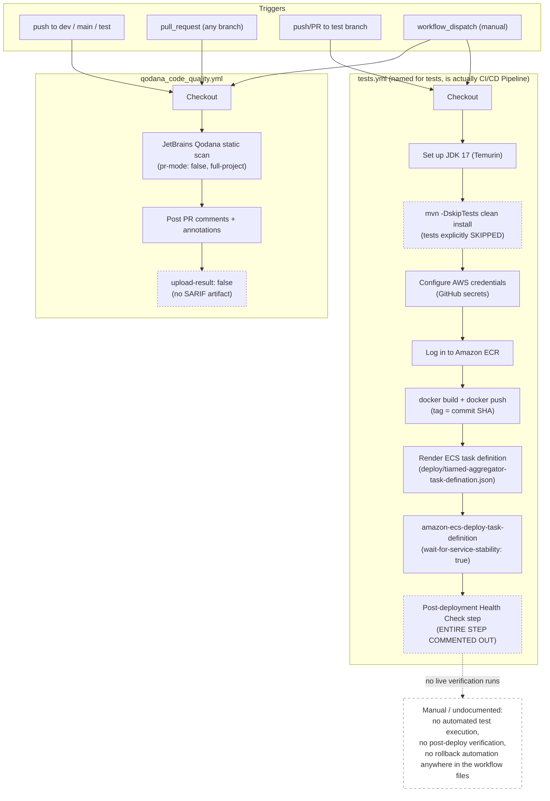

# Security & Deployment

Pharma Aggregator Marketplace — `pharma-aggregator-server` (Spring Boot backend) + `pharma-aggregator-client` (Next.js frontend)

---

## 1. Document Control

| Field | Value |
|---|---|
| Document | Security & Deployment Assessment |
| Scope | `pharma-aggregator-server` (Spring Boot, Java) and `pharma-aggregator-client` (Next.js 16) |
| Method | Direct source inspection — every claim below is tied to a file path actually opened during this and prior discovery passes. No claim is made from framework convention or assumption. |
| Status labels used | **IMPLEMENTED** (verified in source) · **PARTIALLY IMPLEMENTED** (exists but incomplete) · **NOT IDENTIFIED** (searched, not found — search scope stated) · **RECOMMENDATION — NOT CURRENTLY IMPLEMENTED** (a suggestion, never fact) |
| Author | Generated from repository discovery data + direct file reads (SecurityConfig.java, CrossConfig.java, security/*.java, Dockerfile, docker-compose*.yml, ECS task definition, GitHub Actions workflows, `.env.example` names, CLAUDE.md, `proxy.ts`, seller layout) |
| Prepared for | somilm@tiameds.ai |
| Date | 2026-08-31 |
| Not a certification | This document reports what is implemented in code today. It makes no claim of compliance certification, penetration-test sign-off, or production security audit. |

---

## 2. Threat Model / Risk Assessment

| Threat | Attack Vector | Impact | Likelihood | Existing Control | Gap | Recommendation |
|---|---|---|---|---|---|---|
| Global unauthenticated API access | `SecurityConfig.java` line 52: `auth.anyRequest().permitAll()` is the live rule for the entire Spring MVC application — the stricter role-scoped rule set exists only as a commented-out block beneath it | Critical — every REST endpoint in the backend (seller/buyer registration, admin approval, orders, payments, stock, product CRUD) is reachable without a valid JWT at the HTTP layer | Certain (already true in the shipped code, not a hypothetical) | `AuthTokenFilter` still parses and validates any Bearer token present and populates `SecurityContextHolder`; some controllers/services additionally perform a manual `SecurityContextHolder`/`Authentication` check (e.g. `TempSellerServiceImpl.resolveAuthenticatedUser()`, `SellerOrderController`'s JWT-resolved-seller ownership checks) | No endpoint-level authorization is enforced by the framework; protection depends entirely on whether each individual controller/service happens to add its own check — many admin (`AdminBuyerController`, `AdminSellerController`, `AdminOrderController`) and several `TempSellerController`/`TempBuyerController` endpoints have **no check at all** | **RECOMMENDATION — NOT CURRENTLY IMPLEMENTED**: uncomment/rebuild the `authorizeHttpRequests` rule set in `SecurityConfig.java` to require authentication by default and scope admin routes to an ADMIN role via `@PreAuthorize`/`@Secured` (method security is enabled via `@EnableMethodSecurity` but no annotation usage was found anywhere in the codebase) |
| Client-side-only route guard can be bypassed | Seller and buyer dashboard protection is a `useEffect` in `src/app/seller_7a3b9f2c/layout.tsx` / `src/app/buyer_e8d45a1b/dashboard/layout.tsx` that runs after mount and checks `localStorage` | High — protected UI can render briefly before redirect ("flash of protected content"); more importantly, since the backend also permits all requests (row above), a client bypass is not even necessary to reach the underlying API | High — this is the *only* seller/buyer route protection that exists; nothing enforces it at the network edge | `useEffect` checks `accessToken`/`refreshToken` + `sellerAuthService.isAuthenticated()` (seller) or `buyerAuthService.isAuthenticated()` (buyer) and redirects/opens a login modal if missing | `src/proxy.ts` has the correct shape (checks a `token` cookie, redirects unauthenticated seller-dashboard requests) but is **not wired up**: wrong filename (`proxy.ts`, Next.js requires `middleware.ts`/`middleware.js`) and wrong export name (`proxy`, not `middleware`/default export). No file imports it; no `middleware.ts`/`.js` exists anywhere in `src/` or the project root (confirmed by repo-wide search) | **RECOMMENDATION — NOT CURRENTLY IMPLEMENTED**: rename `src/proxy.ts` → `middleware.ts`, export `middleware`, and update its `matcher` to cover the current protected-route set (`dashboard`, `products`, `profile`, `orders`, `conversions`, `settings`, `shipment` — the existing `matcher` only covers `/seller_7a3b9f2c/dashboard(/*)` and would under-protect even if wired up). This alone does not fix the backend gap above and must be paired with it |
| Session token theft via XSS (non-httpOnly cookie + localStorage JWT) | `src/services/seller/authService.ts` and `src/services/buyer/buyerAuthService.ts` both mirror the access token into a plain `document.cookie` (`"token"` for seller, `"buyerToken"` for buyer) using a hand-written `setCookie()` helper — client-side JS cannot set `HttpOnly`, so this cookie (and the parallel `localStorage` copies of `accessToken`/`refreshToken`) is fully readable by any script running in the page | High — a single XSS vulnerability anywhere in the app (any component that renders unsanitized user/seller-supplied content) would allow exfiltration of both the access token and, more seriously, the raw refresh token, giving an attacker persistent account takeover until the refresh token is rotated/revoked | Medium — depends on an XSS vector existing elsewhere in the app; not independently confirmed present, but the storage design offers no defense-in-depth if one is found | None — this is architectural, not a bug in a specific line | This is a real, structural gap, not a hypothetical: tokens are deliberately stored in JS-readable locations (`localStorage` + non-httpOnly cookie) rather than an httpOnly, `SameSite=Strict` cookie set by the server | **RECOMMENDATION — NOT CURRENTLY IMPLEMENTED**: issue the refresh token (and ideally the access token) as a server-set `HttpOnly; Secure; SameSite=Strict` cookie instead of returning it in the JSON body for client-side storage; this requires backend (`AuthenticationController`/`BuyerAuthenticationController`) and frontend (`lib/api.ts`/`lib/buyerApi.ts`) changes together |
| JWT contains no roles/claims beyond subject | `security/JwtUtils.java`: the signed JWT carries only `sub` (username), `iat`, `exp` — no roles, no userId | Low-Medium — every request must re-resolve the full `UserDetails` (including roles) from the database via `UserDetailsServiceImpl.loadUserByUsername()`, which is a design choice, not itself a vulnerability, but it does mean a stale/cached role assumption is impossible while a DB-lookup-skipping optimization is not | Low | `AuthTokenFilter` re-resolves roles per request | None identified beyond the performance/architecture trade-off | No recommendation — documenting the design choice, not flagging a defect |
| Access-token lifetime misconfigured for production | `application-dev.yml` / `application-test.yml`: `app.jwt.expiration=86400000` (24 hours), with an inline comment admitting it is "Temporarily set to 24 hours for testing, change back to 30 minutes in production" | Medium — a stolen access token remains valid for a full day instead of 30 minutes, widening the exploitation window if one leaks (e.g. via the XSS/storage gap above) | Certain in dev/test profiles as shipped; `application-prod.yml` defines **no** `app.jwt.*` keys at all (see Secrets Management, §5) | None — the comment is the only safeguard, and it is advisory only | The 24h value ships in the checked-in dev/test YAML; prod would need this value supplied externally or the application fails to start (unresolved `${app.jwt.expiration}` placeholder) | **RECOMMENDATION — NOT CURRENTLY IMPLEMENTED**: set `app.jwt.expiration` to the intended 30-minute value via an externally-injected value for any real production deployment, and remove/correct the misleading comment |
| Refresh token replay / no server-side revocation on logout across devices | `RefreshToken.tokenHash` (SHA-256, tbl_refresh_tokens) — rotation is implemented (old token revoked on refresh, new one issued) and logout revokes the *presented* refresh token, but there is no "revoke all sessions for this user" action anywhere in the code inspected | Medium — a leaked refresh token that is never used again by the legitimate device (so never triggers rotation) remains valid until its 7-day (`app.jwt.refresh-expiration=604800000`) expiry, with no way for the user/admin to kill it early except knowing the exact stored hash | Low-Medium | Rotation + hash-only storage (`JwtUtils.hashToken`) already mitigate raw-token-at-rest exposure | No bulk/"logout everywhere" revocation endpoint found in `AuthenticationController.java` / `BuyerAuthenticationController.java` | **RECOMMENDATION — NOT CURRENTLY IMPLEMENTED**: add a "revoke all refresh tokens for user" admin/self-service action |
| CORS wildcard + credentials conflict | `config/CrossConfig.java` registers a `CorsFilter` bean on `/**` with a fixed 5-origin allowlist + `allowCredentials=true` — correct per spec. However several individual controllers (`SignupController.java`, `IFSCOverrideController.java`, seller `AuthenticationController.java`) additionally carry `@CrossOrigin(origins = "*")` | Medium — a wildcard origin combined with credentials is invalid per the CORS spec and is rejected by browsers when both are actually in force together, but Spring's precedence between a global `CorsFilter` bean and a per-controller `@CrossOrigin` annotation was **not traced** in this inspection, so the practical effect for a given request is unconfirmed | Unknown — depends on which mechanism Spring actually applies per request | The global whitelist itself, if it is the one enforced, is a reasonable control | Ambiguous precedence between two competing CORS configurations is itself a maintainability/security risk (a future change to one without checking the other could silently open or close cross-origin access) | **RECOMMENDATION — NOT CURRENTLY IMPLEMENTED**: remove the per-controller `@CrossOrigin(origins="*")` annotations and rely solely on the single `CrossConfig` `CorsFilter` bean, or vice versa — pick one mechanism |
| No CSRF protection | `SecurityConfig.java` line 48: CSRF is explicitly disabled (`.csrf(csrf -> csrf.disable())`) | Low, given the app is a stateless, Bearer-token SPA architecture (CSRF primarily threatens cookie-session-authenticated state-changing requests) — but the non-httpOnly auth cookie (row above) that IS also sent automatically by the browser on same-origin requests, combined with a fully-open backend (`permitAll()`), means CSRF-style attacks are not entirely moot if the cookie is ever relied on server-side for auth (not observed to be the case; the cookie appears to be a client-side convenience mirror, not something the backend reads for `Authorization`) | Low, given current usage of the cookie is client-read-only per source inspected | Standard for stateless JWT-Bearer APIs (`SessionCreationPolicy.STATELESS` is also set) | None identified as a live exploitation path in the code inspected | No recommendation — standard practice for this architecture as implemented |
| No rate limiting / brute-force throttling at the infrastructure layer | Login lockout exists at the *application* layer only: seller login locks after 5 failed password attempts (`AuthService.MAX_LOGIN_FAILED_ATTEMPTS=5`) and 3 failed OTP attempts (`MAX_OTP_FAILED_ATTEMPTS=3`); buyer login mirrors this | Medium — application-level lockout is real and does function, but there is no evidence of any WAF, API gateway, or reverse-proxy rate limiting in front of the service (no such config found in the ECS task definition, docker-compose files, or any config file inspected) | Medium | Per-account lockout (application code) | No IP-based or endpoint-wide rate limiting identified anywhere in the infrastructure config inspected | **RECOMMENDATION — NOT CURRENTLY IMPLEMENTED**: add rate limiting at a load balancer / API gateway / WAF layer (none of which appear in this repository's infrastructure config) |
| Input validation posture — mixed | Extensive Bean Validation (`@Valid`) plus hand-written `ValidationException`-collecting validators exist per product-import category (`DrugImportStrategy`, `ConsumableImportStrategy`, etc. — regex/length/range checks on product fields), and Zod schemas exist frontend-side (`src/schema/**`) | Low-Medium overall — validation exists and is fairly thorough where it is wired up | Low for the wired-up paths; higher for the gaps below | Server-side Bean Validation on DTOs; category-specific import validators; frontend Zod schemas paired with manual `.safeParse()` calls in most product forms | Frontend validation is inconsistent: `CosmeticSchema.ts`, `ConsumableDeviceSchema.ts`, `NonConsumableDeviceSchema.ts` are defined but **not imported by any live component** (orphaned); `FoodInfantForm.tsx` imports `foodInfantSchema` but never calls `.parse()`/`.safeParse()` on it (dead import); `EditProduct.tsx` and `ProductOnboarding.tsx` have their schema `.safeParse()` calls commented out. Regardless, this is frontend-only defense-in-depth — the backend's own Bean Validation and `ValidationException` collectors are the actual enforcement boundary and were confirmed present for Drug/Consumable import paths | **RECOMMENDATION — NOT CURRENTLY IMPLEMENTED**: re-wire the orphaned Cosmetic/Consumable/Non-Consumable Zod schemas into their respective forms, or remove them if genuinely superseded, to avoid maintaining dead validation code that could mislead a future reviewer into believing client-side validation exists where it does not |
| Multi-seller-type IDOR-style exposure via unauthenticated GETs | Numerous `TempSellerController`/`TempBuyerController` endpoints (e.g. `GET /temp-sellers/{id}`, `GET /temp-sellers/user/{userId}`, all `/contact/check-*`, all document upload/delete endpoints) have **no auth check in the controller method itself**, on top of the global `permitAll()` | High — any caller who can guess/enumerate a numeric `id`/`userId` can read another seller's/buyer's full registration record (address, GST, bank details, documents) or delete/replace their uploaded files | High, given IDs are small sequential integers in several of these paths | None found for the specific endpoints named | Sensitive PII/financial data (GST numbers, bank account details, uploaded license/ID documents) is retrievable and mutable by an unauthenticated caller who knows or guesses an ID | **RECOMMENDATION — NOT CURRENTLY IMPLEMENTED**: add authentication + ownership checks (mirroring the pattern already used in `SellerOrderController`, which resolves the seller from the JWT rather than trusting a path parameter) to every `TempSellerController`/`TempBuyerController` GET/PATCH/DELETE/upload endpoint |
| Admin approval endpoints fully open | `AdminBuyerController.reviewBuyer`, `AdminSellerController.reviewSeller`, `AdminOrderController.overrideOrderStatus`/`getAllOrders` have no `@PreAuthorize`/role check anywhere, and `AdminOrderOverrideRequestDTO.adminId` is an optional, free-text, unvalidated field only used to stamp an audit column | Critical — any unauthenticated caller who reaches the network can approve/reject seller and buyer registrations, or force any order into any status string (no validation that the string is even a real `SellerOrderStatus` constant) | High given `permitAll()` is confirmed live | An append-only `*ReviewHistory`/`OrderStatusHistory` audit trail exists, so actions are logged, but nothing prevents them | Same root cause as row 1, called out separately here because these specific endpoints have real business-approval and financial-state consequences (this app has "no admin UI" per its own `CLAUDE.md`, meaning these endpoints are presumably intended to be called from a separate, undiscovered admin tool referenced only by an `app.admin-frontend-url` property — that tool's own access control, if any, was not part of this repository and could not be assessed) | **RECOMMENDATION — NOT CURRENTLY IMPLEMENTED**: gate all `/admin/**` controllers behind a verified `ROLE_ADMIN` check once the global `permitAll()` is corrected |

---

## 3. Authentication & Authorization Architecture

### 3.1 Sequence diagram (traced from source)

The diagram below is reproduced from `d:/Tiameds_MarketPlace/Frontend/pharma-aggregator-client/docs/diagrams/authentication-sequence.mmd`, itself built by directly reading `AuthenticationController.java`, `AuthService.java`, `BuyerAuthenticationController.java`, `BuyerAuthService.java`, `JwtUtils.java`, `AuthTokenFilter.java`, `src/lib/api.ts`, and `src/lib/buyerApi.ts`.

```mermaid
sequenceDiagram
    autonumber

    participant Browser as Browser (localStorage + document.cookie)
    participant SUI as Seller UI (LoginModals.tsx)
    participant SAuth as sellerAuthService.ts
    participant SApi as lib/api.ts (axios, seller)
    participant SCtrl as AuthenticationController (/authentication)
    participant SSvc as AuthService (seller, backend)
    participant Jwt as JwtUtils (shared, HS256)
    participant Mail as EmailService (SMTP, shared)
    participant SDB as tbl_user / tbl_login_otp / tbl_refresh_tokens
    participant AF as AuthTokenFilter (shared, on every request)

    participant BUI as Buyer UI (LoginForm / LoginOtpStep)
    participant BAuth as buyerAuthService.ts
    participant BApi as lib/buyerApi.ts (axios, buyer)
    participant BCtrl as BuyerAuthenticationController (/buyer/authentication)
    participant BSvc as BuyerAuthService (buyer, backend)
    participant BDB as tbl_buyer_user / tbl_buyer_login_otp / tbl_buyer_refresh_tokens

    Note over SUI,SDB: SELLER LOGIN — src/app/modals/LoginModals/LoginModals.tsx is the REAL, wired-up seller login UI.<br/>src/app/(auth)/login_fhy26sb/** is a separate, orphaned scaffold (fetch('/api/seller/...') routes that don't exist) — not part of this flow.

    rect rgb(235,245,255)
    Note over Browser,SDB: STEP 1 — password login, sends OTP
    Browser->>SUI: submit username + password
    SUI->>SAuth: sellerAuthService.login(credentials)
    SAuth->>SApi: POST /authentication/login {username,password}
    SApi->>SCtrl: forwarded (Bearer attach interceptor: no token yet, so no header)
    SCtrl->>SSvc: validateCredentialsAndSendOtp(loginRequest)
    SSvc->>SDB: findByUsername(username)
    SDB-->>SSvc: User row
    alt account locked or inactive
        SSvc-->>SCtrl: AccountLockedException / AccountInactiveException
        SCtrl-->>SApi: 403 {status,error,message}
    else credentials checked
        SSvc->>SSvc: AuthenticationManager.authenticate() — BCrypt check via Spring Security
        alt bad password
            SSvc->>SDB: increment failedLoginAttempts (lock account at 5 — MAX_LOGIN_FAILED_ATTEMPTS)
            SSvc-->>SCtrl: InvalidCredentialsException
            SCtrl-->>SApi: 401 {status,error,message}
        else password OK
            SSvc->>SDB: resetFailedLoginAttempts; invalidateAllOtpsForUser(user)
            SSvc->>SDB: save new LoginOtp (6-digit, isUsed=false, expiresAt=+5min, OTP_EXPIRY_MINUTES)
            SSvc->>Mail: sendCoordinatorOtp(user.username, otpCode)
            SSvc-->>SCtrl: OtpSentResponse{message, username}
            SCtrl-->>SApi: 200 {status:"SUCCESS", data:{message,username}}
            SApi-->>SAuth: response (checked for a nested 200-wrapped 401 failure shape)
            SAuth->>Browser: localStorage.setItem("otpUsername", username)
            SAuth-->>SUI: OtpSentResponse — show OTP entry screen
        end
    end
    end

    rect rgb(235,255,240)
    Note over Browser,SDB: STEP 2 — OTP verification, JWT + refresh-token issuance
    Browser->>SUI: submit 6-digit OTP
    SUI->>SAuth: sellerAuthService.verifyOtp({username, otp})
    SAuth->>SApi: POST /authentication/verify-otp {username, otp}
    SApi->>SCtrl: forwarded
    SCtrl->>SSvc: verifyOtpAndIssueToken(request)
    SSvc->>SDB: findActiveOtpByUser(user) — unused AND unexpired AND unlocked
    alt no active OTP found
        SSvc-->>SCtrl: OtpExpiredException
        SCtrl-->>SApi: 410 Gone
    else OTP row found
        alt otp.otpCode != request.otp
            SSvc->>SDB: incrementFailedAttempts; lock OTP row at 3 (MAX_OTP_FAILED_ATTEMPTS)
            SSvc-->>SCtrl: OtpInvalidException (401) or OtpLockedException (429, must login again)
            SCtrl-->>SApi: 401 / 429 {status,error,message}
        else OTP matches
            SSvc->>SDB: markOtpAsUsed(otpId); updateLastLogin(userId, now)
            SSvc->>Jwt: generateJwtToken(authentication)
            Note right of Jwt: HS256, key = HMAC(app.jwt.secret).<br/>Claims: sub=username, iat, exp only — NO roles/userId embedded.<br/>app.jwt.expiration in application-dev.yml = 86400000ms (24h, commented as a "temporary" override of an intended 30 min)
            Jwt-->>SSvc: accessToken (signed JWT)
            SSvc->>Jwt: generateRefreshToken()
            Note right of Jwt: 64 random bytes (SecureRandom), base64url-encoded — an OPAQUE token, not a JWT
            Jwt-->>SSvc: rawRefreshToken
            SSvc->>Jwt: hashToken(rawRefreshToken) — SHA-256
            SSvc->>SDB: save RefreshToken{tokenHash (raw never stored), expiresAt=now+app.jwt.refresh-expiration (7 days)}
            SSvc-->>SCtrl: LoginResponse{accessToken, refreshToken(raw), userId, username, roles, passwordTemporary, message}
            SCtrl-->>SApi: 200 {status:"SUCCESS", data:LoginResponse}
            SApi-->>SAuth: response
            alt loginData.passwordTemporary === true
                SAuth->>Browser: do NOT store accessToken/refreshToken; clear any stale ones; deleteCookie("token")
                SAuth-->>SUI: caller routes to first-time password-reset step (POST /auth/reset-password)
            else normal login
                SAuth->>Browser: localStorage.setItem(accessToken, refreshToken, user, lastLogin)
                SAuth->>Browser: decode JWT payload via atob() to read exp → localStorage.setItem("tokenExpiresAt", exp*1000)
                SAuth->>Browser: setCookie("token", accessToken, 1 day) — plain document.cookie, NOT httpOnly, SameSite=Lax
                SAuth-->>SUI: LoginResponse — redirect into /seller_7a3b9f2c/dashboard
            end
        end
    end
    end

    Note over BUI,BDB: BUYER LOGIN — src/app/buyer_e8d45a1b/login/page.tsx renders null; a global BuyerLoginModalProvider (mounted in root layout.tsx) opens the actual modal built from these same LoginForm/LoginOtpStep components. Structurally mirrors seller login but is fully isolated (own tables, own controller, own axios client, own localStorage key prefix "buyer*").

    rect rgb(255,245,235)
    Note over Browser,BDB: STEP 1 — password login, sends OTP (buyer)
    Browser->>BUI: submit email + password
    BUI->>BAuth: buyerAuthService.login(credentials)
    BAuth->>BApi: POST /buyer/authentication/login
    BApi->>BCtrl: forwarded
    BCtrl->>BSvc: validateCredentialsAndSendOtp(loginRequest)
    BSvc->>BDB: findByEmail(username)
    BDB-->>BSvc: BuyerUser row
    alt locked / inactive
        BSvc-->>BCtrl: AccountLockedException / AccountInactiveException (403)
    else
        BSvc->>BSvc: passwordEncoder.matches(password, buyerUser.passwordHash) — manual BCrypt check, NOT Spring Security's AuthenticationManager
        alt bad password
            BSvc->>BDB: increment failedLoginAttempts (lock at 5)
            BSvc-->>BCtrl: InvalidCredentialsException (401)
        else password OK
            BSvc->>BDB: resetFailedLoginAttempts; invalidateAllOtpsForBuyerUser(buyerUser)
            BSvc->>BDB: save new BuyerLoginOtp (6-digit, +5min expiry)
            BSvc->>Mail: sendBuyerOtp(email, otpCode)
            BSvc-->>BCtrl: BuyerOtpSentResponse{message, username}
            BCtrl-->>BApi: 200 {status:"SUCCESS", data:{...}}
            BApi-->>BAuth: response
            BAuth->>Browser: localStorage.setItem("buyerOtpUsername", username)
            BAuth-->>BUI: show OTP entry screen
        end
    end
    end

    rect rgb(250,240,255)
    Note over Browser,BDB: STEP 2 — OTP verification, JWT + refresh-token issuance (buyer)
    Browser->>BUI: submit 6-digit OTP
    BUI->>BAuth: buyerAuthService.verifyOtp({username, otp})
    BAuth->>BApi: POST /buyer/authentication/verify-otp
    BApi->>BCtrl: forwarded
    BCtrl->>BSvc: verifyOtpAndIssueToken(request)
    BSvc->>BDB: findActiveOtpByBuyerUser(buyerUser)
    alt no active OTP
        BSvc-->>BCtrl: OtpExpiredException (410)
    else
        alt otp mismatch
            BSvc->>BDB: incrementFailedAttempts; lock at 3 attempts
            BSvc-->>BCtrl: OtpInvalidException (401) / OtpLockedException (429)
        else OTP matches
            BSvc->>BDB: markOtpAsUsed; updateLastLogin
            BSvc->>BSvc: manually build UserDetailsImpl{id=buyerUserId, authorities=[ROLE_BUYER]} — no AuthenticationManager/UserDetailsServiceImpl involved
            BSvc->>Jwt: generateJwtToken(authentication) — same shared JwtUtils/HS256 key as seller
            Jwt-->>BSvc: accessToken
            BSvc->>Jwt: generateRefreshToken() + hashToken()
            Jwt-->>BSvc: rawRefreshToken
            BSvc->>BDB: save BuyerRefreshToken{tokenHash, expiresAt=+7 days}
            BSvc-->>BCtrl: BuyerLoginResponse{accessToken, refreshToken(raw), buyerUserId, username, phone, roles, passwordTemporary}
            BCtrl-->>BApi: 200 {status:"SUCCESS", data:...}
            BApi-->>BAuth: response
            alt passwordTemporary === true
                BAuth-->>BUI: no tokens stored — route to reset-password (temp password from e.g. a guest quote-request account)
            else
                BAuth->>Browser: localStorage.setItem(buyerUser, buyerLastLogin, buyerAccessToken, buyerRefreshToken, buyerTokenExpiresAt)
                BAuth->>Browser: setCookie("buyerToken", accessToken, 1 day) — separate cookie name from seller's "token"
                BAuth-->>BUI: redirect — /buyer_e8d45a1b/dashboard (client-side guard in dashboard/layout.tsx checks buyerAccessToken+buyerRefreshToken)
            end
        end
    end
    end

    Note over Browser,AF: SUBSEQUENT AUTHENTICATED REQUESTS — Authorization header attach (both roles)
    rect rgb(245,245,245)
    Browser->>SApi: any seller-domain call (request interceptor)
    SApi->>SApi: reads localStorage("accessToken") → sets header Authorization: Bearer <token>
    SApi->>AF: request with Bearer token
    Note right of AF: AuthTokenFilter parses the Bearer header, jwtUtils.validateJwtToken(), then<br/>userDetailsService.loadUserByUsername(username, preferBuyer) — preferBuyer=true only if the<br/>request URI contains "/buyer/", so an email registered as both buyer and seller resolves correctly.<br/>NOTE: SecurityConfig.filterChain() sets anyRequest().permitAll() — Spring Security enforces<br/>NOTHING at the HTTP layer; this filter only populates SecurityContext for app-code checks to read.
    AF-->>SApi: 200 (protected data) — normal case
    Browser->>BApi: any buyer-domain call (request interceptor)
    BApi->>BApi: reads localStorage("buyerAccessToken") → sets Authorization: Bearer <token>
    BApi->>AF: request with Bearer token (same shared filter/JwtUtils, different token/table)
    end

    Note over Browser,SDB: 401 / REFRESH HANDLING — src/lib/api.ts response interceptor (seller)
    rect rgb(255,235,235)
    AF-->>SApi: 401 Unauthorized (expired/invalid access token)
    alt request URL contains "/refresh", or is /authentication/login, /authentication/verify-otp, or /auth/signup
        SApi-->>Browser: reject as-is (treated as a normal auth failure, NOT session expiry — no refresh attempted)
    else any other protected call, and not already retried
        alt a refresh is already in flight (isRefreshing)
            SApi->>SApi: push {resolve,reject} onto failedQueue and wait
        else first 401 to arrive
            SApi->>SApi: set _retry=true, isRefreshing=true
            alt no refreshToken in localStorage
                SApi->>Browser: clear all seller auth localStorage keys + cookie "token"; redirect "/?showLogin=true&session=expired"
            else refreshToken present
                SApi->>SCtrl: raw axios.post(/authentication/refresh, {refreshToken}) — bypasses the `api` instance itself to avoid interceptor recursion
                SCtrl->>SSvc: refreshAccessToken(rawRefreshToken)
                SSvc->>Jwt: hashToken(rawRefreshToken)
                SSvc->>SDB: findByTokenHash(hash)
                alt not found, or !isValid() (revoked or past expiresAt)
                    SSvc-->>SCtrl: RefreshTokenException
                    SCtrl-->>SApi: 401 {message}
                    SApi->>Browser: clear auth keys + cookie + sessionStorage.clear(); redirect "/?showLogin=true&session=expired"
                else valid
                    SSvc->>SDB: stored.setRevokedAt(now) — ROTATE: old refresh token is now dead
                    SSvc->>Jwt: generateJwtToken(new auth) + generateRefreshToken() (new raw)
                    SSvc->>SDB: save new RefreshToken{tokenHash of new raw, +7 days}
                    SSvc-->>SCtrl: LoginResponse{new accessToken, new refreshToken}
                    SCtrl-->>SApi: 200 {accessToken, refreshToken}
                    SApi->>Browser: localStorage.setItem(accessToken, refreshToken); cookie "token" updated
                    SApi->>SApi: processQueue() — replays every request that had queued during the refresh
                    SApi->>AF: retry the original failed request with new Bearer token
                    AF-->>SApi: 200 (success)
                end
            end
        end
    end
    end

    Note over Browser,BDB: 401 / REFRESH HANDLING — src/lib/buyerApi.ts response interceptor (buyer, structurally identical, separate token set)
    rect rgb(255,240,245)
    AF-->>BApi: 401 Unauthorized
    alt url is /refresh, /buyer/authentication/login, /buyer/authentication/verify-otp, or /buyer/auth/signup
        BApi-->>Browser: reject as-is
    else
        BApi->>BApi: queue concurrent 401s the same way (isRefreshing/failedQueue)
        alt no buyerRefreshToken
            BApi->>Browser: clear buyerAccessToken/buyerRefreshToken/buyerTokenExpiresAt/buyerUser + cookie "buyerToken"; redirect "/buyer_e8d45a1b/login?session=expired"
        else
            BApi->>BCtrl: raw axios.post(/buyer/authentication/refresh, {refreshToken})
            BCtrl->>BSvc: refreshAccessToken(rawRefreshToken)
            BSvc->>BDB: findByTokenHash(hash); check isValid()
            alt invalid/expired/revoked
                BSvc-->>BCtrl: RefreshTokenException (401)
                BApi->>Browser: clear buyer auth keys + cookie; redirect to buyer login
            else valid
                BSvc->>BDB: revoke old row (setRevokedAt)
                BSvc->>BSvc: issueTokensForUser(buyerUser) — new access+refresh pair, new BuyerRefreshToken row persisted
                BCtrl-->>BApi: 200 {accessToken, refreshToken}
                BApi->>Browser: localStorage updated; cookie "buyerToken" updated
                BApi->>AF: retry original request with new Bearer token
            end
        end
    end
    end

    Note over SApi,BApi: NOT part of this flow but adjacent: src/utils/api.ts is a THIRD axios client (used by every product/* service, not by login) that attaches the Bearer token but has NO response interceptor at all — a 401 hit through it does not auto-refresh or redirect.
```

### 3.2 Role / permission model — **PARTIALLY IMPLEMENTED**

- **Roles exist as data, not as enforcement.** `RoleMaster` (`tbl_role_master`, `entity/master/RoleMaster.java`) declares `SELLER`/`BUYER`/`ADMIN` per its own comment, but has **no seed data shipped** — `UserCreationService.createUserFromSignup` throws if the `SELLER` row is missing, with the message "Please seed the roles table," confirming this must be done manually outside the repository. **IMPLEMENTED** (as a lookup table) but **NOT IDENTIFIED** as a self-seeding mechanism.
- **JWT carries no role claims** (`JwtUtils.generateJwtToken` — subject/iat/exp only). Roles are re-resolved per request from the database by `UserDetailsServiceImpl.loadUserByUsername(username, preferBuyer)`, with `preferBuyer` derived from whether the request URI contains `/buyer/` (`AuthTokenFilter.java`). **IMPLEMENTED**.
- **Two entirely separate identity tables**: `tbl_user` (seller/admin) and `tbl_buyer_user` (buyer) — a single email can exist in both, disambiguated only by URL prefix at authentication time. **IMPLEMENTED**, but this means "ADMIN" is a role value that would have to live in `tbl_user`, and no admin-specific login flow, admin UI, or admin-role-gated route was found anywhere in this frontend repository (confirmed by the discovery pass: `src/services/admin/TestService.ts` is a one-line placeholder, and no `admin/**` App Router route exists). **NOT IDENTIFIED**: any admin-facing UI or admin-specific login flow in this codebase. The three `/admin/**` controllers found (`AdminBuyerController`, `AdminSellerController`, `AdminOrderController`) are real, wired Spring MVC endpoints, presumably consumed by a separate, undiscovered admin client referenced only by the `app.admin-frontend-url` property in `SellerApprovalServiceImpl.java` — that external tool was not part of this repository and could not be assessed.
- **Authorization enforcement, where it exists at all, is per-endpoint application code**, not a framework-level role check: e.g. `SellerOrderController` resolves the seller from the JWT principal and checks `SellerOrder` ownership; `BuyerProfileController` requires the caller to be the same `buyerUserId` or hold `ROLE_ADMIN`; `TempBuyerController`'s admin-only listing checks `ROLE_ADMIN` manually. **PARTIALLY IMPLEMENTED** — present in a minority of controllers, absent in most (see §2 rows on admin endpoints and `TempSellerController`/`TempBuyerController`).
- **No `@PreAuthorize`/`@Secured` annotation usage was found anywhere in the backend** despite `@EnableMethodSecurity` being turned on in `SecurityConfig.java` — the capability exists but is unused.

---

## 4. Data Encryption

### In Transit

- **NOT IDENTIFIED in the current implementation.** No TLS/HTTPS termination configuration was found in any file inspected — not in the Dockerfile, `docker-compose*.yml`, the ECS task definition, or any Spring configuration file. Next.js and Spring Boot do not self-document TLS termination; it is normally handled by a load balancer or reverse proxy that would sit in front of this application, and no such component (ALB listener config, nginx config, Caddy config, etc.) exists in either repository. **Likely terminated at a load balancer/reverse proxy not present in this repository**, consistent with the fact that the ECS task definition configures only a plain HTTP container health check (`curl -f http://localhost:8080/...`) with no TLS materials referenced.
- Passwords are transmitted from the frontend to `/authentication/login`/`/buyer/authentication/login` as plaintext JSON over whatever transport the deployment uses — this is standard for a Bearer-token API behind TLS, but **the presence of that TLS layer is not evidenced in this repository**.

### At Rest

- **Passwords**: `BCryptPasswordEncoder` is declared as the `PasswordEncoder` bean in `SecurityConfig.java` (lines 37-39) and is genuinely consumed by `SignupService.java`, `UserCreationService.java`, `AuthService.java`, `BuyerSignupService.java`, `BuyerAuthService.java`, `UserService.java`, and `SellerServiceImpl.java` (confirmed via grep across those files). **IMPLEMENTED**.
- **Refresh tokens**: stored only as a SHA-256 hash (`RefreshToken.tokenHash`, `BuyerRefreshToken.tokenHash`) — the raw opaque token is never persisted, only returned to the client once. **IMPLEMENTED**.
- **Database encryption at rest (e.g. RDS storage encryption)**: **NOT IDENTIFIED in the current implementation.** No `storage-encrypted`/KMS configuration was found in any file inspected (there is no Terraform/CloudFormation/CDK infrastructure-as-code in either repository — only an application-level `application-dev.yml` datasource URL pointing at an existing AWS RDS Postgres endpoint). Whether that RDS instance has storage encryption enabled is an AWS console/IaC-level setting outside this repository's scope and **cannot be confirmed from the code**.
- **S3 object encryption** (product images, seller/buyer documents, invoices): `S3Config.java` builds a plain `S3Client` via `StaticCredentialsProvider`; no server-side-encryption (SSE-S3/SSE-KMS) parameter was found on any `S3Service` upload call (`uploadFile`, `uploadFileFromResource`) in the files inspected. **NOT IDENTIFIED in the current implementation** — if the bucket has default encryption configured at the bucket-policy level (not visible from application code), objects would still be encrypted at rest, but that is a bucket configuration this repository does not contain evidence of either way.
- **Sensitive PII in plain columns**: GST numbers, PAN numbers, bank account numbers, and license document numbers are stored as plain `varchar` columns in `tbl_seller_gst`, `tbl_seller_bank_details`, `tbl_temp_buyer` etc., with no column-level/application-level encryption or tokenization identified in any entity file inspected. **NOT IDENTIFIED in the current implementation.**

---

## 5. Secrets Management

| Secret / Config | Where it lives | Evidence |
|---|---|---|
| DB credentials, AWS keys, Twilio credentials, mail credentials (production/ECS) | AWS Secrets Manager, referenced by name only | `deploy/tiamed-aggregator-task-defination.json` — every non-trivial environment variable (`DB_URL`, `DB_PORT`, `DB_NAME`, `DB_USERNAME`, `DB_PASSWORD`, `AWS_ACCESS_KEY`, `AWS_SECRET_KEY`, `AWS_REGION`, `AWS_BUCKET_NAME`, `ACCOUNT_SID`, `AUTH_TOKEN`, `SERVICE_SID`, `SPRING_MAIL_HOST`, `SPRING_MAIL_PORT`, `SPRING_MAIL_USERNAME`, `SPRING_MAIL_PASSWORD`) arrives via the ECS `secrets` block referencing `secretsmanager` ARNs under secret name `pharma_aggregator_test`, **not** the `environment` block. Only `SPRING_PROFILES_ACTIVE=test` is a plaintext value. **IMPLEMENTED** (AWS Secrets Manager usage for the ECS/test deployment). |
| Local/dev secrets | `.env` (git-ignored, not committed) and `.env.example` (committed, names only) | `.env.example` at the backend documents 13 variable **names only** — no values reproduced here. Frontend `.env.example` documents `NEXT_PUBLIC_BACKEND_URL`/`BACKEND_URL` (confirmed stale — not read anywhere in `src/`, per this repo's own `CLAUDE.md`; the real variable is `NEXT_PUBLIC_API_URL`). |
| **Hardcoded credential-shaped strings found during inspection** | | ⚠️ **`application-dev.yml`** (backend, `src/main/resources/application-dev.yml`) hardcodes a literal Postgres username and password on the line following `spring.datasource.url` (pointed at a real AWS RDS endpoint `pharma-aggregator-test.cfsi2w0iou42.ap-south-1.rds.amazonaws.com`). This file is checked into source control. **The value itself is not reproduced here** — flagging only its file location and the fact that it should be rotated and moved to an externally-injected secret (env var or AWS Secrets Manager), consistent with how the `test` profile (`application-test.yml`) already sources its DB credentials from `${DB_USERNAME}`/`${DB_PASSWORD}` env vars instead of hardcoding them. |
| | | ⚠️ **`application-prod.yml`** (backend) hardcodes a Postgres username (`postgres`) and a literal weak password value on its datasource lines, pointed at host `postgres-prod` (the docker-compose-local Postgres container, not RDS). This file is checked into source control. **Recommendation: rotate this credential and source it externally** (env var / secret) rather than committing it, exactly as `application-test.yml` already does for its own datasource block. |
| | | ⚠️ **`application-dev.yml` / `application-test.yml`** (backend) both hardcode a literal JWT signing secret string under `app.jwt.secret`, identical between the two profiles. Since this value is checked into source control and shared across dev and test, **it should be rotated and replaced with an externally-injected secret** for any environment that matters, and must never be reused for a production profile. |
| Production JWT config | **NOT IDENTIFIED** | `application-prod.yml` (read in full, 24 lines) defines **no** `app.jwt.secret`/`app.jwt.expiration`/`app.jwt.refresh-expiration` keys at all. A production deployment using only the four checked-in `application*.yml` files would fail to start (unresolved `${app.jwt.secret}` placeholder) unless these are supplied externally — no such external wiring (e.g. an ECS task definition for prod, a prod Secrets Manager reference) was found in this repository. The only ECS task definition present (`deploy/tiamed-aggregator-task-defination.json`) targets the **test** environment (image tag `pharma-aggregator-test`), not production. |
| Stale env-var documentation | `.env.example` (both repos), `docs/ENVIRONMENT_VARIABLES.md`, `docs/DOCKER.md`, `docs/QUICK_START.md` (backend); `.env.example` (frontend) | Confirmed via grep that the documented variable names in these files diverge from what the code actually reads (backend: `.env.example`'s `POSTGRES_URL`/`POSTGRES_PASSWORD` vs. the real `DB_URL`/`DB_PORT`/`DB_NAME`/`DB_USERNAME`/`DB_PASSWORD`; frontend: `NEXT_PUBLIC_BACKEND_URL` vs. the real `NEXT_PUBLIC_API_URL`, per this repo's own `CLAUDE.md`). **This is a documentation-hygiene gap, not a security control failure**, but it increases the risk of a future engineer misconfiguring a deployment. |

---

## 6. Network Security

- **VPC / Security Groups / Subnets**: **NOT IDENTIFIED in the current implementation.** No VPC ID, subnet ID, or security group reference appears in `deploy/tiamed-aggregator-task-defination.json` — the task definition specifies only `networkMode: awsvpc` (required for Fargate) with no embedded network configuration (network configuration for `awsvpc` mode is normally supplied at `ecs run-task`/service-creation time, not in the task definition JSON itself, and no ECS service definition or `aws ecs create-service` invocation was found in this repository to confirm what subnets/security groups are actually attached).
- **Application Load Balancer**: **NOT IDENTIFIED in the current implementation.** No ALB/target-group configuration was found in the task definition, the GitHub Actions workflows, or any other file inspected.
- **Container-to-container network isolation**: `docker-compose.yml` defines three isolated environment stacks (dev/test/prod), each with its own Postgres container on distinct host ports (5432/5433/5434) and app container on distinct host ports (8080/8081/8082) — this is local/dev-only Docker networking, not a production network topology. **IMPLEMENTED** for local development only.
- **RDS network placement**: the `application-dev.yml` datasource points directly at a public-looking RDS endpoint (`*.rds.amazonaws.com`) — whether that RDS instance sits in a private subnet reachable only from the application's security group, or is publicly accessible, **is not evidenced in this repository** (that is an AWS console/IaC-level setting, and no IaC exists here).

---

## 7. Compliance

| Framework | Classification | Basis |
|---|---|---|
| GDPR | Potentially Applicable | The system stores personal data (names, emails, phone numbers, addresses, uploaded ID/license documents) for sellers and buyers. No code-level data-subject-rights tooling (export/erasure endpoints), consent-tracking beyond a boolean `termsAccepted` flag, or data-residency configuration was found. **No certification claim can be made; this is a data-handling characteristic only.** |
| HIPAA | Not Evidenced | This is a pharmaceutical *marketplace* (product catalog, ordering, seller/buyer onboarding) — no patient health record, prescription, or clinical data model was found anywhere in the entities inspected (product entities model drug/device/cosmetic catalog attributes, not patient data). No BAA, PHI-handling code, or HIPAA-specific control was found. |
| SOC 2 | Not Evidenced | No SOC 2 control documentation, audit trail retention policy, or formal change-management process artifact was found in either repository. Application-level audit trails do exist for specific workflows (`OrderStatusHistory`, `TempSellerReviewHistory`, `TempBuyerReviewHistory`) but this does not constitute or imply SOC 2 compliance. |
| PCI-DSS | Not Applicable (as currently coded) | `Payment.java`'s own class javadoc references a `PaymentServiceImpl#handleWebhook` method that **does not exist in the codebase** — `PaymentServiceImpl` has exactly one method (`getByPaymentId`, read-only). Every order in the current implementation is settled as `provider='COD'`, `status=SUCCESS` at placement time (`OrderPlacementServiceImpl`) — there is no payment gateway, card data collection, or tokenization integration anywhere in the code inspected. PCI-DSS scope would only become relevant if a card-payment gateway is added later. |
| DPDP (India's Digital Personal Data Protection Act) | Potentially Applicable | Given the application's operating context (Indian states/districts/talukas master data, GST/PAN fields, `.rds.amazonaws.com` in `ap-south-1`), DPDP is a plausible applicable framework given the personal data processed, but **no DPDP-specific control (consent manager, data-principal-rights endpoint, breach-notification workflow) was found in the code.** |

No compliance certification of any kind is claimed or evidenced anywhere in either repository.

---

## 8. CI/CD Pipeline

Two GitHub Actions workflows exist in the backend repository (`D:/Tiameds_MarketPlace/Backend/pharma-aggregator-server/.github/workflows/`); **none exist in the frontend repository** (confirmed: no `.github/` directory, no `.gitlab-ci.yml`, no `Jenkinsfile` anywhere in `pharma-aggregator-client`).

### `qodana_code_quality.yml` — **IMPLEMENTED** (static analysis only)
- Triggers: `workflow_dispatch`, all `pull_request`s, and pushes to `dev`/`main`/`test`.
- Runs JetBrains Qodana (`JetBrains/qodana-action@v2025.2`), full-project scan (`pr-mode: false`), posts PR comments, does **not** upload a SARIF artifact (`upload-result: false`).
- Does **not** build, test, or deploy anything.

### `tests.yml` — **IMPLEMENTED**, but its name is misleading (it is a build+deploy pipeline that skips tests)
- Triggers: push/PR to the `test` branch, and manual dispatch.
- Steps (in order): checkout → set up JDK 17 (Temurin) → `mvn -DskipTests clean install` (**tests are explicitly skipped**) → configure AWS credentials from GitHub secrets → log in to Amazon ECR → `docker build`/`docker push` tagged with the commit SHA → render the ECS task definition (`deploy/tiamed-aggregator-task-defination.json`) → `amazon-ecs-deploy-task-definition` with `wait-for-service-stability: true`.
- A "Post-deployment Health Check" step exists in the file but is **entirely commented out** — no live post-deploy verification runs.

### Plain statement of what does and does not exist
- **NOT IDENTIFIED**: any automated unit/integration test execution in CI (neither workflow runs `mvn test` or equivalent, despite one being named `tests.yml`).
- **IMPLEMENTED**: a real, automatic build → containerize → deploy pipeline exists, gated to the `test` branch only (there is no equivalent workflow deploying to a `prod` branch/environment anywhere in this repository).
- **NOT IDENTIFIED**: any lint step, any dedicated security-scan step beyond Qodana (which is a separate, non-blocking workflow), or any automated rollback step.
- **NOT IDENTIFIED (frontend)**: any CI/CD configuration of any kind for `pharma-aggregator-client` — it has only local build/containerization assets (`Dockerfile`, `docker-compose.yml`), no automated pipeline.

The Mermaid flowchart at `d:/Tiameds_MarketPlace/Frontend/pharma-aggregator-client/docs/diagrams/cicd-flow.mmd` visualizes this exact pipeline, stopping where the evidenced automation stops and explicitly labeling everything past that point as "manual/undocumented."



---

## 9. Environment Strategy

Three Spring profiles are evidenced by `application-dev.yml`, `application-test.yml`, `application-prod.yml`:

| | Local (`dev`) | Test | Production (`prod`) |
|---|---|---|---|
| `ddl-auto` | `update` | `update` | `validate` (schema must already exist — see the `docs/migration_*.sql` ad hoc scripts run manually against this profile) |
| Datasource | Hardcoded AWS RDS Postgres endpoint (`pharma-aggregator-test.cfsi2w0iou42.ap-south-1.rds.amazonaws.com`) with hardcoded credentials in the committed YAML | Fully env-var driven (`${DB_URL}`/`${DB_PORT}`/`${DB_NAME}`/`${DB_USERNAME}`/`${DB_PASSWORD}`) | Hardcoded to local docker-compose host `postgres-prod` with a hardcoded credential in the committed YAML |
| Flyway | `enabled:true`, `locations:classpath:db/migration`, `baseline-on-migrate:true` | Same as dev | **No `spring.flyway` block at all** — falls back to Flyway library defaults, with `ddl-auto=validate` implying the prod schema is expected to be pre-existing/managed manually |
| Swagger/OpenAPI | Enabled, `try-it-out-enabled: true` | Enabled, `try-it-out-enabled: true` | **Explicitly disabled** (`springdoc.swagger-ui.enabled: false`) |
| JWT config (`app.jwt.*`) | Present (hardcoded secret, 24h access-token expiry — see §2/§5) | Present (same hardcoded secret as dev) | **Absent entirely** — see §5 |
| Container port mapping (docker-compose) | 8080:8080 (app-dev), 5432 (postgres-dev) | 8081:8080 (app-test), 5433 (postgres-test) | 8082:8080 (app-prod), 5434 (postgres-prod) |
| Deployed via CI/CD | No (local `docker-compose up`/`start-dev.*` scripts only) | **Yes** — `tests.yml` builds and deploys this profile to AWS ECS Fargate | No CI/CD pipeline targets this profile anywhere in this repository |

**Frontend**: no equivalent profile system exists — a single `.env`/`NEXT_PUBLIC_API_URL` value determines which backend the Next.js app talks to, switched manually (the `.env` file itself contains a commented-out production alternative URL, `https://api-test-aggreator.tiameds.ai/api/v1/`, alongside the live local value).

---

## 10. Infrastructure Setup

Only AWS services with direct file/config evidence are listed. **No other AWS service is claimed.**

| Service | Evidence | Status |
|---|---|---|
| Amazon S3 | `config/S3Config.java` defines an `S3Client` bean (AWS SDK v2, `software.amazon.awssdk:s3` v2.25.60 per `pom.xml`) using `StaticCredentialsProvider` from `aws.s3.access-key`/`aws.s3.secret-key`/`aws.s3.region` properties; consumed by `S3Service.java` (upload/delete/copy/getFile) throughout product image, document, and invoice-PDF handling | **IMPLEMENTED** |
| Twilio (not AWS, third-party) | `config/TwilioConfig.java` — `@PostConstruct` `Twilio.init(accountSid, authToken)`; `twilio.verify.service-sid` property present, consistent with Twilio Verify for delivery-OTP SMS (`TwilioOTPService`) | **IMPLEMENTED** |
| Amazon ECS (Fargate) | `deploy/tiamed-aggregator-task-defination.json` — a registered Fargate task definition (`requiresCompatibilities: ["FARGATE"]`, `networkMode: awsvpc`, task-level `cpu:1024`/`memory:3072`); `tests.yml` actively deploys to it via `amazon-ecs-deploy-task-definition` | **IMPLEMENTED** (for the `test` environment only — no prod ECS task definition exists in this repository) |
| Amazon ECR | `tests.yml` logs in and pushes images to an ECR repository named via `secrets.ECR_REPOSITORY` | **IMPLEMENTED** |
| Amazon RDS | `application-dev.yml`'s hardcoded datasource URL points at a real `*.rds.amazonaws.com` endpoint | **IMPLEMENTED** (dev profile only — `test` sources its DB target from injected env vars of unknown backing infrastructure, and `prod`'s datasource points at a local docker-compose Postgres container, not RDS) |
| AWS Secrets Manager | ECS task definition's `secrets` block (see §5) | **IMPLEMENTED** |
| AWS CloudWatch Logs | ECS task definition's `logConfiguration.logDriver: "awslogs"`, log group `/ecs/tiameds-tiamed-aggregator-task-defination` | **IMPLEMENTED** (log shipping only — see §11 for what is and isn't monitored) |

**NOT IDENTIFIED anywhere in the files inspected**: CloudFront, Lambda, SQS/SNS, API Gateway, ElastiCache, DynamoDB, Cognito, WAF, or any VPC/security-group/ALB infrastructure-as-code.

---

## 11. Monitoring & Logging

- **Logging framework**: Spring Boot's default logging (SLF4J/Logback) is used throughout the backend (`log.warn`/`log.error` calls observed in numerous service classes, e.g. `SellerApprovalServiceImpl`, `BuyerApprovalServiceImpl`, `SellerOrderFulfillmentServiceImpl`). **IMPLEMENTED** at the application-code level (structured try/catch + logging around best-effort side effects like email sends and S3 migrations).
- **Log shipping**: `awslogs` driver configured in the ECS task definition, shipping container stdout/stderr to CloudWatch Logs group `/ecs/tiameds-tiamed-aggregator-task-defination`. **IMPLEMENTED** for the `test` ECS deployment.
- **APM / distributed tracing**: **NOT IDENTIFIED in the current implementation.** No X-Ray, Datadog, New Relic, OpenTelemetry, or Micrometer/Actuator-metrics-export configuration was found in `pom.xml` or any `application*.yml`.
- **Health checks**: `GET /api/v1/public/health-check` (`HomeController.java`) is implemented and is the exact endpoint the ECS task definition's container health check curls (`interval 30s / timeout 5s / retries 3 / startPeriod 60s`). **IMPLEMENTED**, but this is a liveness check only (`{"status":"UP"}` unconditionally) — it does not check database connectivity, S3 reachability, or any dependency health.
- **Spring Boot Actuator**: **NOT IDENTIFIED** — no `spring-boot-starter-actuator` dependency or `/actuator/**` endpoint reference was found in `pom.xml` or any controller.
- **CloudWatch Alarms / dashboards**: **NOT IDENTIFIED in the current implementation** — no alarm/dashboard configuration exists in any file inspected (would be an AWS console/IaC-level setting outside this repository's scope).
- **Audit trails** (application-level, not infrastructure monitoring): `OrderStatusHistory`, `TempSellerReviewHistory`, `TempBuyerReviewHistory` tables provide append-only business-event audit trails. **IMPLEMENTED**, but these are business-process audit logs, not security/access monitoring.

---

## 12. Backup & Disaster Recovery

**RPO/RTO are not explicitly defined in the current implementation.** No backup schedule, snapshot policy, multi-AZ configuration, or disaster-recovery runbook was found in any file inspected in either repository. This is consistent with the absence of any infrastructure-as-code (Terraform/CloudFormation/CDK) — RDS backup retention, snapshot frequency, and multi-AZ failover are all AWS console/IaC-level settings that would not appear in an application source repository, and none were found.

> **RECOMMENDATION — NOT CURRENTLY IMPLEMENTED**: Define explicit RPO (maximum acceptable data loss) and RTO (maximum acceptable downtime) targets, then configure RDS automated backups/snapshots and multi-AZ deployment (or equivalent) to meet them, and document the restore procedure. Given the presence of financial data (orders, payments, refunds) and regulated-adjacent PII (GST/PAN, license documents), a same-day RPO and a low-single-digit-hour RTO would be a reasonable starting target, but this is a suggestion, not a requirement derived from any evidence in the codebase.

---

## 13. Rollback Strategy

### Actual (evidenced)
- **Application deploy rollback**: **NOT IDENTIFIED as an automated capability.** `tests.yml`'s deploy step uses `amazon-ecs-deploy-task-definition` with `wait-for-service-stability: true` — if the new task definition fails to stabilize, ECS's own deployment circuit breaker (if enabled at the *service* level, which is not configured in any file inspected here) would be the only automatic protection; no explicit rollback step exists in the workflow file itself.
- **Data-layer rollback**: Flyway migrations (`V1`, `V2`, `V3` under `src/main/resources/db/migration/`) are forward-only — no `undo`/`down` migrations were found, and Flyway Community Edition (the dependency present, `flyway-core` with no `flyway-database-postgresql` companion artifact confirmed absent) does not support automated rollback of applied migrations.
- **Application-level "rollback" patterns that do exist** (business-logic safety nets, not deployment rollback): the two-phase approval pattern (`SellerApprovalServiceImpl`, `BuyerApprovalServiceImpl`) deliberately commits the database state change *before* best-effort S3 file migration and email sending, specifically so a downstream failure in those side effects can never leave a record half-approved — this is a data-consistency safeguard, not a deployment rollback mechanism. **IMPLEMENTED** as a design pattern, but scoped narrowly to the approval workflows, not to deployments.

### Recommended
> **RECOMMENDATION — NOT CURRENTLY IMPLEMENTED**: 
> 1. Enable ECS deployment circuit breaker with automatic rollback on the ECS *service* definition (not present in this repository — only the task definition is).
> 2. Add an explicit rollback job to `tests.yml` (or a separate workflow) that re-deploys the last-known-good task definition revision on health-check failure, since the existing "Post-deployment Health Check" step is currently commented out and would need to be restored first to have anything to gate a rollback on.
> 3. Adopt Flyway `undo` migrations (Flyway Teams/Enterprise feature) or hand-write compensating migrations for any schema change that needs to be reversible in production.

---

## Implementation Traceability

| Design Element | Source File | Implementation |
|---|---|---|
| Global HTTP authorization | `D:/Tiameds_MarketPlace/Backend/pharma-aggregator-server/src/main/java/com/example/pharmaaggregatorserver/config/SecurityConfig.java` | **IMPLEMENTED as `permitAll()`** — the intended role-scoped rule set exists only as commented-out code |
| CORS | `D:/Tiameds_MarketPlace/Backend/pharma-aggregator-server/src/main/java/com/example/pharmaaggregatorserver/config/CrossConfig.java` | **IMPLEMENTED** — fixed 5-origin allowlist + credentials, `CorsFilter` bean on `/**` |
| JWT issuance/validation | `.../security/JwtUtils.java` | **IMPLEMENTED** — HS256, subject-only claims |
| JWT request filter | `.../security/AuthTokenFilter.java` | **IMPLEMENTED** — buyer/seller dual-identity resolution via URI-prefix check |
| Unauthenticated-access entry point | `.../security/AuthEntryPointJwt.java` | **IMPLEMENTED** — JSON 401 body |
| Password hashing | `SecurityConfig.java` (bean) + consumers (`SignupService.java`, `AuthService.java`, `BuyerAuthService.java`, etc.) | **IMPLEMENTED** — BCrypt |
| Refresh-token rotation (seller) | `.../service/seller/SellerLogIn/AuthService.java` | **IMPLEMENTED** — hash-only storage, single-use rotation |
| Refresh-token rotation (buyer) | `.../service/buyer/BuyerAuthService.java` | **IMPLEMENTED** — mirrors seller |
| Global exception handling | `.../exception/GlobalExceptionHandler.java`, `.../exception/GlobalLogInExceptionHandler.java` | **PARTIALLY IMPLEMENTED** — two competing `@ControllerAdvice` classes with overlapping `@ExceptionHandler(Exception.class)`/`MethodArgumentNotValidException` mappings; precedence between them was not traced |
| Response enveloping | `.../response/GlobalResponseHandler.java` | **IMPLEMENTED** — `ResponseBodyAdvice` wraps all 2xx bodies |
| Secrets injection (ECS) | `deploy/tiamed-aggregator-task-defination.json` | **IMPLEMENTED** — AWS Secrets Manager references, names only |
| S3 file storage | `.../config/S3Config.java`, `.../service/S3Service.java` | **IMPLEMENTED** — AWS SDK v2, no SSE parameter identified |
| Twilio SMS OTP | `.../config/TwilioConfig.java`, `.../service/temp/seller/TwilioOTPService.java` | **IMPLEMENTED** |
| CI build/deploy | `.github/workflows/tests.yml` | **IMPLEMENTED** for `test` branch/environment only; tests skipped, health-check step disabled |
| CI static analysis | `.github/workflows/qodana_code_quality.yml` | **IMPLEMENTED** |
| Client-side seller route guard | `d:/Tiameds_MarketPlace/Frontend/pharma-aggregator-client/src/app/seller_7a3b9f2c/layout.tsx` | **IMPLEMENTED** — post-mount `useEffect`, can flash protected content |
| Client-side buyer dashboard guard | `.../src/app/buyer_e8d45a1b/dashboard/layout.tsx` | **IMPLEMENTED** — renders `null` while unauthenticated (no flash), opens login modal rather than redirecting |
| Edge/middleware route protection | `.../src/proxy.ts` | **NOT IMPLEMENTED (dead code)** — wrong filename/export, never wired up by Next.js, no `middleware.ts` exists anywhere in the repo |
| Inactivity auto-logout | `.../src/hooks/useSessionManager.ts` | **IMPLEMENTED** — seller only, 30-minute timeout; **NOT IDENTIFIED** for buyer |
| Session token storage | `.../src/services/seller/authService.ts`, `.../src/services/buyer/buyerAuthService.ts` | **IMPLEMENTED as localStorage + non-httpOnly cookie** — a documented gap, see Threat Model §2 |

---

## Open Items Requiring Follow-Up Beyond This Repository's Evidence

- TLS termination point and certificate management (not present in either repository).
- Whether the RDS instance referenced in `application-dev.yml` has storage encryption, automated backups, or multi-AZ enabled (AWS console/IaC-level, no IaC found).
- VPC/subnet/security-group placement for the ECS service (no ECS *service* definition or network configuration was found alongside the task definition).
- The identity, access control, and security posture of the external admin frontend implied by `app.admin-frontend-url` (referenced but not present in this repository).
- Whether S3 bucket-level default encryption or bucket policies are configured (not visible from application code).
