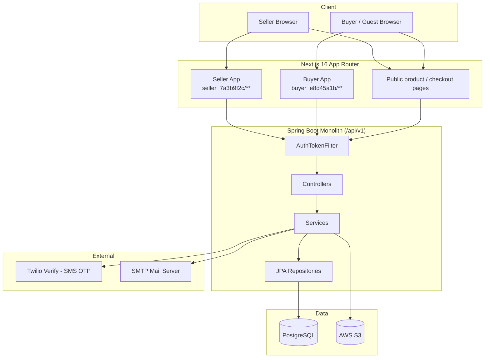

# High-Level Design (HLD)
## Pharma Aggregator Marketplace

---

## 1. Overview

The Pharma Aggregator Marketplace is a two-sided B2B platform connecting pharmaceutical/medical-product **sellers** (manufacturers, distributors, PCD companies, white-labelers) with **buyers** (hospitals, clinics, pharmacies, diagnostic centres, laboratories).

| Item | Detail |
|---|---|
| Frontend | `pharma-aggregator-client` — Next.js 16 (App Router), client-rendered |
| Backend | `pharma-aggregator-server` — Spring Boot monolith, context path `/api/v1` |
| Database | PostgreSQL (single instance) |
| Admin UI | Not present in this repository — admin actions hit backend-only endpoints |

---

## 2. Goals & Scope

**In scope**
- Seller & buyer registration/onboarding with document upload and admin review
- Authentication (password + email/SMS OTP), JWT + rotating refresh tokens
- Product catalog management across 6 categories (Drug, Consumable, Non-Consumable, Supplement, Cosmetic, Food & Infant)
- Stock/batch/pricing management (FIFO ledger)
- Order placement & fulfillment (COD only), invoicing, returns
- Quote Request / RFQ negotiation between buyer and seller

**Out of scope**
- No admin frontend
- No payment gateway integration (Cash on Delivery only)
- No real-time notification channel beyond email/SMS
- No horizontal scaling, caching layer, or message queue

---

## 3. Architecture

Three-tier architecture: browser client → Spring Boot monolith → PostgreSQL, with S3 for file storage and Twilio/SMTP for OTP and email.

There is no API gateway, message queue, cache layer, or CDN in the current architecture.

---

## 4. Major Components

### 4.1 Frontend

| Component | Responsibility |
|---|---|
| Seller App (`seller_7a3b9f2c/`) | Registration, dashboard, product CRUD, orders, quotes; client-side auth guard, inactivity logout |
| Buyer App (`buyer_e8d45a1b/`) | Signup/login, dashboard, RFQ management, order history |
| Public pages | Product browsing, guest quote requests, checkout |
| `src/lib/api.ts` | Seller HTTP client with 401 refresh-token rotation |
| `src/lib/buyerApi.ts` | Buyer HTTP client, isolated token set, own refresh logic |
| `src/utils/api.ts` | Product/master-data HTTP client (Bearer attach only, no refresh) |

### 4.2 Backend

| Component | Responsibility |
|---|---|
| Auth (Seller/Buyer) | Password + OTP login, JWT + refresh-token issuance |
| Onboarding (Temp Seller/Buyer) | Draft/submit registration, document upload to S3 |
| Admin Approval | Review, approve/reject/request-correction on registrations |
| Master/Reference Data | Geography, categories, dosage forms, pack types, etc. |
| Product Catalog | CRUD across 6 product categories, bulk import |
| Stock & Pricing | Batch-level stock ledger, FIFO consumption |
| Orders | Placement, fulfillment state machine, invoicing, returns |
| Quote Requests | RFQ negotiation between buyer and seller |

---

## 5. Technology Stack

| Layer | Technology |
|---|---|
| Frontend framework | Next.js 16 (App Router), React 19, TypeScript |
| Frontend styling | Tailwind CSS v4, MUI, Bootstrap |
| Forms/Validation | react-hook-form + zod |
| HTTP client | axios |
| Backend framework | Spring Boot, Java 17 |
| Backend security | Spring Security, JWT (HS256), BCrypt |
| Persistence | Spring Data JPA / Hibernate, Flyway |
| Database | PostgreSQL |
| File storage | AWS S3 |
| SMS OTP | Twilio Verify |
| Email | SMTP via Spring JavaMailSender |
| Infra | AWS ECS (Fargate), ECR, Secrets Manager, CloudWatch Logs |

---

## 6. Key Flows

### 6.1 Authentication
Password login → email OTP → JWT access token + opaque rotating refresh token, stored in `localStorage` and mirrored to a non-httpOnly cookie. Seller and buyer flows are structurally identical but fully isolated (separate tables, controllers, and frontend HTTP clients).

### 6.2 Seller/Buyer Onboarding
Registration wizard collects org/coordinator/bank details and documents → submitted as a "temp" record → admin reviews (Accept / Reject / Request Correction) → on acceptance, a permanent Seller/Buyer record is created and documents migrated in S3.

### 6.3 Product Catalog
Each of the 6 product categories has its own schema, service, and import strategy on both frontend and backend, kept in sync 1:1.

### 6.4 Orders
Buyer places an order → fanned out per seller → each seller fulfills through a state machine (confirm → pack → ship → deliver) → OTP-gated delivery confirmation → invoice generated → returns handled within a fixed window.

### 6.5 Quote Requests (RFQ)
Buyer requests a price → seller responds once → buyer accepts/rejects → accepted quotes can be converted into an order.

---

## 7. Non-Functional Considerations

| Aspect | Current State |
|---|---|
| Authentication | JWT + refresh-token rotation; access enforcement is app-level, not edge-level |
| Scalability | Single backend instance, single database; no caching or queueing |
| Observability | CloudWatch log aggregation only; no APM or error tracking |
| Testing | No automated test suite on frontend or backend CI |
| Payments | Cash on Delivery only; no gateway integration |

---

## 8. Related Documents

- `docs/04-HLD.md` — detailed, source-traced High-Level Design with full component/data-flow diagrams and implementation-traceability tables
- `docs/05-LLD.md` — Low-Level Design
- `docs/06-DATA-MODEL.md` — Data Model
- `docs/07-API-SPECIFICATION.md` — API Specification
- `docs/08-SECURITY-AND-DEPLOYMENT.md` — Security & Deployment
